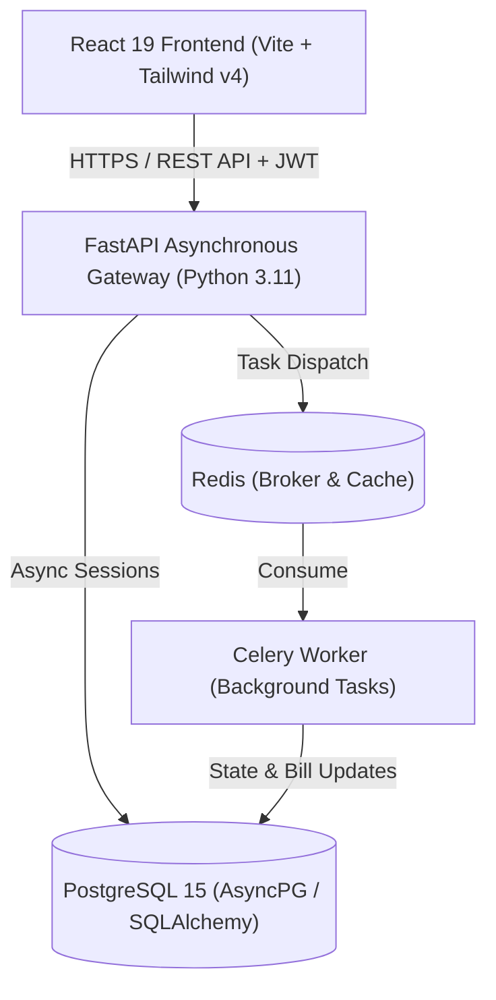

# 💰 WealthSync — Intelligent Personal Finance Platform

[](https://github.com/SatyaTejaChukka/wealth_sync/actions)
[](LICENSE)
[](https://fastapi.tiangolo.com)
[](https://react.dev)
[](https://tailwindcss.com)
[](https://www.postgresql.org)
[](https://www.docker.com)

**WealthSync** is an enterprise-grade, modern personal wealth and cashflow management platform. Engineered with a high-performance **FastAPI** asynchronous backend, a **React 19** dark-glassmorphic frontend, and **PostgreSQL**, WealthSync unifies daily expense tracking, budget allocation, automated electricity bill fetching, EMI schedules, peer-to-peer lending calculations, and automated financial health scoring into a seamless, real-time dashboard.

---

## 📑 Table of Contents

- [Key Features](#-key-features)
- [Architecture & Tech Stack](#-architecture--tech-stack)
- [Project Directory Structure](#-project-directory-structure)
- [API Endpoints Overview](#-api-endpoints-overview)
- [Local Development Setup](#-local-development-setup)
  - [Prerequisites](#prerequisites)
  - [Quick Start via Docker](#quick-start-via-docker-recommended)
  - [Manual Local Setup](#manual-local-setup)
- [Environment Variables](#-environment-variables)
- [Testing & Quality Assurance](#-testing--quality-assurance)
- [Production Deployment](#-production-deployment)
- [Security & Reliability](#-security--reliability)
- [Contributing & License](#-contributing--license)

---

## ✨ Key Features

### 📊 Cashflow & Core Ledger
- **Multi-Source Income Management** — Track fixed salaries, freelance gigs, dividends, and passive revenue streams.
- **Categorized Expense Logging** — Real-time transaction logging with custom categories, icons, color-coding, and search/filter capabilities.
- **Sankey Flow Chart** — Interactive SVG cashflow diagram mapping gross income through categories, fixed obligations, EMIs, and unspent savings.
- **Export & Filtering** — Filter transactions by date range, category, payment method, or source; export to CSV for tax or external auditing.

### ⚡ Utility Automation & Electricity Fetcher
- **Live Board Connections** — Link state electricity boards (APSPDCL, BESCOM, TSSPDCL, MSEDCL) directly via consumer number.
- **Background Bill Polling** — Automated Celery background workers that periodically fetch current due amounts, due dates, and kWh consumption metrics.
- **Proactive Reminders** — Smart notifications triggered before utility due dates to eliminate late payment penalties.

### 💳 Debt, Loans & Peer-to-Peer Lending
- **Loan & EMI Tracker** — Manage personal, home, and auto loans with fixed or reducing interest, tenure tracking, and automatic monthly EMI amortization logging.
- **P2P Lent Money Ledger** — Track money lent to friends, family, or business associates. Features day-accurate simple/compound accrued interest calculations (including custom "₹ per ₹100/month" Indian lending models) and partial/full settlement workflows.

### 🎯 Smart Budgeting & Financial Calendar
- **Safe-to-Spend Daily Engine** — Dynamically calculates your daily discretionary spending limit based on income, fixed obligations, and savings goals.
- **50/30/20 & Custom Budget Rules** — Set fixed-amount or percentage-based caps per category with visual progress gauges.
- **Unified Financial Calendar** — A single monthly view aggregating bills, loan EMIs, subscriptions, utility dues, and expected repayments with quick-pay action shortcuts.

### 🧠 Intelligence & Financial Health
- **Algorithmic Health Score (0–100)** — Evaluates liquidity ratio, savings rate, debt-to-income ratio, and budget adherence to deliver an objective health score with actionable recommendations.
- **Autopilot Engine** — Suggests optimized payment orders and automated budget reallocations to accelerate debt elimination and goal completion.

### 🎨 Design & Experience
- **Dark Glassmorphic UI** — Sleek zinc-900 foundation with frosted glass surfaces, neon border glows, and violet/indigo gradient accents.
- **Micro-Animations & Visual Feedback** — Powered by Framer Motion, featuring smooth transitions, optimistic UI updates, and slide-in toast notifications.

---

## 🛠 Architecture & Tech Stack



| Layer | Technology | Description |
| :--- | :--- | :--- |
| **Frontend** | React 19, React Router 7, Vite | High-performance Single Page Application (SPA) |
| **Styling** | Tailwind CSS 4, Framer Motion | Modern dark glassmorphism, responsive neomorphic cards |
| **Visualizations** | Recharts, Custom SVG Sankey | Financial charts, spending trends, and cashflow diagrams |
| **Backend** | FastAPI, Python 3.11, Pydantic v2 | High-concurrency async REST API |
| **ORM & DB** | SQLAlchemy 2.0 (asyncio), Asyncpg | Fully asynchronous connection pooling and transactions |
| **Database** | PostgreSQL 15 | Relational storage with strict foreign keys & constraints |
| **Database Migrations**| Alembic | Version-controlled schema migrations |
| **Auth & Security** | JWT (python-jose), Argon2, SlowAPI | Secure hashing, role/user tokens, rate limiting |
| **Async Tasks** | Celery + Redis | Asynchronous electricity bill polling & notification dispatch |
| **Testing** | Pytest, Pytest-AsyncIO, HTTPX | Comprehensive integration and unit test suite |
| **Containerization**| Docker & Docker Compose | Multi-container development and production deployment |

---

## 📁 Project Directory Structure

```
wealth_sync/
├── backend/
│   ├── alembic/                      # Alembic schema migration environment
│   │   ├── versions/                 # Revision scripts (001_initial to latest)
│   │   └── env.py                    # Async migration runner
│   ├── app/
│   │   ├── api/                      # API Layer (FastAPI routers)
│   │   │   ├── deps.py               # Dependency injection (get_db, current_user)
│   │   │   └── v1/                   # REST API v1 modular endpoints
│   │   │       ├── auth.py           # Signup, login, refresh, token management
│   │   │       ├── autopilot.py      # Autopilot payment planning & rules
│   │   │       ├── bills.py          # Recurring bills CRUD & payment actions
│   │   │       ├── budgets.py        # Budget allocation rules & monthly stats
│   │   │       ├── calendar.py       # Aggregated financial events calendar
│   │   │       ├── categories.py     # Budget categories & color mappings
│   │   │       ├── dashboard.py      # Summary metrics, cashflow & Sankey data
│   │   │       ├── electricity.py    # Utility accounts & manual/auto bill sync
│   │   │       ├── health.py         # Financial health score calculation
│   │   │       ├── income.py         # Income sources CRUD
│   │   │       ├── lent_money.py     # P2P lending, interest tracking & settle
│   │   │       ├── loans.py          # Loan portfolios & EMI payments
│   │   │       ├── notifications.py  # User notifications feed & read status
│   │   │       ├── savings.py        # Savings goals & contribution history
│   │   │       ├── subscriptions.py  # Recurring subscriptions management
│   │   │       ├── transactions.py   # Ledger transactions, filters & export
│   │   │       └── users.py          # User profile & avatar uploads
│   │   ├── core/                     # Core infrastructure & configuration
│   │   │   ├── config.py             # Pydantic BaseSettings (env parsing)
│   │   │   ├── database.py           # Async engine & sessionmaker setup
│   │   │   ├── errors.py             # Standard error codes & exceptions
│   │   │   ├── logging_config.py     # Structured logging formatting
│   │   │   ├── middleware.py         # Request context, security headers, CORS fix
│   │   │   ├── request_context.py    # Async request ID tracking contextvars
│   │   │   └── security.py           # Password hashing (Argon2) & JWT logic
│   │   ├── models/                   # SQLAlchemy declarative ORM models
│   │   │   ├── autopilot_payment.py  # Autopilot execution records
│   │   │   ├── bill.py               # Recurring bills model
│   │   │   ├── budget.py             # Budget categories & rules
│   │   │   ├── electricity_account.py# Utility consumer connection model
│   │   │   ├── health_score.py       # Financial health logs
│   │   │   ├── income.py             # Income sources model
│   │   │   ├── lent_money.py         # Debts lent & interest metadata model
│   │   │   ├── loan.py               # Loan & EMI tracking model
│   │   │   ├── notification.py       # In-app notifications model
│   │   │   ├── savings.py            # Savings goals & logs model
│   │   │   ├── subscription.py       # Subscriptions model
│   │   │   ├── transaction.py        # Master financial ledger model
│   │   │   └── user.py               # User account model
│   │   ├── schemas/                  # Pydantic validation & serialization schemas
│   │   ├── services/                 # Pure domain business logic
│   │   │   ├── autopilot.py          # Autonomous financial execution logic
│   │   │   ├── budget_engine.py      # Daily spendable & monthly allocation logic
│   │   │   ├── electricity_service.py# State board scrapers & fetchers
│   │   │   ├── financial_planning.py # Long-term forecasting & debt snowball
│   │   │   ├── financial_triage.py   # Immediate cashflow health checks
│   │   │   ├── health_score.py       # Algorithmic score weighting
│   │   │   ├── lent_money_service.py # Accrued interest calculations
│   │   │   └── loan_service.py       # EMI schedule & amortization calculations
│   │   ├── tasks/                    # Asynchronous Celery workers
│   │   │   ├── celery_app.py         # Celery instance configuration
│   │   │   └── electricity_tasks.py  # Scheduled utility bill sync worker
│   │   ├── static/avatars/           # Local user avatar upload storage
│   │   └── main.py                   # FastAPI application factory & lifespan
│   ├── tests/                        # Comprehensive Pytest suite (30+ tests)
│   ├── Dockerfile                    # Production backend container definition
│   ├── pytest.ini                    # Pytest configuration
│   └── requirements.txt              # Production Python dependencies
├── frontend/
│   ├── src/
│   │   ├── assets/                   # Static images, icons, and brand graphics
│   │   ├── components/               # Reusable UI component library
│   │   │   ├── bills/                # Bill card, modals, and status badges
│   │   │   ├── dashboard/            # Sankey flow, trend charts, triage cards
│   │   │   ├── layout/               # Sidebar, Navbar, PageContainer
│   │   │   └── ui/                   # Button, Card, Modal, Input, Toast, Select
│   │   ├── hooks/                    # Custom React hooks (useAuth, useToast)
│   │   ├── layouts/                  # Main application layout wrappers
│   │   ├── lib/                      # Core utilities, Axios client, AuthContext
│   │   ├── pages/                    # Route page components
│   │   │   ├── dashboard/            # Authenticated application views
│   │   │   │   ├── Analytics.jsx     # Deep-dive spending analytics & trends
│   │   │   │   ├── Bills.jsx         # Bills & electricity board manager
│   │   │   │   ├── Budget.jsx        # Budget allocation rules & daily spendable
│   │   │   │   ├── Calendar.jsx      # Financial events calendar view
│   │   │   │   ├── Dashboard.jsx     # Master overview, Sankey, quick stats
│   │   │   │   ├── Goals.jsx         # Savings targets & contribution logs
│   │   │   │   ├── Lent.jsx          # P2P debt tracking & settlement
│   │   │   │   ├── Loans.jsx         # Loans, EMIs & payoff schedules
│   │   │   │   ├── Settings.jsx      # Account settings & preferences
│   │   │   │   ├── Subscriptions.jsx # Subscription tracking & analysis
│   │   │   │   └── Transactions.jsx  # Full transaction history & CSV export
│   │   │   ├── Landing.jsx           # Public marketing landing page
│   │   │   ├── Login.jsx             # User authentication login
│   │   │   └── Signup.jsx            # User registration (with auto-login)
│   │   ├── services/                 # Typed API client services (16 modules)
│   │   ├── App.jsx                   # Application router & providers
│   │   ├── index.css                 # Tailwind CSS 4 & custom design tokens
│   │   └── main.jsx                  # React DOM mount point
│   ├── Dockerfile                    # Multi-stage Nginx production container
│   ├── package.json                  # Node dependencies and build scripts
│   ├── vite.config.js                # Vite build and dev server config
│   └── vercel.json                   # Vercel SPA routing rules
├── docs/                             # Architecture diagrams and specifications
├── scripts/                          # Utility & maintenance scripts
├── docker-compose.yml                # Full local multi-service stack
├── docker-compose.hub.yml            # Production pre-built image deployment
├── docker-compose.prod.yml           # Production deployment stack with SSL
├── setup.ps1                         # Automated Windows setup script
├── DEPLOYMENT.md                     # Detailed cloud deployment manual
└── README.md                         # Project documentation
```

---

## 🔌 API Endpoints Overview

All backend endpoints are prefixed with `/api/v1`. Interactive OpenAPI/Swagger documentation is available at `/docs` when enabled.

| Module | Route Prefix | Primary Operations |
| :--- | :--- | :--- |
| **Authentication** | `/auth` | `POST /signup`, `POST /login`, `GET /me`, `POST /refresh` |
| **Users** | `/users` | `GET /profile`, `PUT /profile`, `POST /avatar` |
| **Income** | `/income` | `GET /`, `POST /`, `PUT /{id}`, `DELETE /{id}` |
| **Transactions** | `/transactions` | `GET /` (filters/pagination), `POST /`, `PUT /{id}`, `DELETE /{id}`, `GET /export` |
| **Categories** | `/categories` | `GET /`, `POST /`, `PUT /{id}`, `DELETE /{id}` |
| **Budgets** | `/budgets` | `GET /rules`, `POST /rules`, `DELETE /rules/{id}`, `GET /summary`, `GET /daily-spendable` |
| **Bills** | `/bills` | `GET /`, `POST /`, `PUT /{id}`, `DELETE /{id}`, `POST /{id}/pay` |
| **Electricity** | `/electricity` | `GET /boards`, `GET /accounts`, `POST /accounts`, `POST /accounts/{id}/fetch`, `DELETE /accounts/{id}` |
| **Subscriptions** | `/subscriptions` | `GET /`, `POST /`, `PUT /{id}`, `DELETE /{id}`, `POST /{id}/log-usage` |
| **Savings Goals** | `/goals` | `GET /`, `POST /`, `PUT /{id}`, `DELETE /{id}`, `POST /{id}/contribute`, `GET /{id}/logs` |
| **Loans** | `/loans` | `GET /`, `POST /`, `PUT /{id}`, `DELETE /{id}`, `POST /{id}/pay`, `POST /calculate` |
| **P2P Lent Money** | `/lent` | `GET /`, `POST /`, `GET /{id}`, `PUT /{id}`, `DELETE /{id}`, `POST /{id}/repay` |
| **Financial Calendar**| `/calendar` | `GET /events?month={m}&year={y}` (Aggregates bills, EMIs, subs, lent returns) |
| **Dashboard** | `/dashboard` | `GET /summary`, `GET /sankey`, `GET /trends`, `GET /recent` |
| **Notifications** | `/notifications` | `GET /`, `PUT /{id}/read`, `DELETE /{id}`, `POST /read-all` |
| **Health Score** | `/health` | `GET /` (Calculates 0–100 score, tier, liquidity metrics & recommendations) |
| **Autopilot** | `/autopilot` | `GET /plan`, `POST /execute`, `GET /status`, `POST /reallocate` |

---

## 🚀 Local Development Setup

### Prerequisites

- **Docker & Docker Compose** (Recommended) — *OR*
- **Python 3.11+** and **Node.js 18+**
- **PostgreSQL 15+** (if running locally without Docker)

---

### Quick Start via Docker (Recommended)

Clone the repository and spin up the complete multi-container stack:

```bash
git clone https://github.com/SatyaTejaChukka/wealth_sync.git
cd wealth_sync
```

#### Windows (One-Click Setup)
```powershell
.\setup.ps1
```

#### Linux / macOS
```bash
# Start backend, frontend, postgres, redis, and celery
docker-compose up -d --build

# Run database migrations
docker-compose exec backend alembic upgrade head
```

The application will be accessible at:
- **Frontend Application**: [http://localhost:3000](http://localhost:3000)
- **Backend API Docs (Swagger)**: [http://localhost:8000/docs](http://localhost:8000/docs)
- **Health Check Endpoint**: [http://localhost:8000/health](http://localhost:8000/health)

---

### Manual Local Setup

<details>
<summary><strong>1. Backend Setup</strong></summary>

```bash
cd backend

# Create and activate a virtual environment
python -m venv venv
# On Windows:
venv\Scripts\activate
# On Linux/macOS:
# source venv/bin/activate

# Install dependencies
pip install -r requirements.txt

# Copy environment file
cp .env.example .env

# Run database migrations
alembic upgrade head

# Start development server
uvicorn app.main:app --reload --port 8000
```

</details>

<details>
<summary><strong>2. Frontend Setup</strong></summary>

```bash
cd frontend

# Install node dependencies
npm install

# Copy environment file
cp .env.example .env

# Start Vite dev server
npm run dev
```

</details>

---

## ⚙️ Environment Variables

### Backend Configuration (`backend/.env`)

| Variable | Required | Default | Description |
| :--- | :--- | :--- | :--- |
| `SECRET_KEY` | **Yes** | — | Cryptographic secret for signing JWTs (`openssl rand -hex 32`) |
| `DATABASE_URL` | **Yes** | — | Asynchronous PostgreSQL connection string (`postgresql+asyncpg://...`) |
| `ENVIRONMENT` | No | `development` | Environment mode (`development` or `production`) |
| `DEBUG` | No | `False` | Enables verbose stack traces in responses |
| `ENABLE_DOCS` | No | `True` | Toggles OpenAPI `/docs` and `/redoc` availability |
| `AUTO_CREATE_TABLES` | No | `True` | Automatically runs `Base.metadata.create_all` on startup |
| `BACKEND_CORS_ORIGINS` | No | `[]` | JSON array of permitted client origins (e.g. `["http://localhost:3000"]`) |
| `ALLOWED_HOSTS` | No | `[]` | JSON array of allowed Host headers (protection against Host-header attacks) |
| `ACCESS_TOKEN_EXPIRE_MINUTES`| No | `11520` | Lifetime of authentication JWT in minutes (default: 8 days) |
| `RATE_LIMIT_LOGIN` | No | `5/minute` | Rate limit for login attempts per IP |
| `RATE_LIMIT_SIGNUP` | No | `3/minute` | Rate limit for signup attempts per IP |
| `DB_POOL_SIZE` | No | `5` | Base database connection pool size |
| `DB_MAX_OVERFLOW` | No | `10` | Extra connections allowed beyond pool size |
| `REDIS_URL` | No | `redis://localhost:6379/0` | Redis connection URL for Celery task queuing |
| `SENTRY_DSN` | No | — | Optional Sentry DSN for production exception tracking |

### Frontend Configuration (`frontend/.env`)

| Variable | Required | Default | Description |
| :--- | :--- | :--- | :--- |
| `VITE_API_BASE_URL` | **Yes** | `http://localhost:8000/api/v1` | Root API URL targeting the backend v1 endpoints |
| `VITE_ENVIRONMENT` | No | `development` | Client environment descriptor |

> [!IMPORTANT]
> All client-side environment variables in the frontend must start with the `VITE_` prefix to be bundled by Vite.

---

## 🧪 Testing & Quality Assurance

WealthSync maintains a comprehensive automated test suite covering end-to-end user flows, financial calculation accuracy, cascade unlinking, and API contracts.

```bash
cd backend

# Run the complete test suite
python -m pytest

# Run with verbose output and test names
python -m pytest -v

# Run a specific test module (e.g. Lent Money & Interest Engine)
python -m pytest tests/test_lent_money.py
```

### Test Coverage Highlights:
- **Interest Accuracy**: Verified against both simple interest and compound monthly interest calculations.
- **Ledger Invariant Integrity**: Validates that deleting parent profiles (loans, lending records, bills) properly unlinks ledger transactions without violating foreign key constraints.
- **CORS & Error Resilience**: Validates that 500 error scenarios preserve CORS headers and return structured JSON payloads to the browser.

---

## 🌐 Production Deployment

For an in-depth, step-by-step production walkthrough, review our [Deployment Guide](DEPLOYMENT.md).

### Recommended Cloud Stack:
- **Frontend**: [Vercel](https://vercel.com) (Automated Vite SPA deployment with `vercel.json` rewrites)
- **Backend API**: [Render](https://render.com) (Web Service using Docker or native Python runtime)
- **Database**: [Supabase](https://supabase.com) or [Neon](https://neon.tech) (Serverless PostgreSQL with SSL)

```
[User Browser]
      │
      ├── HTTPS (HTML/JS/CSS Assets) ──> [Vercel CDN]
      │
      └── HTTPS (REST API Requests) ───> [Render Web Service (FastAPI)]
                                                   │
                                                   └── Secure SSL (Port 5432) ──> [Supabase / Neon Postgres]
```

---

## 🔒 Security & Reliability

- **Argon2 Password Hashing** — Uses modern, memory-hard Argon2id hashing algorithms to protect user credentials.
- **JWT Authorization** — Stateless, signed bearer tokens with configurable expiration windows.
- **Host Header & CORS Protection** — Strict validation of `Host` headers to prevent HTTP Host Header poisoning, paired with origin validation.
- **Rate Limiting** — SlowAPI integration on sensitive authentication routes (`/login`, `/signup`) to mitigate brute-force attacks.
- **SQL Injection Prevention** — 100% parameterized queries via SQLAlchemy 2.0 ORM and Core expressions.
- **CORS Fallback Preservation** — Middleware-level exception interception ensures browsers receive CORS headers even during 500 errors, eliminating opaque browser network blocks.

---

## 📄 License

This project is licensed under the **MIT License** — see the [LICENSE](LICENSE) file for details.
