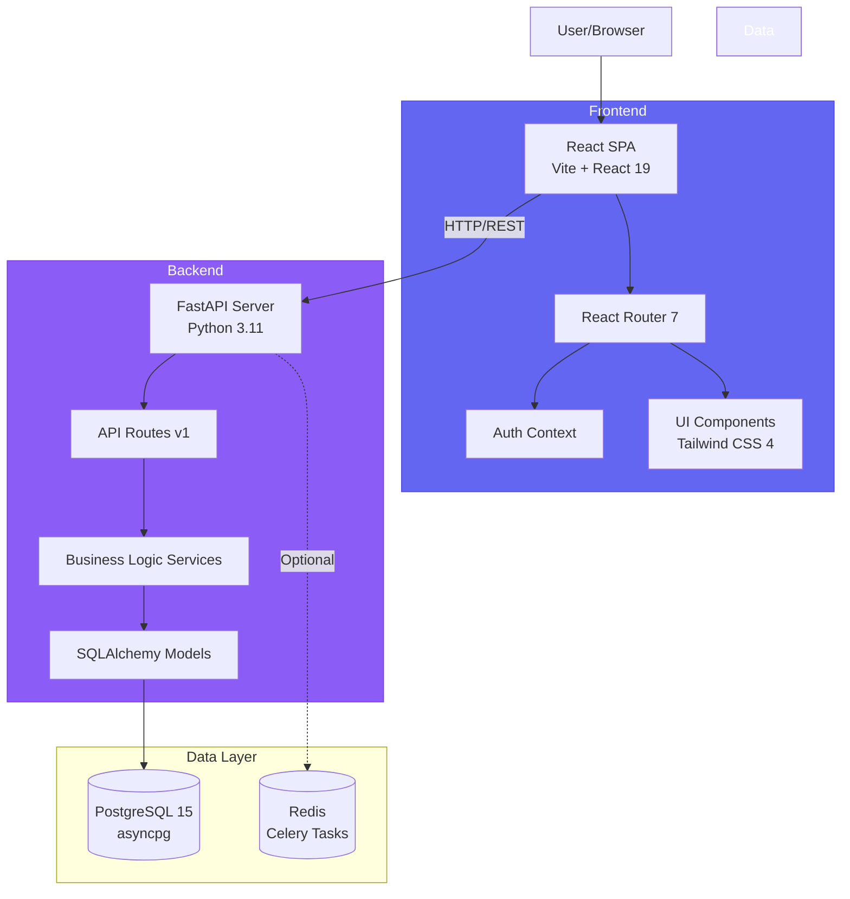

# Chapter 1: Introduction & Architecture Overview

## Welcome to WealthSync: A Tutorial Journey

This tutorial will guide you through the complete thought process, design decisions, trade-offs, and implementation details of **WealthSync** — a full-stack personal finance management platform. By the end of this tutorial series, you'll understand not just what was built, but **why** it was built this way, what alternatives existed, and how every piece fits together.

---

## Why Build a Personal Finance Platform?

### The Problem

People struggle with:

- **Scattered financial data** — income, expenses, bills, subscriptions spread across multiple apps
- **Lack of insight** — no unified view of financial health
- **Reactive spending** — realizing too late that the budget is blown
- **Missed bills** — late fees and credit score impacts

### The Solution: WealthSync

A **single source of truth** for all personal finance activities with:

- Real-time transaction tracking
- Intelligent budget engine
- Financial health scoring
- Automated bill management
- Savings goal tracking

---

## High-Level Architecture

### Architecture Principles

1. **Frontend-Backend Separation**
   - **Why**: Independent scaling, technology flexibility, dedicated teams
   - **Trade-off**: More network overhead, CORS complexity
   - **Alternative**: Monolithic server-side rendering (SSR) with Django/Flask templates
     - **Why not?**: Less interactive UX, harder to scale separately

2. **REST API Communication**
   - **Why**: Standard, well-understood, HTTP-based
   - **Trade-off**: Multiple roundtrips for complex operations
   - **Alternative**: GraphQL
     - **Why not?**: Overkill for this app's query patterns, simpler REST is sufficient

3. **Async-First Backend**
   - **Why**: Handle many concurrent users efficiently with async/await
   - **Trade-off**: More complex to debug, requires async-compatible libraries
   - **Alternative**: Synchronous WSGI (Django)
     - **Why not?**: Lower throughput for I/O-bound operations (database queries)

4. **PostgreSQL Database**
   - **Why**: ACID guarantees, rich SQL features, battle-tested
   - **Trade-off**: Schema changes require migrations
   - **Alternative**: MongoDB (NoSQL)
     - **Why not?**: Financial data is relational, need strong consistency

---

## Technology Stack Breakdown

### Frontend Stack

| Technology        | Version         | Why Chosen                                                | Trade-offs                         | Alternative                                        |
| ----------------- | --------------- | --------------------------------------------------------- | ---------------------------------- | -------------------------------------------------- |
| **React**         | 19              | Component-based UI, huge ecosystem, excellent performance | Learning curve, verbose            | Vue.js (simpler), Svelte (smaller bundle)          |
| **React Router**  | 7               | Standard routing library, nested routes support           | Client-side only                   | Next.js (SSR) - overkill for this SPA              |
| **Tailwind CSS**  | 4               | Utility-first, fast development, consistent design        | Large initial HTML, learning curve | Styled Components, Vanilla CSS                     |
| **Vite**          | rolldown-vite 7 | Blazing fast HMR, modern ES modules                       | Newer ecosystem                    | Webpack (more mature), Parcel                      |
| **Recharts**      | 3               | React-native charts, good defaults                        | Bundle size                        | Chart.js (lighter), D3 (more powerful but complex) |
| **Axios**         | 1.13            | HTTP client with interceptors, timeout handling           | Extra dependency                   | Fetch API (built-in but less features)             |
| **Framer Motion** | 12              | Smooth animations, spring physics                         | Bundle size                        | CSS animations only (lighter)                      |

### Backend Stack

| Technology            | Version   | Why Chosen                                        | Trade-offs                        | Alternative                                     |
| --------------------- | --------- | ------------------------------------------------- | --------------------------------- | ----------------------------------------------- |
| **FastAPI**           | Latest    | Modern, fast, automatic API docs, async-native    | Younger framework                 | Django REST (more batteries), Flask (lighter)   |
| **Python**            | 3.11      | Clear syntax, rich libraries, async support       | Slower than compiled languages    | Node.js (same lang as frontend), Go (faster)    |
| **Pydantic**          | v2        | Data validation, type safety, auto-docs           | Runtime overhead                  | Manual validation (error-prone)                 |
| **SQLAlchemy**        | 2 (async) | Mature ORM, async support, powerful query API     | Complex for simple queries        | Raw SQL (faster but harder to maintain)         |
| **asyncpg**           | Latest    | Fastest Python PostgreSQL driver                  | Async-only                        | psycopg2 (sync, more mature)                    |
| **JWT (python-jose)** | Latest    | Stateless auth, scales horizontally               | Token size, revocation complexity | Session cookies (easier but stateful)           |
| **Argon2**            | Latest    | Secure password hashing, resistant to GPU attacks | Slower than bcrypt                | bcrypt (faster but less secure)                 |
| **Alembic**           | Latest    | Database migrations, version control              | Learning curve                    | Manual SQL scripts (dangerous)                  |
| **PostgreSQL**        | 15        | ACID, mature, complex queries, JSON support       | Vertical scaling limits           | MySQL (less features), MongoDB (NoSQL, no ACID) |

---

## Design Decisions Deep Dive

### 1. Why FastAPI over Django?

**Decision**: FastAPI

**Reasoning**:

- **Modern async/await**: Native async support = better performance for I/O-bound operations
- **Automatic API documentation**: Swagger UI out of the box from type hints
- **Type safety**: Pydantic models enforce request/response validation
- **Lightweight**: Only what you need, no template engine overhead

**Trade-offs**:

- **Less batteries included**: No built-in admin panel (Django has one)
- **Younger ecosystem**: Fewer third-party packages than Django
- **More manual setup**: Authentication, permissions need more code

**When Django would be better**:

- Building a traditional server-rendered web app
- Need a built-in admin interface immediately
- Team already knows Django

### 2. Why Separate Frontend & Backend?

**Decision**: Decoupled SPA + API

**Reasoning**:

- **Independent deployment**: Update frontend without backend restart
- **Mobile-ready**: Same API can serve mobile apps
- **Team specialization**: Frontend and backend devs can work in parallel
- **Technology flexibility**: Can replace React without touching FastAPI

**Trade-offs**:

- **CORS complexity**: Must configure allowed origins
- **More network hops**: Each screen might make 3-5 API calls
- **SEO challenges**: Client-side rendering isn't great for SEO (but this is an authenticated app)

**When monolithic would be better**:

- SEO-critical public content
- Simpler deployment requirements
- Small team wearing both hats

### 3. Why PostgreSQL over NoSQL?

**Decision**: PostgreSQL

**Reasoning**:

- **Relational data**: Users → Transactions → Categories are natural foreign key relationships
- **ACID guarantees**: Financial data must be consistent
- **Complex queries**: Need aggregations (monthly spending by category)
- **JSON support**: Can still store flexible data when needed (meta_json field)

**Trade-offs**:

- **Schema rigidity**: Changes require migrations
- **Vertical scaling**: Eventually need sharding for massive scale
- **Learning curve**: SQL syntax vs. document queries

**When MongoDB would be better**:

- Rapidly changing schema
- Nested document structures
- Horizontal scaling from day 1

### 4. Why JWT over Session Cookies?

**Decision**: JWT (JSON Web Tokens)

**Reasoning**:

- **Stateless**: No server-side session store needed
- **Horizontal scaling**: Any backend instance can validate the token
- **Mobile-friendly**: Easy to store in mobile app storage

**Trade-offs**:

- **Cannot revoke**: Once issued, valid until expiry (workaround: short expiry + refresh tokens)
- **Token size**: Larger than session IDs (sent with every request)
- **Secrets management**: Must secure SECRET_KEY carefully

**When sessions would be better**:

- Need instant revocation (logout from all devices)
- Very tight security requirements
- Server-side state is acceptable

### 5. Why Async SQLAlchemy over Sync?

**Decision**: Async SQLAlchemy with asyncpg

**Reasoning**:

- **Concurrency**: Can handle 100 concurrent requests without blocking
- **FastAPI alignment**: FastAPI is async-native
- **Database connection efficiency**: Connection pool shares connections across requests

**Trade-offs**:

- **Complexity**: `async`/`await` everywhere, harder to debug
- **Library compatibility**: Some libraries don't support async
- **Overkill for low traffic**: Sync would be simpler for <100 concurrent users

**When sync would be better**:

- Simple CRUD app with low concurrency
- Team unfamiliar with async programming
- Using libraries that don't support async

---

## Core Concepts Explained

### 1. Budget Engine

- **What**: Calculates "safe to spend" amount per day
- **How**: (Monthly Income - Fixed Bills - Budget Allocations) / Days Left in Month
- **Why**: Prevents overspending before month-end

### 2. Financial Health Score

- **What**: 0-100 score = Savings Rate (35%) + Budget Adherence (35%) + Bill Punctuality (30%)
- **Why**: Single metric for financial wellness
- **Trade-off**: Simplified scoring might miss nuances (debt, credit score, etc.)

### 3. Financial Triage

- **What**: Prioritized list of actions (overdue bills, over-budget categories)
- **Why**: Helps users focus on highest-impact fixes first
- **How**: Severity scoring algorithm based on cashflow risk

### 4. Autopilot Payments

- **What**: Scheduled payments for bills/subscriptions needing approval
- **Why**: Automate recurring payments
- **Trade-off**: Requires payment provider integration (currently "internal_ledger" stub)

---

## What's Next?

In the following chapters, we'll dive deep into:

- **Chapter 2**: System Design & Architecture Patterns (LLD concepts, design patterns, trade-offs)
- **Chapter 3**: Complete Request Flow Analysis (end-to-end sequence diagrams)
- **Chapter 4**: Database Schema Design (ER diagrams, all 11 tables, relationships)
- **Chapter 5**: SQLAlchemy Models Line-by-Line (all models explained in detail)
- **Chapter 6**: FastAPI Core Setup (main.py, middleware, config, security)
- **Chapter 7**: Pydantic Schemas (all 11 schema modules, DTO pattern, validation)
- **Chapter 8**: Dependency Injection Deep Dive (get_db, get_current_user)
- **Chapter 9**: Service Layer Complete Breakdown (BudgetEngine, HealthScore, FinancialTriage)
- **Chapter 10**: Celery & Background Tasks (async tasks, monitoring)
- **Chapter 11**: Authentication & Authorization (JWT, Argon2, security)
- **Chapter 12**: API Routes Complete Coverage (58+ endpoints across 13 modules)
- **Chapter 13**: Complete API Flow & Communication Architecture (industrial-level detail)
- **Chapter 14**: React Setup & Architecture (routing, auth guards, navigation)
- **Chapter 15**: Frontend Libraries & Utilities (Axios, hooks, services)
- **Chapter 16**: UI Components Library (all 34 components)
- **Chapter 17**: Pages Complete Breakdown (all 9 pages)
- **Chapter 18**: Styling, UX & Accessibility (Tailwind, animations, WCAG)
- **Chapter 19**: Deployment & DevOps (Docker, CI/CD, production)

Each chapter will include:
✅ **Line-by-line code explanations**
✅ **Design pattern identification**
✅ **Trade-off discussions**
✅ **Alternative approaches**
✅ **Common pitfalls and solutions**

Let's begin building! 🚀

---

## Navigation

**Next Chapter**: [→ Chapter 2: System Design & Architecture Patterns](./Chapter_02_System_Design_Patterns.md)

**Back to Index**: [📚 Tutorial Home](./README.md)
