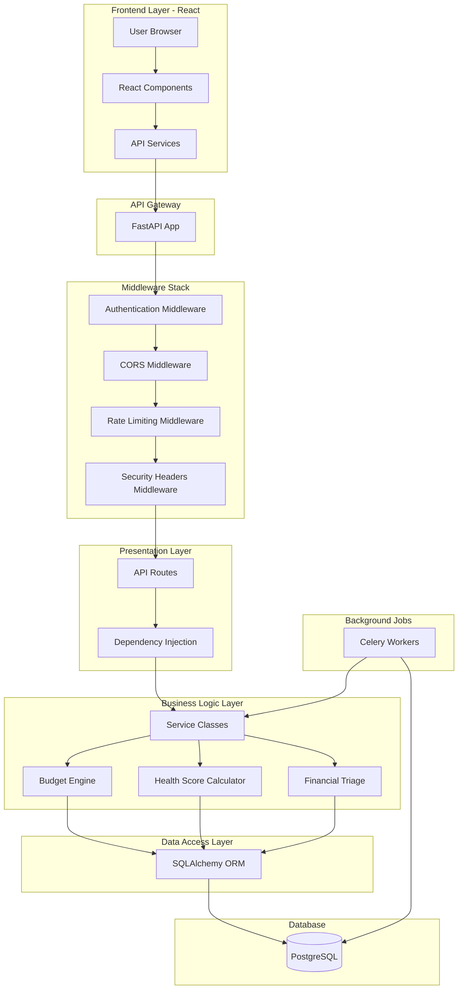
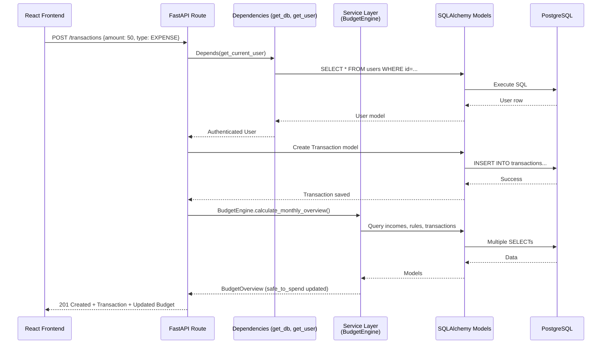

# Chapter 2: System Design & Architecture Patterns

> **Industrial-Level Deep Dive**: This chapter explains the Low-Level Design (LLD) concepts and design patterns that make WealthSync production-ready, scalable, and maintainable.

---

## What is System Design? (For Complete Beginners)

**System Design** = How you organize your code so it's easy to:

- **Understand**: New developers can learn it quickly
- **Maintain**: Fix bugs without breaking everything
- **Scale**: Handle more users and features
- **Test**: Write automated tests easily

**Analogy**: Building a house

- **Bad Design**: All rooms connected, no walls, everything in one space (spaghetti code)
- **Good Design**: Separate rooms (kitchen, bedroom, bathroom), each with a specific purpose (organized code)

---

## WealthSync Architecture Overview

### The Big Picture



**Three-Tier Architecture** (Classic LLD Pattern):

1. **Presentation Tier**: API Routes (handle HTTP requests/responses)
2. **Business Logic Tier**: Services (calculations, rules, algorithms)
3. **Data Tier**: Models + Database (persistent storage)

**Why this matters**:

- Change database? Only modify Data Tier
- Change business rules? Only modify Service Tier
- Add new API endpoint? Only add to Presentation Tier

---

## Low-Level Design (LLD) Concepts

### 1. Layered Architecture

**Definition**: Organize code into horizontal layers, each with specific responsibilities.

**WealthSync's Layers**:

```
┌─────────────────────────────────────┐
│  API Layer (routes/)                │  ← HTTP request/response handling
├─────────────────────────────────────┤
│  Service Layer (services/)          │  ← Business logic & algorithms
├─────────────────────────────────────┤
│  Data Access Layer (models/)        │  ← Database operations
├─────────────────────────────────────┤
│  Database (PostgreSQL)              │  ← Persistent storage
└─────────────────────────────────────┘
```

**Rule**: Upper layers can call lower layers, but NOT vice versa

- ✅ API Route can call Service
- ✅ Service can call Model/Database
- ❌ Model CANNOT call Service
- ❌ Database CANNOT call API Route

**Benefits**:

- **Testability**: Test each layer independently
- **Maintainability**: Changes isolated to one layer
- **Reusability**: Services can be called from multiple routes

**Real Example from WealthSync**:

```python
# ❌ BAD: Business logic in API route
@router.get("/dashboard/summary")
async def get_dashboard_summary(db: AsyncSession, current_user: User):
    # Calculating budget directly in route (BAD!)
    income = await db.execute(select(Income).filter(...))
    expenses = await db.execute(select(Transaction).filter(...))
    safe_to_spend = (income - expenses) / 30  # Logic in route!
    return {"safe_to_spend": safe_to_spend}

# ✅ GOOD: Business logic in Service Layer
@router.get("/dashboard/summary")
async def get_dashboard_summary(db: AsyncSession, current_user: User):
    # Route just orchestrates, delegates logic to service
    budget_overview = await BudgetEngine.calculate_monthly_overview(
        db, current_user.id
    )
    return {"safe_to_spend": budget_overview.daily_spendable}
```

---

### 2. Separation of Concerns (SoC)

**Definition**: Each module/class should have ONE clear responsibility.

**WealthSync Example**:

- `BudgetEngine` = Calculate budgets (NOT handle HTTP requests)
- `auth.py` route = Handle authentication endpoints (NOT calculate budgets)
- `Transaction` model = Define database table (NOT make API calls)

**Benefits**:

- **Easier to understand**: Small, focused files vs giant "God classes"
- **Easier to test**: Mock one concern at a time
- **Parallel development**: Different devs work on different concerns

---

### 3. SOLID Principles

#### S - Single Responsibility Principle (SRP)

**"A class should have one, and only one, reason to change"**

```python
# ✅ GOOD: Each class has one responsibility
class BudgetEngine:
    """Responsibility: Calculate budget metrics"""
    @staticmethod
    def calculate_safe_to_spend(...): ...

class HealthScoreCalculator:
    """Responsibility: Calculate financial health score"""
    @staticmethod
    async def calculate_overall_score(...): ...

# ❌ BAD: One class doing everything
class FinancialManager:
    def calculate_budget(...): ...
    def calculate_health_score(...): ...
    def send_notifications(...): ...  # Too many responsibilities!
```

#### D - Dependency Inversion Principle (DIP)

**"Depend on abstractions, not concretions"**

```python
# ✅ GOOD: Route depends on abstraction (get_db function)
@router.post("/transactions")
async def create_transaction(
    db: AsyncSession = Depends(get_db),  # ← Abstraction injected
    current_user: User = Depends(get_current_user)
):
    # We don't create the database connection ourselves
    # It's "injected" by FastAPI's Depends system
    ...

# ❌ BAD: Route creates its own database connection (concrete dependency)
@router.post("/transactions")
async def create_transaction():
    db = AsyncSessionLocal()  # ← Tightly coupled!
    # Now we can't easily test this with a mock database
```

---

## Design Patterns Used in WealthSync

### Pattern 1: Service Layer Pattern

**Intent**: Centralize business logic in service classes, separate from HTTP layer.

**Problem Solved**: Without this pattern:

- Business logic scattered across API routes
- Code duplication (same calculation in multiple endpoints)
- Hard to test (need to make actual HTTP requests)

**Implementation in WealthSync**:

```python
# services/budget_engine.py

class BudgetEngine:
    """
    Service class encapsulating budget calculation logic.

    Design Pattern: Service Layer
    Responsibility: All budget-related business logic
    """

    @staticmethod
    def calculate_monthly_overview(
        incomes: List[Income],
        rules: List[BudgetRule],
        transactions: List[Transaction],
        year: int,
        month: int
    ) -> BudgetOverview:
        """
        Calculate comprehensive budget overview for a month.

        This is a PURE FUNCTION:
        - No side effects (doesn't modify database)
        - Same inputs → same output (testable!)
        - Reusable from any API route or background job
        """
        # 1. Calculate total income
        total_income = sum(income.amount for income in incomes)

        # 2. Calculate allocated amounts from budget rules
        allocated = self._calculate_allocations(rules, total_income)

        # 3. Calculate actual spending
        total_spent = sum(
            t.amount for t in transactions
            if t.type == "EXPENSE"
        )

        # 4. Calculate safe to spend
        remaining = total_income - allocated - total_spent
        days_left = monthrange(year, month)[1] - datetime.now().day
        daily_spendable = remaining / max(days_left, 1)

        return BudgetOverview(
            total_income=total_income,
            total_allocated=allocated,
            total_spent=total_spent,
            daily_spendable=daily_spendable
        )
```

**Benefits**:

- ✅ **Reusable**: Called from `/dashboard`, `/budgets/overview`, background jobs
- ✅ **Testable**: Can test without making HTTP requests
- ✅ **Maintainable**: Change budget logic in one place

**Used in**:

- [`services/budget_engine.py`](file:///c:/Users/satya/Desktop/wealth_sync/backend/app/services/budget_engine.py)
- [`services/health_score_calculator.py`](file:///c:/Users/satya/Desktop/wealth_sync/backend/app/services/health_score_calculator.py)
- [`services/financial_triage.py`](file:///c:/Users/satya/Desktop/wealth_sync/backend/app/services/financial_triage.py)
- [`services/autopilot.py`](file:///c:/Users/satya/Desktop/wealth_sync/backend/app/services/autopilot.py)

---

### Pattern 2: Dependency Injection (DI) Pattern

**Intent**: Provide dependencies from outside rather than creating them inside.

**Problem Solved**: Tight coupling makes testing impossible.

**Implementation** (FastAPI's `Depends`):

```python
# api/deps.py

async def get_db():
    """
    Dependency that provides database session.

    Design Pattern: Dependency Injection
    Benefits:
    - Routes don't create their own database connections
    - Easy to swap with mock for testing
    - Automatic session cleanup (even if error occurs)
    """
    async with AsyncSessionLocal() as session:
        yield session  # ← Provides session to route
        # Automatic cleanup after route finishes

async def get_current_user(
    db: AsyncSession = Depends(get_db),  # ← get_db is also a dependency!
    token: str = Depends(oauth2_scheme)
) -> User:
    """
    Dependency that validates JWT and returns current user.

    Design Pattern: Dependency Injection + Chain of Responsibility
    Benefits:
    - Automatic authentication for protected routes
    - Centralized auth logic (don't repeat in every route)
    - Composable (can add more dependencies)
    """
    # Decode JWT
    payload = jwt.decode(token, settings.SECRET_KEY, algorithms=[ALGORITHM])
    user_id = payload.get("sub")

    # Fetch user from database
    result = await db.execute(select(User).filter(User.id == user_id))
    user = result.scalars().first()

    if not user:
        raise HTTPException(status_code=401, detail="Invalid token")

    return user

# Usage in API route:
@router.post("/transactions")
async def create_transaction(
    transaction_data: TransactionCreate,
    current_user: User = Depends(get_current_user),  # ← Injected!
    db: AsyncSession = Depends(get_db)               # ← Injected!
):
    """
    FastAPI automatically:
    1. Calls get_db() → provides db session
    2. Calls get_current_user(db, token) → provides authenticated user
    3. Passes both to this function
    4. Cleans up database session after function completes
    """
    new_transaction = Transaction(
        user_id=current_user.id,  # ← Using injected user
        **transaction_data.dict()
    )
    db.add(new_transaction)
    await db.commit()
    return new_transaction
```

**Benefits**:

- ✅ **Testable**: Inject mock database/user for unit tests
- ✅ **DRY**: Auth logic in one place, not repeated in every route
- ✅ **Composable**: Dependencies can depend on other dependencies

**Dependency Graph Example**:

```
create_transaction endpoint
    ↓
Depends(get_current_user)
    ↓
Depends(get_db) + Depends(oauth2_scheme)
    ↓
Database session + JWT token
```

---

### Pattern 3: Repository Pattern (via SQLAlchemy ORM)

**Intent**: Abstract database operations behind a clean interface.

**Without ORM (Raw SQL - Hard to maintain)**:

```python
# ❌ BAD: Raw SQL everywhere
cursor.execute("SELECT * FROM users WHERE email = %s", (email,))
user = cursor.fetchone()
# SQL scattered across codebase, prone to SQL injection!
```

**With ORM (Clean abstraction)**:

```python
# ✅ GOOD: ORM provides repository-like interface
result = await db.execute(
    select(User).filter(User.email == email)
)
user = result.scalars().first()
# Type-safe, protects against SQL injection, easy to test!
```

**Benefits**:

- ✅ **Security**: SQL injection impossible (queries are parameterized)
- ✅ **Type Safety**: IDE autocomplete for model fields
- ✅ **Database Agnostic**: Switch from PostgreSQL → MySQL by changing driver only

---

### Pattern 4: Factory Pattern (Database Connection)

**Intent**: Create objects without specifying exact class.

**Implementation in database.py**:

```python
# core/database.py

# Factory function creates async database engine
engine = create_async_engine(
    str(settings.DATABASE_URL),  # ← Configuration injected
    echo=settings.DEBUG,
    pool_size=settings.DB_POOL_SIZE,
    max_overflow=settings.DB_MAX_OVERFLOW,
    pool_pre_ping=True  # Health check before using connection
)

# Factory function creates session maker
AsyncSessionLocal = sessionmaker(
    engine,
    class_=AsyncSession,
    expire_on_commit=False
)
```

**Why Factory Pattern**:

- Configuration (pool size, debug mode) comes from `settings`
- Actual engine class (`AsyncEngine`) chosen automatically based on database URL
- Centralizes creation logic

---

### Pattern 5: Singleton Pattern (FastAPI App)

**Intent**: Ensure only ONE instance of a class exists.

**Implementation in main.py**:

```python
# main.py

# This app instance is a SINGLETON
# Only created once, reused for all requests
app = FastAPI(
    title=settings.PROJECT_NAME,
    openapi_url=openapi_url,
    docs_url=docs_url,
    redoc_url=redoc_url,
    debug=settings.DEBUG
)

# Same instance used when adding middleware
app.add_middleware(CORSMiddleware, ...)
app.add_middleware(SecurityHeadersMiddleware)

# Same instance used when including routers
app.include_router(auth.router, ...)
app.include_router(transactions.router, ...)
```

**Why Singleton**:

- All routes share same app configuration
- Middleware stack consistent across all requests
- Performance: Don't recreate app on every request

---

### Pattern 6: Data Transfer Object (DTO) Pattern - Pydantic Schemas

**Intent**: Validate and transfer data between layers without exposing internal models.

**Problem**: Directly exposing database models to API is dangerous!

- User could send `is_admin=True` in signup request
- Response might leak password hashes
- Database fields might change, breaking API contract

**Solution**: Pydantic schemas as DTOs

```python
# schemas/user.py

class UserCreate(BaseModel):
    """
    DTO for user creation (API Request).
    Only accepts fields we want from user.
    """
    email: EmailStr
    password: str
    full_name: str | None = None
    # ❌ NOT accepting: is_admin, created_at, etc.

class UserResponse(BaseModel):
    """
    DTO for user response (API Response).
    Only exposes fields safe for user to see.
    """
    id: str
    email: str
    full_name: str | None
    created_at: datetime
    # ❌ NOT exposing: password_hash, is_admin, etc.

    class Config:
        from_attributes = True  # Allow creation from ORM models

# Usage in API route:
@router.post("/signup", response_model=UserResponse)
async def signup(user_data: UserCreate):
    # user_data is validated DTO, not raw JSON
    # response automatically filtered to  UserResponse fields
    ...
```

**Three DTO Patterns**:

1. **Create schemas**: API request for creating resources (`TransactionCreate`)
2. **Update schemas**: API request for updating resources (`TransactionUpdate`)
3. **Response schemas**: API response to client (`TransactionResponse`)

**Benefits**:

- ✅ **Security**: Only accept/expose approved fields
- ✅ **Validation**: Pydantic auto-validates types, constraints
- ✅ **Decoupling**: API contract independent from database schema

---

### Pattern 7: Middleware Pattern (Chain of Responsibility)

**Intent**: Process requests through a chain of handlers before reaching route.

**Request Flow Through Middleware Stack**:

```
Incoming HTTP Request
    ↓
1. CORS Middleware (add Access-Control headers)
    ↓
2. SecurityHeaders Middleware (add CSP, X-Frame-Options)
    ↓
3. RateLimiting Middleware (check if user exceeded rate limit)
    ↓
4. RequestContext Middleware (add request ID for tracing)
    ↓
5. Authentication (extract JWT from header)
    ↓
6. API Route Handler
    ↓
Response (flows back through middleware in reverse)
```

**Implementation**:

```python
# core/middleware.py

class SecurityHeadersMiddleware(BaseHTTPMiddleware):
    """
    Middleware adding security headers to all responses.

    Design Pattern: Middleware (Chain of Responsibility)
    Benefits:
    - Applied to ALL routes automatically
    - Centralized security logic
    - Can be enabled/disabled easily
    """
    async def dispatch(self, request: Request, call_next):
        # Before route handler
        response = await call_next(request)

        # After route handler (modify response)
        response.headers["X-Content-Type-Options"] = "nosniff"
        response.headers["X-Frame-Options"] = "DENY"
        response.headers["X-XSS-Protection"] = "1; mode=block"

        return response

# main.py - Apply middleware to app
app.add_middleware(SecurityHeadersMiddleware)
```

**Benefits**:

- ✅ **Cross-Cutting Concerns**: Apply behavior to all routes (logging, auth, CORS)
- ✅ **DRY**: Don't repeat security headers in every route
- ✅ **Composable**: Add/remove middleware without changing routes

---

### Pattern 8: Strategy Pattern (Budget Allocation Types)

**Intent**: Define family of algorithms, make them interchangeable.

**Implementation**:

```python
# services/budget_engine.py

class BudgetEngine:
    @staticmethod
    def _calculate_allocations(rules: List[BudgetRule], total_income: Decimal) -> Decimal:
        """
        Strategy Pattern: Different allocation strategies based on rule type.
        """
        total_allocated = Decimal(0)

        for rule in rules:
            if rule.allocation_type == "FIXED":
                # Strategy 1: Fixed amount allocation
                total_allocated += rule.allocation_value

            elif rule.allocation_type == "PERCENT":
                # Strategy 2: Percentage allocation
                total_allocated += (rule.allocation_value / 100) * total_income

        return total_allocated
```

**Benefits**:

- Easy to add new allocation types (e.g., "TIERED", "DYNAMIC")
- Each strategy is self-contained
- Can be tested independently

---

## Architectural Trade-offs & Decisions

### Decision 1: Async vs Sync

**Chosen**: Async (FastAPI + SQLAlchemy async)

**Rationale**:

- **I/O-bound workload**: Most time spent waiting for database
- **Concurrency**: Handle 1000s of requests with few threads
- **Performance**: 3-5x throughput vs sync Django

**Trade-off**:

- ✅ **Pro**: High performance, scalable
- ❌ **Con**: More complex (async/await everywhere), debugging harder

**When NOT to use async**: CPU-heavy tasks (image processing, ML inference) → Use Celery workers instead

### Decision 2: PostgreSQL vs MongoDB

**Chosen**: PostgreSQL (Relational)

**Rationale**:

- **Financial data**: ACID transactions critical (can't lose money!)
- **Complex queries**: JOIN transactions + bills + budgets
- **Data integrity**: Foreign keys prevent orphaned records

**Trade-off**:

- ✅ **Pro**: ACID, referential integrity, mature ecosystem
- ❌ **Con**: Schema migrations needed, less flexible than NoSQL

**When to use MongoDB**: Flexible schema, document storage (user preferences JSON)

### Decision 3: Service Layer vs Fat Models (Django-style)

**Chosen**: Service Layer (thin models, logic in services)

**Rationale**:

- **Reusability**: Services called from routes, background jobs, CLI
- **Testability**: Test business logic without database
- **SRP**: Models define schema, services define behavior

**Alternative** (Fat Models - Django ORM style):

```python
# ❌ Fat Model (puts business logic in model class)
class Transaction(Base):
    def calculate_impact_on_budget(self, user):
        # Business logic mixed with data model...
```

**Trade-off**:

- ✅ **Pro**: Clear separation, testable, reusable
- ❌ **Con**: More files, explicit passing of data

---

## Component Interaction Diagram



---

## Key Takeaways

1. **Layered Architecture** = Organize into Presentation → Business → Data tiers
2. **Service Layer Pattern** = Business logic in services, not routes or models
3. **Dependency Injection** = FastAPI's `Depends` provides loose coupling
4. **Repository Pattern** = SQLAlchemy ORM abstracts database access
5. **DTO Pattern** = Pydantic schemas validate and transfer data safely
6. **Middleware Pattern** = Cross-cutting concerns (auth, CORS, logging)
7. **Strategy Pattern** = Interchangeable algorithms (budget allocation types)
8. **Singleton Pattern** = One FastAPI app instance
9. **Factory Pattern** = Database engine/session creation

**Industrial Standard**: WealthSync follows **Clean Architecture** principles:

- Independent of frameworks
- Testable without database
- Independent of UI
- Independent of external systems

---

## Navigation

**Previous Chapter**: [← Chapter 1: Introduction & Project Overview](./Chapter_01_Introduction_and_Architecture.md)

**Next Chapter**: [→ Chapter 3: Complete Request Flow Analysis](./Chapter_03_Complete_Request_Flows.md)

**Back to Index**: [📚 Tutorial Home](./README.md)
