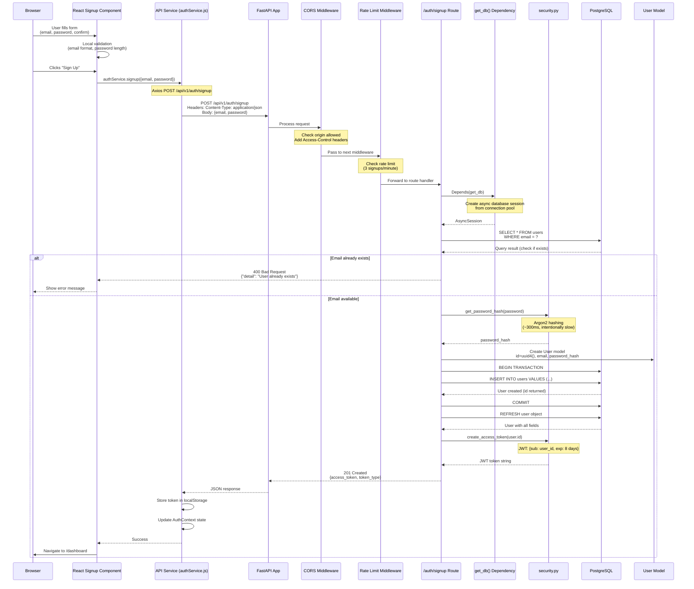
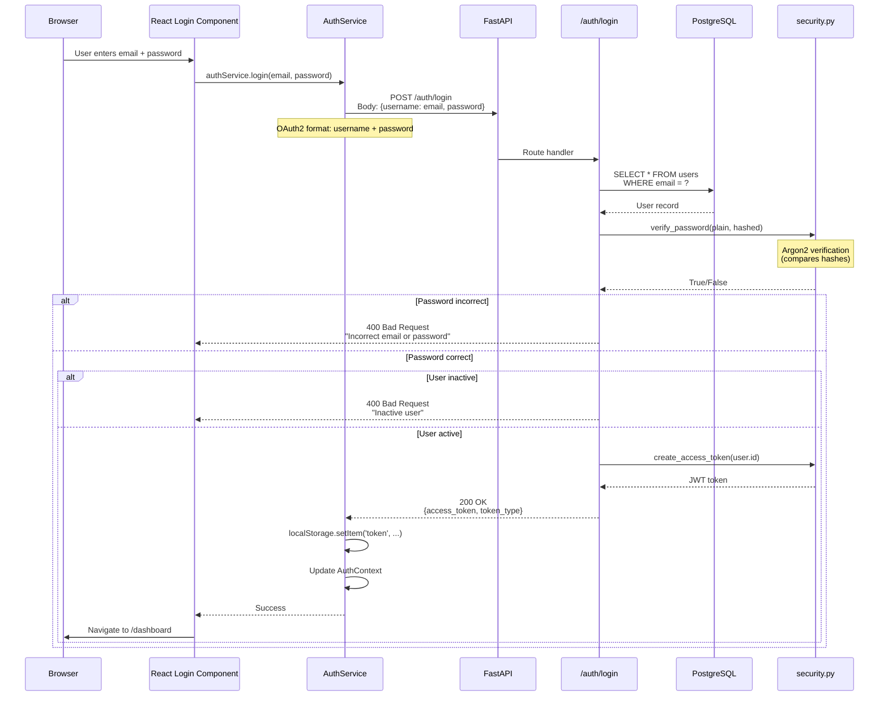
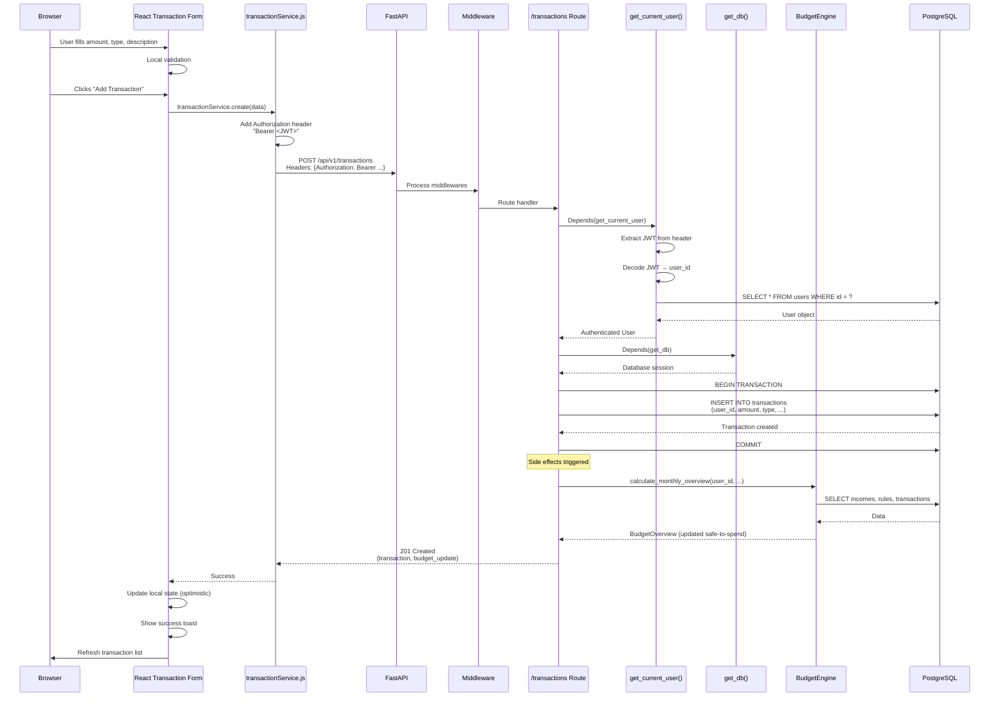
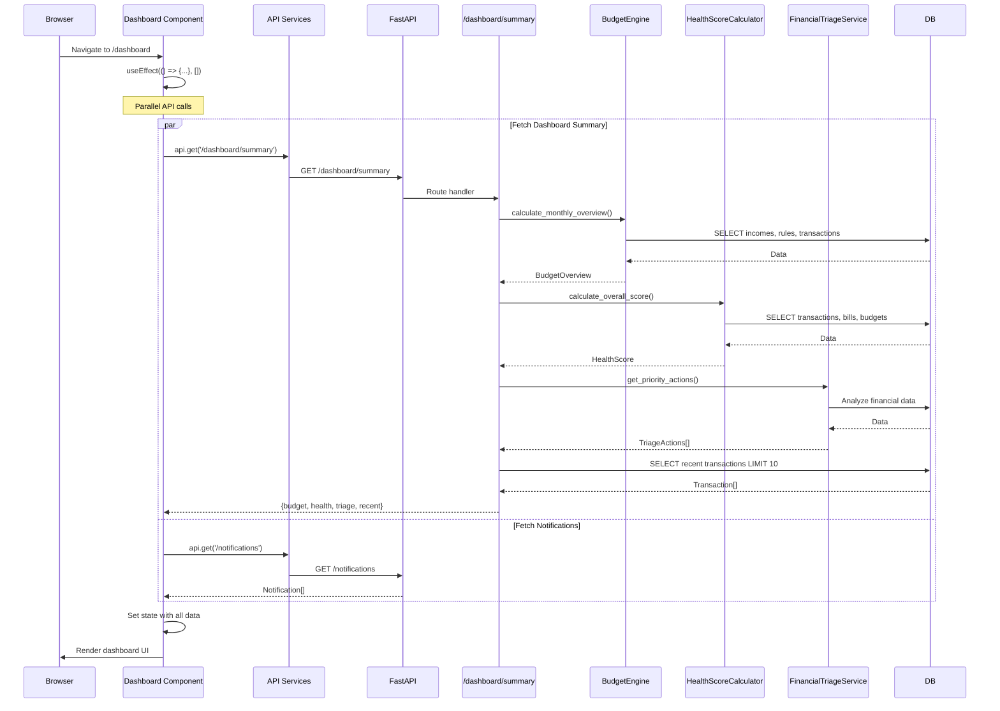

# Chapter 3: Complete Request Flow Analysis

> **Industrial-Level**: This chapter traces EVERY step of critical request flows through the entire WealthSync stack, from React component click to database write and back.

---

## What is a Request Flow?

**Request Flow** = The complete journey of a user action through your system.

**Analogy**: Ordering food at a restaurant

1. You tell waiter your order (Frontend → API request)
2. Waiter writes it down (Middleware processes request)
3. Waiter gives order to kitchen (Route → Service)
4. Kitchen cooks food (Business logic executes)
5. Kitchen stores receipt (Database write)
6. Waiter brings food back (Response returns to frontend)
7. You eat (Frontend displays result)

---

## Flow 1: User Signup (Complete End-to-End)

### High-Level Overview

```
User fills signup form
  ↓
Clicks "Sign Up" button
  ↓
React component validates locally
  ↓
API request sent to backend
  ↓
Backend validates + hashes password
  ↓
Creates user in database
  ↓
Generates JWT token
  ↓
Returns token to frontend
  ↓
Frontend stores token + redirects to dashboard
```

### Detailed Sequence Diagram



### Line-by-Line Code Walkthrough

#### Frontend: Signup Component

```javascript
// frontend/src/pages/Signup.jsx (simplified)

import { useState } from 'react';
import { useNavigate } from 'react-router-dom';
import { useAuth } from '../lib/auth';

function Signup() {
  // Line 1-3: Local state for form fields
  const [email, setEmail] = useState('');        // Controlled input
  const [password, setPassword] = useState('');  // Controlled input
  const [loading, setLoading] = useState(false); // Loading state

  // Line 4-5: Hooks for navigation and auth context
  const navigate = useNavigate();                // React Router navigation
  const { signup } = useAuth();                  // AuthContext method

  // Line 6-30: Form submission handler
  async function handleSubmit(e) {
    e.preventDefault();  // Line 7: Prevent default form submission (page reload)

    // Line 8-11: Client-side validation (fail fast before API call)
    if (!email || !password) {
      alert('Fill all fields');
      return;  // Stop execution if validation fails
    }

    setLoading(true);  // Line 12: Disable button, show spinner

    try {
      // Line 13-20: API call through AuthContext
      await signup(email, password);
      // ↑ This calls authService.signup() which makes HTTP request
      // If successful, AuthContext automatically:
      // 1. Stores JWT in localStorage
      // 2. Updates user state in context
      // 3. Sets authenticated = true

      navigate('/dashboard');  // Line 21: Redirect to dashboard

    } catch (error) {
      // Line 22-25: Error handling
      const message = error.response?.data?.detail || 'Signup failed';
      alert(message);  // Show error to user
    } finally {
      setLoading(false);  // Line 26: Re-enable button
    }
  }

  return (/* JSX form */);
}
```

#### Backend: Auth Route Handler

```python
# backend/app/api/v1/auth.py

# Line 1-18: Imports (dependencies, types, database, security)
from typing import Any, Annotated
from datetime import timedelta
from fastapi import APIRouter, Depends, HTTPException
from sqlalchemy.ext.asyncio import AsyncSession
from sqlalchemy.future import select
from app.core import security
from app.core.config import settings
from app.core.database import get_db
from app.models.user import User
from app.schemas.auth import UserCreate, Token

router = APIRouter()  # Line 17: Create router for /auth endpoints

# Line 20-63: Signup endpoint
@router.post("/signup", response_model=Token, status_code=201)
# ↑ Line 20: Decorator defines HTTP method, path, response model, status code
@limiter.limit(settings.RATE_LIMIT_SIGNUP)
# ↑ Line 21: Rate limiting (3 requests/minute from same IP)

async def create_user(
    request: Request,  # Line 23: Needed for rate limiter
    user_in: UserCreate,  # Line 24: Pydantic validates request body automatically
    db: Annotated[AsyncSession, Depends(get_db)]  # Line 25: DI injects database session
) -> Any:
    """Create new user and return access token."""

    # Line 30-37: Check if user already exists
    result = await db.execute(
        select(User).filter(User.email == user_in.email)
    )
    # ↑ SQLAlchemy ORM translates to: SELECT * FROM users WHERE email = ?
    # ↑ 'await' because database I/O is async (non-blocking)

    existing_user = result.scalars().first()
    # ↑ Extract first User object from result (or None if not found)

    if existing_user:
        # Line 32-36: User exists, return 400 error
        raise HTTPException(
            status_code=400,
            detail="The user with this email already exists in the system.",
        )
        # ↑ FastAPI catches exception, converts to JSON error response

    try:
        # Line 40-48: Create user
        user = User(
            email=user_in.email,
            password_hash=security.get_password_hash(user_in.password),
            # ↑ Hash password with Argon2 (line 42)
            # ↑ NEVER store plaintext passwords!
            is_active=True
        )
        # ↑ Create User model instance (not yet saved to DB)

        db.add(user)  # Line 45: Stage user for insertion
        await db.commit()  # Line 46: Execute INSERT, commit transaction
        await db.refresh(user)  # Line 47: Reload user from DB (gets generated ID)

        # Line 49-56: Generate JWT token
        access_token_expires = timedelta(minutes=settings.ACCESS_TOKEN_EXPIRE_MINUTES)
        # ↑ Line 49: Token valid for 8 days (11520 minutes)

        return {
            "access_token": security.create_access_token(
                user.id,  # Subject claim (who this token is for)
                expires_delta=access_token_expires
            ),
            "token_type": "bearer",  # OAuth2 standard
        }
        # ↑ FastAPI serializes dict to JSON automatically
        # ↑ response_model=Token validates response matches Token schema

    except Exception as e:
        # Line 57-63: Error handling
        await db.rollback()  # Line 59: Undo database changes
        raise HTTPException(
            status_code=500,
            detail=f"Error creating user: {str(e)}"
        )
```

### Key Concepts in This Flow

1. **Controlled Components**: React state synced with input values
2. **Client-Side Validation**: Fail fast before API call
3. **Dependency Injection**: `Depends(get_db)` provides database session
4. **Pydantic Validation**: `user_in: UserCreate` auto-validates request body
5. **ORM**: SQLAlchemy translates Python to SQL
6. **Password Hashing**: Argon2 (one-way, can't reverse)
7. **JWT Generation**: Stateless authentication token
8. **Transaction Management**: `commit()` or `rollback()`
9. **Error Propagation**: HTTPException → JSON error response

---

## Flow 2: User Login (Authentication)

### Sequence Diagram



### Code Walkthrough

```python
# Line 65-91: Login endpoint

@router.post("/login", response_model=Token)
@limiter.limit(settings.RATE_LIMIT_LOGIN)  # 5 attempts/minute
async def login_access_token(
    request: Request,
    db: Annotated[AsyncSession, Depends(get_db)],
    form_data: Annotated[OAuth2PasswordRequestForm, Depends()]
    # ↑ OAuth2 standard: expects 'username' and 'password' fields
) -> Any:
    """OAuth2 compatible token login."""

    # Line 75-76: Fetch user by email
    result = await db.execute(
        select(User).filter(User.email == form_data.username)
        # ↑ OAuth2 calls it 'username' but we treat it as email
    )
    user = result.scalars().first()

    # Line 78-79: Verify credentials
    if not user or not security.verify_password(form_data.password, user.password_hash):
        # ↑ Check user exists AND password matches
        # ↑ Short-circuit evaluation: if no user, don't verify password
        raise HTTPException(status_code=400, detail="Incorrect email or password")
        # ↑ Generic message (don't reveal if email exists for security)

    # Line 81-82: Check if user is active
    if not user.is_active:
        raise HTTPException(status_code=400, detail="Inactive user")

    # Line 84-91: Generate and return token
    access_token_expires = timedelta(minutes=settings.ACCESS_TOKEN_EXPIRE_MINUTES)
    return {
        "access_token": security.create_access_token(
            user.id,
            expires_delta=access_token_expires
        ),
        "token_type": "bearer",
    }
```

**Security Notes**:

- Password verification is intentionally slow (~300ms) to prevent brute force
- Generic error message (don't reveal if email exists)
- Rate limiting prevents credential stuffing attacks
- JWT is signed (can't be tampered with)

---

## Flow 3: Creating a Transaction (Authenticated Request)

### Sequence Diagram



### Code Walkthrough

#### Frontend: Transaction Creation

```javascript
// frontend/src/services/transactions.js

import api from "./api"; // Axios instance with auth interceptor

export const transactionService = {
  async create(data) {
    // Line 1-10: Create transaction via API
    const response = await api.post("/transactions", data);
    // ↑ api is configured with:
    //   - Base URL: http://localhost:8000/api/v1
    //   - Request interceptor: Adds Authorization header
    //   - Response interceptor: Handles errors, token refresh

    return response.data;
    // ↑ Returns: {id, amount, type, created_at, ...}
  },
};

// frontend/src/lib/api.js - Axios configuration

import axios from "axios";

const api = axios.create({
  baseURL: import.meta.env.VITE_API_BASE_URL || "http://localhost:8000/api/v1",
});

// Request interceptor: Add JWT to every request
api.interceptors.request.use((request) => {
  const token = localStorage.getItem("token");
  if (token) {
    request.headers.Authorization = `Bearer ${token}`;
    // ↑ Adds: Authorization: Bearer eyJhbGci0iJIUz...
  }
  return request;
});

// Response interceptor: Handle errors globally
api.interceptors.response.use(
  (response) => response, // Pass through successful responses
  (error) => {
    if (error.response?.status === 401) {
      // Unauthorized: logout and redirect to login
      localStorage.removeItem("token");
      window.location.href = "/login";
    }
    return Promise.reject(error);
  },
);
```

#### Backend: Transaction Creation Endpoint

```python
# backend/app/api/v1/transactions.py (simplified)

@router.post("", response_model=TransactionResponse, status_code=201)
async def create_transaction(
    transaction_in: TransactionCreate,  # Body validation
    current_user: Annotated[User, Depends(deps.get_current_user)],  # Auth
    db: Annotated[AsyncSession, Depends(get_db)]  # Database
):
    """
    Create new transaction.

    Flow:
    1. Validate request body (Pydantic automatic)
    2. Authenticate user (Depends automatic)
    3. Force user_id from token (security)
    4. Create transaction
    5. Recalculate budget (side effect)
    6. Return created transaction
    """

    # Line 1-7: Create transaction model
    transaction = Transaction(
        user_id=current_user.id,  # ← Force from authenticated user
        # ↑ NEVER trust user_id from request body!
        # ↑ Always get from JWT token
        amount=transaction_in.amount,
        type=transaction_in.type,
        description=transaction_in.description,
        category_id=transaction_in.category_id,
        occurred_at=transaction_in.occurred_at or datetime.utcnow()
    )

    # Line 8-11: Save to database
    db.add(transaction)
    await db.commit()  # Execute INSERT
    await db.refresh(transaction)  # Reload with generated fields

    # Line 12-15: Trigger side effects (budget recalculation)
    # This could be async background job in production
    # For now, calculate synchronously

    return transaction
    # ↑ FastAPI serializes using TransactionResponse schema
    # ↑ Only exposes approved fields (not password_hash, etc.)
```

### Authentication Flow (get_current_user)

```python
# backend/app/api/deps.py

async def get_current_user(
    token: Annotated[str, Depends(oauth2_scheme)],
    # ↑ oauth2_scheme extracts token from Authorization header
    # ↑ Format: "Authorization: Bearer <token>"
    db: Annotated[AsyncSession, Depends(get_db)]
) -> User:
    """
    Dependency that authenticates user from JWT.

    Flow:
    1. Extract token from Authorization header
    2. Decode JWT (validate signature)
    3. Extract user_id from 'sub' claim
    4. Fetch user from database
    5. Return User object (or raise 401 if invalid)
    """

    credentials_exception = HTTPException(
        status_code=status.HTTP_401_UNAUTHORIZED,
        detail="Could not validate credentials",
        headers={"WWW-Authenticate": "Bearer"},
    )

    try:
        # Line 1-5: Decode JWT
        payload = jwt.decode(
            token,
            settings.SECRET_KEY,
            algorithms=[security.ALGORITHM]  # HS256
        )
        # ↑ If signature invalid, raises JWTError
        # ↑ If token expired, raises JWTError

        user_id: str = payload.get("sub")  # Line 6: Extract user ID
        if user_id is None:
            raise credentials_exception

    except JWTError:
        # Line 7-8: Token invalid or expired
        raise credentials_exception

    # Line 9-13: Fetch user from database
    result = await db.execute(
        select(User).filter(User.id == user_id)
    )
    user = result.scalars().first()

    if user is None:
        # Line 14-15: User deleted after token was issued
        raise credentials_exception

    return user
    # ↑ User object injected into route handler
```

**Key Security Points**:

1. **JWT Signature**: Can't forge tokens (requires SECRET_KEY)
2. **Token in Header**: Not in URL (prevents logging token)
3. **User ID from Token**: Never trust client-provided user_id
4. **Expiration**: Tokens expire (8 days)
5. **Stateless**: No server-side session storage

---

## Flow 4: Dashboard Loading (Complex Multi-Request)

### Sequence Diagram



### Code: Dashboard Route Handler

```python
# backend/app/api/v1/dashboard.py

@router.get("/summary", response_model=DashboardSummary)
async def get_dashboard_summary(
    current_user: Annotated[User, Depends(deps.get_current_user)],
    db: Annotated[AsyncSession, Depends(get_db)],
    period: Literal["week", "month", "year"] = "month"
):
    """
    Aggregate dashboard data: budget, health score, triage, recent activity.

    This is a READ-HEAVY endpoint:
    - Multiple database queries
    - Complex calculations
    - Ideal candidate for caching in production
    """

    # Line 1-20: Fetch all required data
    # In production, use asyncio.gather() for parallel queries

    # Budget calculation
    budget_overview = await BudgetEngine.calculate_monthly_overview(
        db,
        current_user.id,
        datetime.now().year,
        datetime.now().month
    )

    # Health score calculation
    health_score = await HealthScoreCalculator.calculate_overall_score(
        db,
        current_user.id
    )

    # Financial triage (priority actions)
    triage_actions = await FinancialTriageService.get_priority_actions(
        db,
        current_user.id
    )

    # Recent transactions
    result = await db.execute(
        select(Transaction)
        .filter(Transaction.user_id == current_user.id)
        .order_by(Transaction.occurred_at.desc())
        .limit(10)
    )
    recent_transactions = result.scalars().all()

    # Category breakdown for chart
    category_result = await db.execute(
        select(
            BudgetCategory.name,
            func.sum(Transaction.amount).label('total')
        )
        .join(Transaction)
        .filter(Transaction.user_id == current_user.id)
        .filter(Transaction.type == "EXPENSE")
        .group_by(BudgetCategory.name)
    )
    category_breakdown = category_result.all()

    return DashboardSummary(
        budget=budget_overview,
        health_score=health_score,
        triage_actions=triage_actions,
        recent_transactions=recent_transactions,
        category_breakdown=category_breakdown
    )
```

**Performance Optimization**:

- **Caching**: Cache response for 5 minutes (reduce DB load)
- **Parallel Queries**: Use `asyncio.gather()` instead of sequential
- **Eager Loading**: Use `selectinload()` for relationships
- **Pagination**: Limit recent transactions to 10

---

## Key Takeaways

### Request Flow Patterns

1. **Frontend Validation → Backend Validation**
   - Fail fast on client (better UX)
   - Always validate on server (security)

2. **Middleware Stack** (CORS → Rate Limit → Auth → Route)
   - Processed in order
   - Each can short-circuit request

3. **Dependency Injection** (`Depends()`)
   - Clean separation of concerns
   - Automatic resource management
   - Testable (can mock dependencies)

4. **Authentication Flow**
   - JWT in Authorization header
   - Decoded and validated on every request
   - User object injected into route

5. **Database Transactions**
   - `BEGIN` → `INSERT/UPDATE` → `COMMIT` (or `ROLLBACK` on error)
   - Atomic operations (all or nothing)

6. **Error Propagation**
   - Backend: `raise HTTPException()` → JSON error
   - Frontend: Axios interceptor catches → Show toast/alert

7. **Side Effects**
   - Transaction creation triggers budget recalculation
   - Could be async background job in production
   - Ensures data consistency

---

## Navigation

**Previous Chapter**: [← Chapter 2: System Design & Architecture Patterns](./Chapter_02_System_Design_Patterns.md)

**Next Chapter**: [→ Chapter 4: Database Schema Design](./Chapter_04_Database_Schema.md)

**Back to Index**: [📚 Tutorial Home](./README.md)
