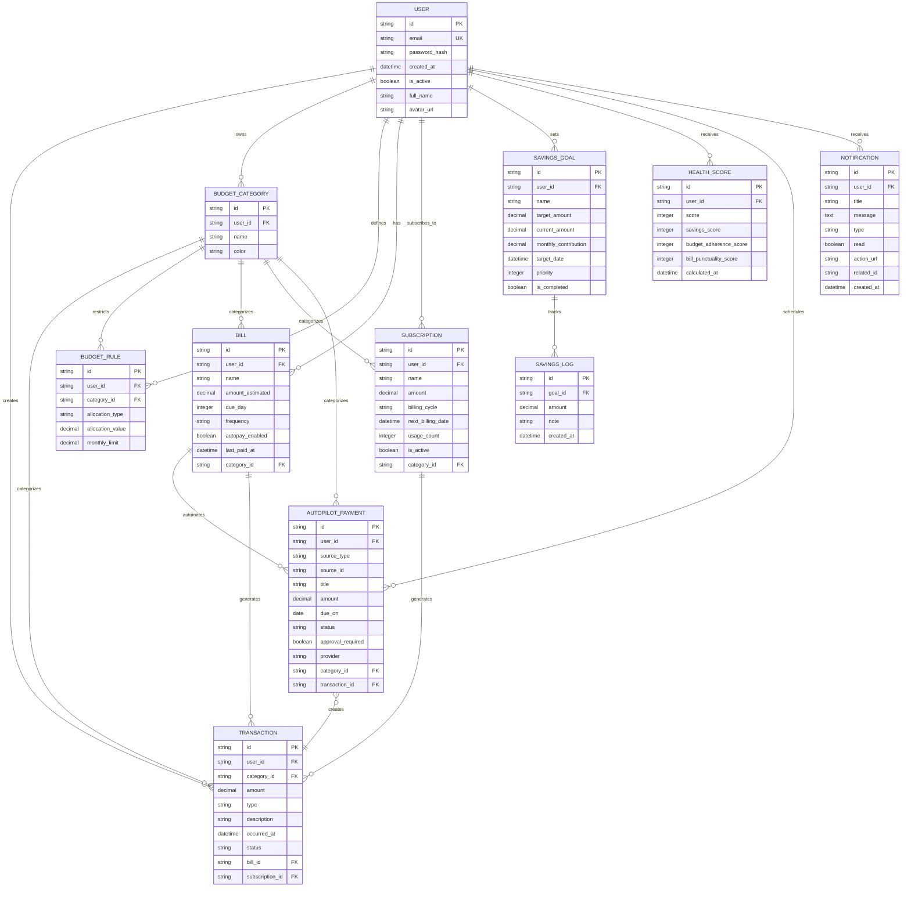

# Chapter 4: Database Design & Schema Architecture

## Starting From First Principles: What Data Do We Actually Need?

Before we write a single line of SQL, let's think about our domain:

### Core Entities We're Modeling

1. **Users** — people using the app
2. **Transactions** — individual money movements (income/expense)
3. **Categories** — spending categories (groceries, rent, entertainment)
4. **Budget Rules** — monthly spending limits per category
5. **Bills** — recurring obligations (rent, utilities)
6. **Subscriptions** — recurring services (Netflix, Gym)
7. **Savings Goals** — target amounts to save
8. **Health Scores** — historical financial health snapshots
9. **Autopilot Payments** — scheduled payments awaiting approval
10. **Notifications** — user alerts (bill reminders, budget warnings)

### Key Relationships

- A **User** has many **Transactions**, **Bills**, **Goals**, etc.
- A **Transaction** belongs to a **Category**
- A **Budget Rule** applies to a **Category**
- A **Bill** can be linked to **Autopilot Payments**
- A **Savings Goal** has many **Contribution Logs**

---

## Entity-Relationship Diagram



---

## Table Designs: Line-by-Line Breakdown

### 1. Users Table

```python
class User(Base):
    __tablename__ = "users"

    id = Column(String, primary_key=True, default=lambda: str(uuid4()))
    email = Column(String, unique=True, index=True, nullable=False)
    password_hash = Column(String, nullable=False)
    created_at = Column(DateTime, default=datetime.utcnow)
    is_active = Column(Boolean, default=True)
    full_name = Column(String, nullable=True)
    avatar_url = Column(String, nullable=True)
```

**Design Decisions**:

**`id = Column(String, primary_key=True, default=lambda: str(uuid4()))`**

- **Why UUID strings?** UUIDs prevent ID enumeration attacks (can't guess user IDs)
- **Why strings?** Easier to work with in JSON APIs vs. binary UUIDs
- **Trade-off**: Larger index size (36 chars) vs. auto-incrementing integers (4-8 bytes)
- **Alternative**: Sequential integers — faster joins, but exposes count of users

**`email = Column(String, unique=True, index=True, nullable=False)`**

- **Why unique?** Email is login identifier
- **Why index?** Fast lookups during authentication (`SELECT ... WHERE email = ?`)
- **Why not nullable?** Every user must have an email

**`password_hash = Column(String, nullable=False)`**

- **Never store plain passwords!** Always hash with Argon2
- **Why String?** Hash output is base64-encoded string

**`created_at = Column(DateTime, default=datetime.utcnow)`**

- **Why `utcnow`?** Always store timestamps in UTC to avoid timezone confusion
- **Trade-off**: Need to convert to user's timezone in frontend

**`is_active = Column(Boolean, default=True)`**

- **Why?** Soft-delete pattern — mark users inactive instead of deleting
- **Alternative**: Hard delete — loses transactionhistory, complicates foreign keys

**`full_name = Column(String, nullable=True)`**

- **Why nullable?** Optional field, user might not provide
- **Alternative**: Separate `first_name`, `last_name` — better for sorting, but overkill here

---

### 2. Transactions Table

```python
class Transaction(Base):
    __tablename__ = "transactions"

    id = Column(String, primary_key=True, default=lambda: str(uuid4()))
    user_id = Column(String, index=True, nullable=False)
    category_id = Column(String, ForeignKey("budget_categories.id"), nullable=True)
    amount = Column(Numeric(14,2), nullable=False)
    type = Column(String, nullable=False) # INCOME or EXPENSE
    description = Column(String, nullable=True)
    occurred_at = Column(DateTime, default=datetime.utcnow)
    created_at = Column(DateTime, default=datetime.utcnow)

    # Bill tracking fields
    status = Column(String, default="completed") # pending, completed, cancelled
    bill_id = Column(String, ForeignKey("bills.id"), nullable=True)
    subscription_id = Column(String, ForeignKey("subscriptions.id"), nullable=True)

    category = relationship("BudgetCategory", back_populates="transactions")
```

**Design Decisions**:

**`amount = Column(Numeric(14,2), nullable=False)`**

- **Why Numeric?** Exact decimal precision for money (never use `float` for currency!)
- **Why (14,2)?** Up to 999,999,999,999.99 — enough for most personal finance
- **Trade-off**: Slower arithmetic than integers, but correctness is more important

**`type = Column(String, nullable=False)`**

- **Why String?** Stores "INCOME" or "EXPENSE"
- **Alternative**: Boolean `is_income` — faster, but less extensible (what about transfers?)
- **Alternative**: Enum type — more rigid, requires migration to add types

**`occurred_at` vs `created_at`**

- **`occurred_at`**: When the transaction actually happened (user-entered)
- **`created_at`**: When the record was saved to database
- **Why both?** User might log yesterday's coffee today

**`category_id = Column(..., nullable=True)`**

- **Why nullable?** User might not categorize immediately
- **Trade-off**: Need to handle `null` category in queries

**`bill_id` and `subscription_id`**

- **Why?** Link transactions to their source (bill payment, subscription charge)
- **Why nullable?** Most transactions aren't from bills/subscriptions

**`relationship("BudgetCategory", back_populates="transactions")`**

- **What is this?** SQLAlchemy ORM relationship — lets you do `transaction.category.name`
- **Not a foreign key**: This is Python-level navigation, not database constraint
- **Why?** Cleaner code than manual joins

---

### 3. Budget Categories & Rules

```python
class BudgetCategory(Base):
    __tablename__ = "budget_categories"

    id = Column(String, primary_key=True, default=lambda: str(uuid4()))
    user_id = Column(String, index=True, nullable=False)
    name = Column(String, nullable=False)
    color = Column(String, nullable=True)

    rules = relationship("BudgetRule", back_populates="category", cascade="all, delete-orphan")
    transactions = relationship("Transaction", back_populates="category")

class BudgetRule(Base):
    __tablename__ = "budget_rules"

    id = Column(String, primary_key=True, default=lambda: str(uuid4()))
    user_id = Column(String, index=True, nullable=False)
    category_id = Column(String, ForeignKey("budget_categories.id"), nullable=False)
    allocation_type = Column(String, nullable=False) # FIXED or PERCENT
    allocation_value = Column(Numeric(14,2), nullable=False)
    monthly_limit = Column(Numeric(14,2), nullable=True)

    category = relationship("BudgetCategory", back_populates="rules")
```

**Design Decisions**:

**Why separate BudgetCategory and BudgetRule tables?**

- **Normalization**: Category is the tag, Rule is the spending policy
- **Flexibility**: Can have multiple rules per category (though app currently uses 1:1)
- **Alternative**: Single table — simpler queries, but limits future features

**`cascade="all, delete-orphan"`**

- **What**: When category is deleted, delete all its rules automatically
- **Why**: Prevents orphaned rules pointing to non-existent categories
- **Alternative**: Set `category_id` to `NULL` — leaves dangling rules

**`allocation_type = "FIXED" | "PERCENT"`**

- **FIXED**: Allocate $500/month to groceries
- **PERCENT**: Allocate 30% of income to housing
- **Why String?**: Easy to add new types later (e.g., "ROLLOVER")

---

### 4. Bills Table

```python
class Bill(Base):
    __tablename__ = "bills"

    id = Column(String, primary_key=True, default=lambda: str(uuid4()))
    user_id = Column(String, index=True, nullable=False)
    name = Column(String, nullable=False)
    amount_estimated = Column(Numeric(14,2), nullable=False)
    due_day = Column(Integer, nullable=False) # 1-31
    frequency = Column(String, default="monthly")
    autopay_enabled = Column(Boolean, default=False)
    last_paid_at = Column(DateTime, nullable=True)
    category_id = Column(String, ForeignKey("budget_categories.id"), nullable=True)

    category = relationship("BudgetCategory", foreign_keys=[category_id])
```

**Design Decisions**:

**`due_day = Column(Integer, nullable=False)`**

- **Why Integer (1-31)?** Bills recur monthly on same day (e.g., rent on 1st)
- **Edge case**: Day 31 in a 30-day month → clamped to last day
- **Alternative**: Store full `next_due_date` — need to recalculate monthly

**`amount_estimated`**

- **Why "estimated"?** Utility bills vary month-to-month
- **Use case**: For budgeting projections, not exact charge

**`last_paid_at`**

- **Why?**: Track if this month's bill is paid
- **Logic**: If `last_paid_at > start_of_month`, bill is paid this cycle

---

### 5. Subscriptions Table

```python
class Subscription(Base):
    __tablename__ = "subscriptions"

    id = Column(String, primary_key=True, default=lambda: str(uuid4()))
    user_id = Column(String, index=True, nullable=False)
    name = Column(String, nullable=False)
    amount = Column(Numeric(14,2), nullable=False)
    billing_cycle = Column(String, default="monthly") # monthly, yearly
    next_billing_date = Column(DateTime, nullable=True)
    usage_count = Column(Integer, default=0) # For "Cost per usage" analysis
    is_active = Column(Boolean, default=True)
    category_id = Column(String, ForeignKey("budget_categories.id"), nullable=True)
```

**Design Decisions**:

**Bills vs. Subscriptions — Why separate tables?**

- **Semantics**: Bills are obligations (electricity), subscriptions are optional services (Spotify)
- **Different fields**: Subscriptions have `usage_count`, bills have `due_day`
- **Alternative**: Single `recurring_charges` table with type discriminator — less clear

**`usage_count`**

- **Why?**: Track how often user uses the service
- **Use case**: "You paid $15 for Netflix but only watched twice → $7.50/watch"

---

### 6. Savings Goals & Logs

```python
class SavingsGoal(Base):
    __tablename__ = "savings_goals"

    id = Column(String, primary_key=True, default=lambda: str(uuid4()))
    user_id = Column(String, index=True, nullable=False)
    name = Column(String, nullable=False)
    target_amount = Column(Numeric(14,2), nullable=False)
    current_amount = Column(Numeric(14,2), default=0)
    monthly_contribution = Column(Numeric(14,2), default=0)
    target_date = Column(DateTime, nullable=True)
    priority = Column(Integer, default=5) # 1-10
    is_completed = Column(Boolean, default=False)
    created_at = Column(DateTime, default=datetime.utcnow)

    logs = relationship("SavingsLog", back_populates="goal", cascade="all, delete-orphan")

class SavingsLog(Base):
    __tablename__ = "savings_logs"

    id = Column(String, primary_key=True, default=lambda: str(uuid4()))
    goal_id = Column(String, ForeignKey("savings_goals.id"), nullable=False)
    amount = Column(Numeric(14,2), nullable=False)
    note = Column(String, nullable=True)
    created_at = Column(DateTime, default=datetime.utcnow)

    goal = relationship("SavingsGoal", back_populates="logs")
```

**Design Decisions**:

**Why separate SavingsLog table?**

- **Audit trail**: Track every contribution over time
- **Denormalized `current_amount`**: Could calculate from sum of logs, but slow
- **Trade-off**: Update two places (goal.current_amount + insert log), but faster reads

---

### 7. Other Tables (Abbreviated)

**FinancialHealthScore**

- Stores historical health scores for trend charts
- Separate record per calculation (e.g., daily snapshots)

**AutopilotPayment**

- Scheduled payments awaiting user approval
- Links to source (bill/subscription) via `source_type` + `source_id`
- Unique constraint: `(user_id, source_type, source_id, due_on)` — prevents duplicate payments

**Notification**

- User alerts (bill due soon, payment succeeded)
- `type` field: `bill_reminder`, `bill_overdue`, `payment_success`, etc.

---

## Indexing Strategy

### Why Index?

Indexes speed up queries but slow down writes. Index fields used in `WHERE`, `JOIN`, and `ORDER BY`.

### Indexes in WealthSync:

```sql
CREATE INDEX idx_users_email ON users(email); -- Login lookups
CREATE INDEX idx_transactions_user_id ON transactions(user_id); -- User's transactions
CREATE INDEX idx_transactions_occurred_at ON transactions(occurred_at); -- Monthly filters
CREATE INDEX idx_bills_user_id ON bills(user_id);
CREATE INDEX idx_autopilot_payments_due_on ON autopilot_payments(due_on); -- Find due payments
```

**Why user_id everywhere?**

- Most queries filter by `user_id` (multi-tenant pattern)
- Without index: Full table scan (slow for millions of records)

---

## Migration Workflow with Alembic

### Initial Setup

```bash
# Initialize Alembic
alembic init alembic

# Create first migration
alembic revision --autogenerate -m "Initial schema"

# Apply migration
alembic upgrade head
```

### How Alembic Works

1. **Detects model changes**: Compares SQLAlchemy models to database schema
2. **Generates migration**: Writes `upgrade()` and `downgrade()` functions
3. **Versions migrations**: Each migration is numbered (e.g., `001_initial.py`, `002_add_autopilot.py`)
4. **Tracks state**: `alembic_version` table stores current migration ID

### Example Migration

```python
# alembic/versions/001_initial.py
def upgrade():
    op.create_table(
        'users',
        sa.Column('id', sa.String(), nullable=False),
        sa.Column('email', sa.String(), nullable=False),
        sa.Column('password_hash', sa.String(), nullable=False),
        sa.PrimaryKeyConstraint('id'),
        sa.UniqueConstraint('email')
    )

def downgrade():
    op.drop_table('users')
```

---

## Normalization vs. Denormalization

### Normalized (What We Did)

- **Separate tables** for categories, transactions, bills
- **No redundant data** (category name stored once)
- **Pros**: Easy to update (change category name in one place)
- **Cons**: Requires joins (slower for reads)

### Denormalized Alternative

- Store category **name** directly in transactions table
- **Pros**: Faster reads (no join needed)
- **Cons**: Updating category name requires updating ALL transactions

**Our Choice**: Normalized — financial data changes infrequently, read speed less critical than data integrity.

---

## Key Takeaways

1. **UUIDs as primary keys**: Security over performance
2. **Numeric for money**: Precision over speed
3. **UTC timestamps**: Consistency over convenience
4. **Nullable foreign keys**: Flexibility over strictness
5. **Separate logs tables**: Audit trails over simplicity
6. **Index user_id everywhere**: Multi-tenant performance pattern
7. **Alembic migrations**: Version control for schema changes

**Next Chapter**: Backend architecture — how FastAPI uses these models.

---

## Questions to Consider

1. **Should we use composite primary keys** (e.g., `user_id` + `transaction_id`)?
   - **No**: Complicates foreign key references
2. **Should we add soft-delete `deleted_at` to all tables?**
   - **Maybe**: Better audit trail, but complicates queries (`WHERE deleted_at IS NULL`)
3. **Should we partition tables by user_id for massive scale?**
   - **Later**: Premature optimization, adds complexity

The schema we've built balances simplicity, flexibility, and performance for a personal finance app serving thousands of users. For millions of users, we'd revisit partitioning and read replicas.

## Navigation

**Previous Chapter**: [← Chapter 3: Complete Request Flow Analysis](./Chapter_03_Complete_Request_Flows.md)

**Next Chapter**: [→ Chapter 5: SQLAlchemy Models - Line by Line](./Chapter_05_SQLAlchemy_Models.md)

**Back to Index**: [📚 Tutorial Home](./README.md)
