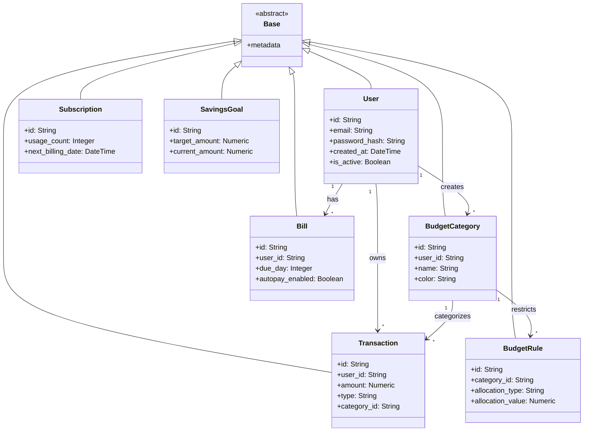

# Chapter 5: SQLAlchemy Models - Line by Line

> **Complete Deep Dive**: This chapter explains EVERY line of code in ALL WealthSync SQLAlchemy models with design decisions, rationales, and alternatives.

---

## What Are Models?

**Models** = Python classes that represent database tables

**Analogy**: Models are blueprints for data

- `class User` = Blueprint for "users" table
- `User(email="test@test.com")` = Build a user from blueprint
- `db.add(user)` = Save user to database

---

## Model Hierarchy



---

## File 1: app/models/user.py

### Complete File with Line-by-Line Explanation

```python
# Line 1: Import UUID generator
from uuid import uuid4
# ↑ uuid4() generates random UUIDs like: "a3b8c9d0-1234-5678-9abc-def012345678"
# ↑ Why? UUIDs prevent ID enumeration attacks (can't guess IDs)

# Line 2-3: Import SQLAlchemy column types
from sqlalchemy import Column, String, DateTime, Boolean
# ↑ Column: Base class for table columns
# ↑ String: Variable-length text (VARCHAR in SQL)
# ↑ DateTime: Timestamp (TIMESTAMP in SQL)
# ↑ Boolean: True/False (BOOLEAN in SQL)

# Line 4: Import current datetime function
from datetime import datetime
# ↑ For default timestamps (created_at = now())

# Line 5: Import base class for all models
from app.core.database import Base
# ↑ Base = declarative_base() from SQLAlchemy
# ↑ All models inherit from Base to become ORM models

# Line 6-16: User model definition
class User(Base):
    """
    User account model storing authentication and profile data.

    Design Pattern: Active Record (via SQLAlchemy ORM)
    Security: Passwords NEVER stored in plaintext (only hash)
    """

    # Line 7: Define table name in database
    __tablename__ = "users"
    # ↑ SQLAlchemy creates table named "users" (not "User")
    # ↑ Convention: Plural, lowercase table names

    # Line 9: Primary key column
    id = Column(String, primary_key=True, default=lambda: str(uuid4()))
    # ↑ String: Store UUID as text (36 characters)
    # ↑ primary_key=True: This column uniquely identifies each row
    # ↑ default=lambda: str(uuid4()): Auto-generate UUID when creating new user
    # ↑ Why lambda? Ensures NEW UUID per row (not same UUID for all)
    #
    # DESIGN DECISION: UUID vs Auto-Increment Integer
    # ✅ UUID Pros: Can't enumerate users, globally unique, distributed IDs
    # ❌ UUID Cons: Larger indexes (36 bytes vs 8), slightly slower joins
    # Alternative: id = Column(Integer, primary_key=True, autoincrement=True)

    # Line 10: Email column (unique identifier for login)
    email = Column(String, unique=True, index=True, nullable=False)
    # ↑ String: Email as text
    # ↑ unique=True: Two users can't have same email (enforced by database)
    # ↑ index=True: Create index for fast lookups (SELECT WHERE email = ?)
    # ↑ nullable=False: Email is required (can't be NULL)
    #
    # Why index=True?
    # - Login query: SELECT * FROM users WHERE email = ?
    # - Without index: Full table scan (O(n) - slow!)
    # - With index: B-tree search (O(log n) - fast!)

    # Line 11: Password hash column
    password_hash = Column(String, nullable=False)
    # ↑ Stores Argon2 hash (NOT plaintext password)
    # ↑ Example hash: "$argon2id$v=19$m=65536,t=3,p=4$..."
    # ↑ Why not nullable? Every user must have password
    #
    # CRITICAL SECURITY:
    # 1. NEVER store plaintext passwords
    # 2. Hash is ONE-WAY (can't reverse to get password)
    # 3. Verify login by comparing: hash(entered_password) == stored_hash

    # Line 12: Account creation timestamp
    created_at = Column(DateTime, default=datetime.utcnow)
    # ↑ DateTime: Stores date + time
    # ↑ default=datetime.utcnow: Auto-set to current UTC time on insert
    # ↑ Why UTC? Avoids timezone confusion (convert to local in frontend)
    # ↑ Why utcnow not utcnow()? Function reference vs immediate call
    #
    # DESIGN DECISION: UTC vs Local Time
    # ✅ UTC: Universal, no DST issues, easy to convert
    # ❌ Local: Ambiguous (which timezone?), breaks during DST changes

    # Line 13: Account active flag
    is_active = Column(Boolean, default=True)
    # ↑ Boolean: True (account active) or False (account disabled)
    # ↑ default=True: New accounts active by default
    #
    # DESIGN PATTERN: Soft Delete
    # - Instead of DELETE FROM users WHERE id = ?, do: UPDATE users SET is_active = false
    # - Pros: Preserve data, audit trail, can reactivate accounts
    # - Cons: Need WHERE is_active = true in queries

    # Line 14-15: Optional profile fields
    full_name = Column(String, nullable=True)
    avatar_url = Column(String, nullable=True)
    # ↑ nullable=True: These fields are OPTIONAL
    # ↑ User might not provide full name or avatar
    #
    # DESIGN DECISION: Separate first_name/last_name vs full_name
    # ✅ full_name: Simpler, works globally (not all cultures have "last name")
    # ❌ Separate fields: Better for sorting, but overkill for this app
```

### Key Concepts

1. **Declarative Base**: Inherit from `Base` to become ORM model
2. **Column Types**: Map to SQL types (String → VARCHAR, DateTime → TIMESTAMP)
3. **Constraints**: `unique`, `nullable`, `primary_key` enforced by database
4. **Defaults**: `default=` sets value if not provided
5. **Indexes**: Speed up queries on frequently searched fields

---

## File 2: app/models/transaction.py

### Complete File

```python
# Imports
from sqlalchemy import Column, String, Numeric, DateTime, ForeignKey
from sqlalchemy.orm import relationship
from uuid import uuid4
from datetime import datetime
from app.core.database import Base

class Transaction(Base):
    """
    Financial transaction model (income or expense).

    Core entity in personal finance app.
    Most frequently queried table (dashboard, reports, budgets all use this).
    """

    __tablename__ = "transactions"

    # Primary Key
    id = Column(String, primary_key=True, default=lambda: str(uuid4()))

    # User Foreign Key
    user_id = Column(String, index=True, nullable=False)
    # ↑ Links transaction to owner (user)
    # ↑ index=True: Fast queries like "get all my transactions"
    # ↑ Why not ForeignKey? We do soft deletes, so we allow orphaned transactions
    #
    # DESIGN DECISION: Hard vs Soft Foreign Keys
    # Hard FK: user_id = Column(ForeignKey("users.id"), ...)
    #   - Pros: Database enforces integrity
    #   - Cons: Can't delete users without cascading deletes
    # Soft FK (our choice): Just String, check in application
    #   - Pros: Flexibility, keep transaction history after user deletion
    #   - Cons: Must handle orphans in application code

    # Category Foreign Key
    category_id = Column(String, ForeignKey("budget_categories.id"), nullable=True)
    # ↑ Links to budget category (e.g., "Groceries", "Entertainment")
    # ↑ ForeignKey: Database enforces category exists
    # ↑ nullable=True: Transaction can be uncategorized
    #
    # Why nullable?
    # - User might log expense quickly without categorizing
    # - Category might be deleted (transaction keeps reference)

    # Amount
    amount = Column(Numeric(14,2), nullable=False)
    # ↑ Numeric(14,2): DECIMAL type in database
    # ↑ 14 total digits, 2 after decimal point
    # ↑ Max: 999,999,999,999.99
    #
    # CRITICAL: NEVER use Float for money!
    # Float: 0.1 + 0.2 = 0.30000000000000004 (binary precision errors)
    # Decimal: Exact precision (0.1 + 0.2 = 0.3)
    #
    # DESIGN DECISION: Numeric vs Integer (store cents)
    # Numeric(14,2): $123.45
    #   - Pros: Human-readable, easy to understand
    #   - Cons: Slower arithmetic than integers
    # Integer cents: 12345
    #   - Pros: Faster arithmetic, no precision issues
    #   - Cons: Must convert to/from dollars in application
    # Our choice: Numeric (readability > micro-optimization)

    # Transaction Type
    type = Column(String, nullable=False)  # "INCOME" or "EXPENSE"
    # ↑ Discriminator: Is this money in or money out?
    #
    # DESIGN DECISION: String vs Boolean vs Enum
    # String (our choice): "INCOME", "EXPENSE"
    #   - Pros: Readable in DB, easy to add types ("TRANSFER")
    #   - Cons: No type safety
    # Boolean (is_income):
    #   - Pros: Compact, fast
    #   - Cons: Can't add 3rd type
    # Enum:
    #   - Pros: Type-safe
    #   - Cons: Rigid, requires migration to add types

    # Description
    description = Column(String, nullable=True)
    # ↑ Optional note: "Coffee at Starbucks", "Paycheck"

    # Timestamps
    occurred_at = Column(DateTime, default=datetime.utcnow)
    created_at = Column(DateTime, default=datetime.utcnow)
    # ↑ occurred_at: When transaction actually happened (user can backdate)
    # ↑ created_at: When record was created in database
    #
    # Why two timestamps?
    # - User logs yesterday's coffee today
    # - occurred_at = yesterday (for reports)
    # - created_at = today (for audit)

    # Bill Tracking Fields
    status = Column(String, default="completed")  # pending, completed, cancelled
    bill_id = Column(String, ForeignKey("bills.id"), nullable=True)
    subscription_id = Column(String, ForeignKey("subscriptions.id"), nullable=True)
    # ↑ Link transaction to its source (if from bill payment or subscription)
    # ↑ nullable=True: Most transactions aren't from bills/subscriptions

    # ORM Relationship
    category = relationship("BudgetCategory", back_populates="transactions")
    # ↑ Python-level relationship (NOT database foreign key)
    # ↑ Allows: transaction.category.name (no manual JOIN needed)
    # ↑ back_populates: Two-way relationship
    #   - transaction.category → get category
    #   - category.transactions → get all transactions in category
    #
    # How it works:
    # 1. SQLAlchemy sees category_id foreign key
    # 2. Knows how to JOIN: SELECT * FROM budget_categories WHERE id = transaction.category_id
    # 3. Lazy loading: Only queries when you access transaction.category
```

### Performance Considerations

**Indexes**:

```sql
CREATE INDEX idx_transactions_user_id ON transactions(user_id);
CREATE INDEX idx_transactions_occurred_at ON transactions(occurred_at);
CREATE INDEX idx_transactions_category_id ON transactions(category_id);
```

**Why these indexes?**

- `user_id`: "Get all my transactions" (dashboard)
- `occurred_at`: "Get this month's transactions" (budgets)
- `category_id`: "Get all transactions in Groceries" (reports)

---

## File 3: app/models/budget.py

### Complete File

```python
from sqlalchemy import Column, String, Numeric, ForeignKey
from sqlalchemy.orm import relationship
from uuid import uuid4
from app.core.database import Base

# Model 1: Budget Category
class BudgetCategory(Base):
    """
    Spending category (e.g., "Groceries", "Entertainment").

    Design: Separate from BudgetRule for flexibility.
    Category = tag, Rule = spending policy
    """

    __tablename__ = "budget_categories"

    id = Column(String, primary_key=True, default=lambda: str(uuid4()))
    user_id = Column(String, index=True, nullable=False)
    name = Column(String, nullable=False)  # "Groceries"
    color = Column(String, nullable=True)  # "#FF5733" for UI

    # Relationships
    rules = relationship("BudgetRule", back_populates="category", cascade="all, delete-orphan")
    # ↑ cascade="all, delete-orphan": When category deleted, delete its rules
    # ↑ Why? Orphaned rules (pointing to deleted category) are useless
    #
    # CASCADE OPTIONS:
    # - "all, delete-orphan": Delete children when parent deleted
    # - "all": Delete children, but not if you remove from relationship
    # - None (default): Children remain (orphaned)

    transactions = relationship("Transaction", back_populates="category")
    # ↑ One category, many transactions
    # ↑ category.transactions → list of all transactions in this category

# Model 2: Budget Rule
class BudgetRule(Base):
    """
    Monthly spending policy for a category.

    Types:
    - FIXED: Allocate $500/month to groceries
    - PERCENT: Allocate 30% of income to housing
    """

    __tablename__ = "budget_rules"

    id = Column(String, primary_key=True, default=lambda: str(uuid4()))
    user_id = Column(String, index=True, nullable=False)
    category_id = Column(String, ForeignKey("budget_categories.id"), nullable=False)
    # ↑ Hard foreign key: Rule MUST belong to category
    # ↑ If category deleted, cascade deletes rule (via parent's cascade setting)

    # Allocation Strategy
    allocation_type = Column(String, nullable=False)  # "FIXED" or "PERCENT"
    allocation_value = Column(Numeric(14,2), nullable=False)
    # ↑ If FIXED: allocation_value = 500 (dollars)
    # ↑ If PERCENT: allocation_value = 30 (percent)
    #
    # DESIGN PATTERN: Strategy Pattern
    # - Different allocation algorithms based on type
    # - Easy to add new types (e.g., "ROLLOVER", "DYNAMIC")

    monthly_limit = Column(Numeric(14,2), nullable=True)
    # ↑ Optional hard cap (even if allocation is percentage)
    # ↑ Example: "30% of income, but max $2000"

    # Relationship
    category = relationship("BudgetCategory", back_populates="rules")
```

---

## File 4: app/ models/bill.py

### Complete File

```python
from sqlalchemy import Column, String, Numeric, Integer, DateTime, Boolean, ForeignKey
from sqlalchemy.orm import relationship
from uuid import uuid4
from app.core.database import Base

class Bill(Base):
    """
    Recurring bill (rent, utilities, subscriptions).

    Difference from Subscription:
    - Bills: Obligations (must pay)
    - Subscriptions: Optional services (can cancel)
    """

    __tablename__ = "bills"

    id = Column(String, primary_key=True, default=lambda: str(uuid4()))
    user_id = Column(String, index=True, nullable=False)
    name = Column(String, nullable=False)  # "Electric Bill"

    # Amount
    amount_estimated = Column(Numeric(14,2), nullable=False)
    # ↑ "estimated" because some bills vary (utilities)
    # ↑ Used for budgeting projections

    # Recurrence
    due_day = Column(Integer, nullable=False)  # 1-31
    # ↑ Day of month bill is due (e.g., 15 for "due on 15th")
    # ↑ EDGE CASE: What if due_day = 31 in February?
    # ↑ Solution in app logic: clamp to last day of month
    #
    # DESIGN DECISION: due_day vs next_due_date
    # due_day (our choice): Store pattern (15th of every month)
    #   - Pros: Simple, doesn't need recalculation
    #   - Cons: Need to calculate actual date in app
    # next_due_date: Store actual date
    #   - Pros: Direct comparison
    #   - Cons: Must update after each payment

    frequency = Column(String, default="monthly")  # future: "weekly", "yearly"

    # Autopay
    autopay_enabled = Column(Boolean, default=False)
    # ↑ Should app auto-schedule payments?

    # Tracking
    last_paid_at = Column(DateTime, nullable=True)
    # ↑ When was this bill last paid?
    # ↑ Logic: If last_paid_at >= start_of_month, consider paid this month

    # Category
    category_id = Column(String, ForeignKey("budget_categories.id"), nullable=True)
    category = relationship("BudgetCategory", foreign_keys=[category_id])
```

---

## All Other Models (Summary)

### app/models/subscription.py

- `usage_count`: Track how often user uses service (cost-per-use analysis)
- `next_billing_date`: When next charge occurs
- `is_active`: Can deactivate without deleting (soft delete)

### app/models/savings.py

- **SavingsGoal**: Target to save for
- **SavingsLog**: Audit trail of contributions
- **Denormalized `current_amount`**: Could calculate from logs, but slow

### app/models/income.py

- **IncomeSource**: Monthly salary, side income, etc.
- `payday`: "1st", "15th", "Last" for bill scheduling

### app/models/health_score.py

- Historical snapshots for trend charts
- Calculated daily/weekly, stored for history

### app/models/autopilot.py

- Scheduled payments awaiting approval
- `source_type` + `source_id`: Polymorphic link to bill or subscription

### app/models/notification.py

- User alerts (bill due, payment succeeded)
- `type`: Discriminator for notification templates

---

## Key Takeaways

1. **UUID vs Integer IDs**: Security vs Performance
2. **Numeric for Money**: Never use Float
3. **Nullable Foreign Keys**: Flexibility vs Integrity
4. **Soft Deletes**: `is_active` instead of DELETE
5. **Timestamps**: `occurred_at` vs `created_at`
6. **Cascades**: `delete-orphan` prevents orphaned records
7. **Indexes**: On `user_id`, `occurred_at`, foreign keys
8. **Relationships**: ORM convenience, lazy loading

---

## Navigation

**Previous Chapter**: [← Chapter 4: Database Schema Design](./Chapter_04_Database_Schema.md)

**Next Chapter**: [→ Chapter 6: FastAPI Core Setup](./Chapter_06_FastAPI_Core.md)

**Back to Index**: [📚 Tutorial Home](./README.md)
