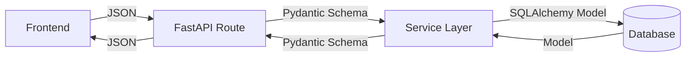
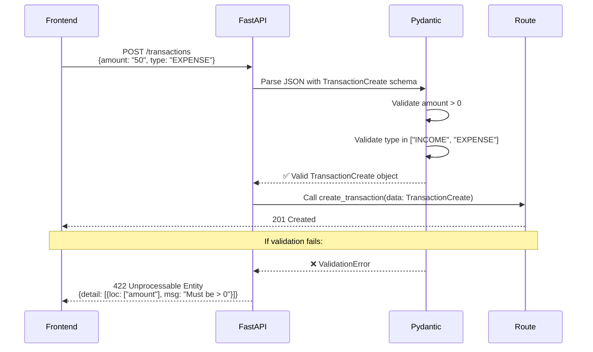

# Chapter 7: Pydantic Schemas - Line by Line

> **Data Transfer Objects**: Understanding validation, serialization, and API contracts with Pydantic.

---

## What Are Pydantic Schemas?

**Schemas** = **DTOs** (Data Transfer Objects) - objects that carry data between layers.



**Why separate Models from Schemas?**

| Aspect         | SQLAlchemy Model                | Pydantic Schema       |
| -------------- | ------------------------------- | --------------------- |
| Purpose        | Database representation         | API data validation   |
| Has DB methods | ✅ Yes (queries, relationships) | ❌ No (pure data)     |
| Validation     | ❌ Minimal                      | ✅ Comprehensive      |
| Used in        | Service layer, database         | API routes, responses |

---

## Schema Pattern: Base → Create → Update → Response

Every entity follows this 4-schema pattern:

```python
class UserBase(BaseModel):
    email: EmailStr  # Fields common to all schemas

class UserCreate(UserBase):
    password: str  # Extra field for creation

class UserUpdate(BaseModel):
    email: Optional[EmailStr] = None  # All fields optional for partial updates

class UserResponse(UserBase):
    id: str  # Extra fields for responses (auto-generated)
    is_active: bool
```

---

## File 1: schemas/auth.py - Authentication DTOs

### Lines 1-7: Token Schemas

```python
# Line 1-2: Imports
from typing import Optional
from pydantic import BaseModel, EmailStr, Field

# Line 5-7: Token response
class Token(BaseModel):
    access_token: str  # JWT string
    token_type: str    # Always "bearer"
```

**Usage**: POST /auth/login returns `Token`

```json
{
  "access_token": "eyJhbGciOi...",
  "token_type": "bearer"
}
```

---

### Lines 9-10: JWT Payload

```python
class TokenPayload(BaseModel):
    sub: Optional[str] = None  # "Subject" = user ID
```

**Why needed?** Decoding JWT produces dict, but we want type safety:

```python
# Without schema
payload = jwt.decode(token)  # Returns dict
user_id = payload.get("sub")  # Could be anything!

# With schema
payload = TokenPayload(**jwt.decode(token))
user_id = payload.sub  # Guaranteed string or None
```

---

### Lines 12-22: User Schemas

```python
# Line 12-13: Base (shared fields)
class UserBase(BaseModel):
    email: EmailStr  # Pydantic's email validator

# ↑ EmailStr validates:
# ✅ "user@example.com"
# ❌ "not-an-email" → raises validation error
```

```python
# Line 15-16: Creation requires password
class UserCreate(UserBase):
    password: str = Field(
        min_length=settings.PASSWORD_MIN_LENGTH,  # From config (e.g., 8)
        max_length=128
    )
# ↑ Field() adds validation constraints
# ↑ Password too short → 422 error with message
```

```python
# Line 18-25: Response includes extra fields
class UserResponse(UserBase):
    id: str                          # Auto-generated UUID
    is_active: bool                  # Soft delete flag
    full_name: Optional[str] = None  # Optional profile field
    avatar_url: Optional[str] = None

    class Config:
        from_attributes = True
    # ↑ CRITICAL: Allows creating from SQLAlchemy models
    # ↑ Without this: TypeError when passing User model
```

**How `from_attributes` works**:

```python
# SQLAlchemy User model instance
user = User(id="abc", email="test@example.com", is_active=True)

# Convert to Pydantic schema
user_response = UserResponse.from_orm(user)  # ✅ Works!
# In Pydantic v2: UserResponse.model_validate(user)
```

---

## File 2: schemas/transaction.py - Transaction DTOs

### Complete Analysis

```python
class TransactionBase(BaseModel):
    amount: Decimal = Field(gt=0, le=999999999.99)
    # ↑ gt=0: Must be positive
    # ↑ le=...: Max value (prevents overflow)
    # ↑ Decimal: Exact precision for money

    type: Literal["INCOME", "EXPENSE"]
    # ↑ Only these 2 values allowed
    # ↑ Typo "EXPENS" → validation error

    description: Optional[str] = Field(None, max_length=500)
    # ↑ Optional but if provided, max 500 chars

    category_id: Optional[str] = None
    occurred_at: datetime
    # ↑ ISO 8601 format: "2024-01-15T10:30:00Z"

class TransactionCreate(TransactionBase):
    pass  # Inherits all fields from base

class TransactionUpdate(BaseModel):
    # All fields optional for PATCH requests
    amount: Optional[Decimal] = Field(None, gt=0)
    type: Optional[Literal["INCOME", "EXPENSE"]] = None
    description: Optional[str] = None
    category_id: Optional[str] = None

class TransactionResponse(TransactionBase):
    id: str
    user_id: str
    created_at: datetime
    category: Optional[CategoryResponse] = None  # Nested schema!

    class Config:
        from_attributes = True
```

**Nested Schema Example**:

```json
{
  "id": "txn-123",
  "amount": "50.00",
  "type": "EXPENSE",
  "category": {
    "id": "cat-456",
    "name": "Groceries",
    "color": "#4CAF50"
  }
}
```

---

## File 3: schemas/budget.py - Budget & Category DTOs

### Category Schemas

```python
class CategoryBase(BaseModel):
    name: str
    color: Optional[str] = None  # Hex color: "#FF5722"

class CategoryCreate(CategoryBase):
    pass

class CategoryUpdate(CategoryBase):
    name: Optional[str] = None    # Can update name only
    color: Optional[str] = None   # Or color only

class CategoryResponse(CategoryBase):
    id: str
    user_id: str

    class Config:
        from_attributes = True
```

### Budget Rule Schemas

```python
class BudgetRuleBase(BaseModel):
    category_id: str
    allocation_type: str  # "FIXED" or "PERCENT"
    allocation_value: Decimal
    monthly_limit: Optional[Decimal] = None

class BudgetRuleCreate(BudgetRuleBase):
    pass

class BudgetRuleUpdate(BudgetRuleBase):
    allocation_type: Optional[str] = None
    allocation_value: Optional[Decimal] = None
    monthly_limit: Optional[Decimal] = None

class BudgetRuleResponse(BudgetRuleBase):
    id: str
    user_id: str
    category: Optional[CategoryResponse] = None  # Nested category

    class Config:
        from_attributes = True
```

---

## File 4: schemas/bill.py - Bill DTOs

```python
class BillBase(BaseModel):
    name: str = Field(max_length=200)
    amount_estimated: Decimal = Field(gt=0)
    due_day: int = Field(ge=1, le=31)  # Day of month (1-31)
    frequency: str  # "monthly", "quarterly", etc.
    autopay_enabled: bool = False
    category_id: Optional[str] = None

class BillCreate(BillBase):
    pass

class BillResponse(BillBase):
    id: str
    user_id: str
    last_paid_at: Optional[datetime] = None
    created_at: datetime
    category: Optional[CategoryResponse] = None

    class Config:
        from_attributes = True
```

---

## File 5: schemas/savings.py - Savings Goal DTOs

```python
class SavingsGoalBase(BaseModel):
    name: str
    target_amount: Decimal = Field(gt=0)
    current_amount: Decimal = Field(ge=0, default=Decimal("0"))
    monthly_contribution: Optional[Decimal] = Field(None, ge=0)
    target_date: Optional[date] = None
    priority: int = Field(ge=1, le=5, default=3)  # 1=highest

class SavingsGoalCreate(SavingsGoalBase):
    pass

class SavingsGoalResponse(SavingsGoalBase):
    id: str
    user_id: str
    created_at: datetime
    progress_percentage: Optional[float] = None  # Calculated field

    class Config:
        from_attributes = True
```

---

## Advanced Validation Patterns

### 1. Custom Validators

```python
from pydantic import validator

class TransactionCreate(TransactionBase):
    @validator('occurred_at')
    def validate_date_not_future(cls, v):
        if v > datetime.utcnow():
            raise ValueError('Transaction date cannot be in the future')
        return v
# ↑ Runs automatically during validation
# ↑ User tries to create txn dated 2030 → 422 error
```

### 2. Field Aliases

```python
class UserResponse(BaseModel):
    id: str = Field(alias="userId")  # JSON uses "userId"
    email: str

    class Config:
        populate_by_name = True  # Accept both "id" and "userId"
```

**Response**:

```json
{
  "userId": "abc-123", // Frontend uses camelCase
  "email": "test@test.com"
}
```

### 3. Computed Fields (Pydantic v2)

```python
class SavingsGoalResponse(SavingsGoalBase):
    id: str

    @computed_field
    @property
    def progress_percentage(self) -> float:
        if self.target_amount > 0:
            return float((self.current_amount / self.target_amount) * 100)
        return 0.0
# ↑ Calculated dynamically when serializing to JSON
```

---

## Schema Validation Flow



---

## All 11 Schema Files Summary

| File              | Schemas                                                                    | Purpose          |
| ----------------- | -------------------------------------------------------------------------- | ---------------- |
| `auth.py`         | Token, TokenPayload, UserBase, UserCreate, UserResponse                    | Authentication   |
| `user.py`         | UserUpdate, UserPasswordChange                                             | User management  |
| `transaction.py`  | TransactionBase/Create/Update/Response                                     | Transactions     |
| `bill.py`         | BillBase/Create/Update/Response                                            | Bills            |
| `budget.py`       | CategoryBase/Create/Update/Response, BudgetRuleBase/Create/Update/Response | Budgets          |
| `subscription.py` | SubscriptionBase/Create/Update/Response                                    | Subscriptions    |
| `savings.py`      | SavingsGoalBase/Create/Update/Response                                     | Savings goals    |
| `income.py`       | IncomeSourceBase/Create/Update/Response                                    | Income sources   |
| `health_score.py` | HealthScoreResponse                                                        | Health score     |
| `triage.py`       | TriageActionResponse                                                       | Financial triage |
| `notification.py` | NotificationBase/Create/Response                                           | Notifications    |

---

## Key Takeaways

1. **DTOs separate API from database** - Different concerns
2. **4-schema pattern** - Base/Create/Update/Response for consistency
3. **Validation at API boundary** - Fail fast, before business logic
4. **from_attributes** - Enables ORM → Schema conversion
5. **Field() constraints** - min_length, max_length, gt, ge, le
6. **Optional fields** - For partial updates (PATCH)
7. **Custom validators** - Add business rules

---

## Navigation

**Previous Chapter**: [← Chapter 6: FastAPI Core Setup](./Chapter_06_FastAPI_Core.md)

**Next Chapter**: [→ Chapter 8: Dependency Injection](./Chapter_08_Dependency_Injection.md)

**Back to Index**: [📚 Tutorial Home](./README.md)
