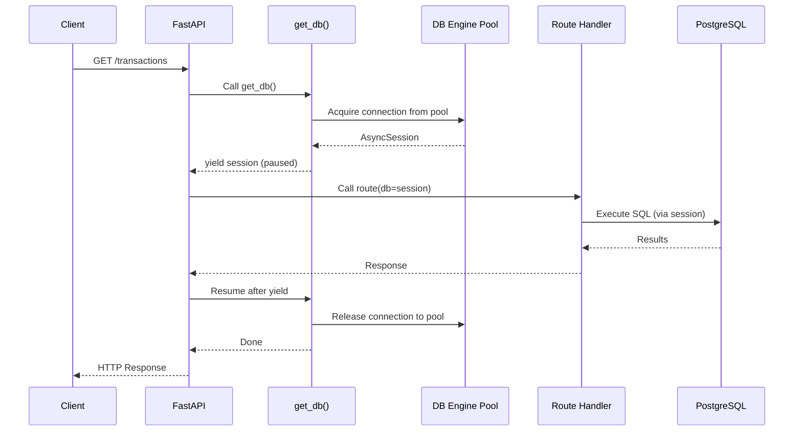

# Chapter 8: Dependency Injection - Complete Deep Dive

> **Industrial Pattern**: Understanding FastAPI's powerful dependency injection system used throughout WealthSync.

---

## What is Dependency Injection?

**Dependency Injection (DI)** = Providing objects from OUTSIDE instead of creating them INSIDE.

**Analogy**: Restaurant kitchen

- **Bad**: Chef buys ingredients themselves (tightly coupled)
- **Good**: Suppliers deliver ingredients (injected dependencies)

**Benefits**:

1. **Testability**: Inject mock database for testing
2. **Reusability**: Same dependency in multiple routes
3. **Maintainability**: Change dependency implementation in one place

---

## FastAPI's Depends()

### Basic Example

```python
from fastapi import Depends

# Dependency function
def get_database():
    return Database()

# Route using dependency
@app.get("/users")
def get_users(db = Depends(get_database)):
    # ↑ FastAPI calls get_database() automatically
    # ↑ Result injected into db parameter
    return db.query_users()
```

**How it works**:

1. Request arrives at `/users`
2. FastAPI sees `Depends(get_database)`
3. Calls `get_database()` → returns Database object
4. Passes Database object to `get_users` as `db`
5. After route completes, cleans up (if generator)

---

## WealthSync Dependency 1: Database Session

### Implementation

```python
# core/database.py

from sqlalchemy.ext.asyncio import AsyncSession, create_async_engine, async_sessionmaker

# Create async engine (connection pool)
engine = create_async_engine(
    str(settings.DATABASE_URL),
    echo=settings.DEBUG,  # Log SQL queries in debug mode
    pool_size=settings.DB_POOL_SIZE,  # Max connections
    max_overflow=settings.DB_MAX_OVERFLOW  # Extra connections if pool full
)

# Session factory
AsyncSessionLocal = async_sessionmaker(
    engine,
    class_=AsyncSession,
    expire_on_commit=False  # Don't expire objects after commit
)

# Dependency: Provides database session
async def get_db():
    """
    Async context manager providing database session.

    Design Pattern: Dependency Injection + Resource Management
    Benefits:
    - Automatic cleanup (session closed even if route errors)
    - Connection pooling (reuse connections)
    - Transaction management
    """
    async with AsyncSessionLocal() as session:
        yield session
        # ↑ Pause here, route executes with session
        # ↑ After route completes (success or error), continue cleanup
    # ↑ Session automatically closed here
```

### Usage in Routes

```python
from typing import Annotated
from fastapi import Depends, APIRouter
from sqlalchemy.ext.asyncio import AsyncSession

router = APIRouter()

@router.get("/transactions")
async def get_transactions(
    db: Annotated[AsyncSession, Depends(get_db)]
    # ↑ FastAPI calls get_db() → yields session
    # ↑ Session injected as db parameter
    # ↑ After route, get_db() cleanup runs
):
    result = await db.execute(select(Transaction))
    return result.scalars().all()
```

### Sequence Diagram



**Why generator (yield)?**

- **Before yield**: Setup (acquire connection)
- **Yield**: Provide resource to route
- **After yield**: Cleanup (release connection)
- **Automatic**: Cleanup runs even if route raises exception

---

## WealthSync Dependency 2: Current User

### Implementation

```python
# api/deps.py

from fastapi import Depends, HTTPException, status
from fastapi.security import OAuth2PasswordBearer
from jose import jwt, JWTError

# OAuth2 scheme (extracts token from Authorization header)
oauth2_scheme = OAuth2PasswordBearer(tokenUrl="/api/v1/auth/login")

async def get_current_user(
    token: Annotated[str, Depends(oauth2_scheme)],
    # ↑ Nested dependency! oauth2_scheme runs first
    # ↑ Extracts token from header: "Authorization: Bearer <token>"
    db: Annotated[AsyncSession, Depends(get_db)]
    # ↑ Another dependency! get_db runs concurrently
) -> User:
    """
    Dependency that authenticates user from JWT token.

    Dependency Chain:
    1. oauth2_scheme → extracts token
    2. get_db → provides database session
    3. get_current_user → validates token, fetches user

    Returns: Authenticated User object
    Raises: HTTPException 401 if invalid token
    """
    credentials_exception = HTTPException(
        status_code=status.HTTP_401_UNAUTHORIZED,
        detail="Could not validate credentials",
        headers={"WWW-Authenticate": "Bearer"},
    )

    try:
        # Decode JWT
        payload = jwt.decode(
            token,
            settings.SECRET_KEY,
            algorithms=[security.ALGORITHM]
        )
        user_id: str = payload.get("sub")
        if user_id is None:
            raise credentials_exception
    except JWTError:
        raise credentials_exception

    # Fetch user from database
    result = await db.execute(
        select(User).filter(User.id == user_id)
    )
    user = result.scalars().first()

    if user is None:
        raise credentials_exception

    return user
```

### Usage in Protected Routes

```python
@router.post("/transactions")
async def create_transaction(
    transaction_data: TransactionCreate,
    current_user: Annotated[User, Depends(get_current_user)],
    # ↑ FastAPI:
    #   1. Calls oauth2_scheme → gets token
    #   2. Calls get_db → gets session
    #   3. Calls get_current_user(token, db) → gets  user
    #   4. Injects user into current_user parameter
    db: Annotated[AsyncSession, Depends(get_db)]
    # ↑ get_db called AGAIN? No! FastAPI reuses the same session
    # ↑ Dependency caching: Same dependency = same result within request
):
    # Now we have both current_user and db
    transaction = Transaction(
        user_id=current_user.id,  # Force user ID from token
        **transaction_data.dict()
    )
    db.add(transaction)
    await db.commit()
    return transaction
```

### Dependency Graph

```
create_transaction
├─ current_user: Depends(get_current_user)
│  ├─ token: Depends(oauth2_scheme)
│  └─ db: Depends(get_db)  ← Cached!
└─ db: Depends(get_db)      ← Reuses cached session
```

**Dependency Caching**:

- `get_db` called twice in route signature
- FastAPI calls it ONCE per request
- Both `current_user` and route get SAME session
- Performance optimization built-in

---

## Advanced Pattern: Sub-Dependencies

### Example: Admin-Only Routes

```python
# api/deps.py

async def get_current_active_user(
    current_user: Annotated[User, Depends(get_current_user)]
) -> User:
    """Sub-dependency: Requires active user."""
    if not current_user.is_active:
        raise HTTPException(status_code=400, detail="Inactive user")
    return current_user

async def get_current_admin_user(
    current_user: Annotated[User, Depends(get_current_active_user)]
    # ↑ Depends on get_current_active_user
    # ↑ Which depends on get_current_user
    # ↑ Dependency chain: oauth2_scheme → get_db → get_current_user → get_current_active_user → get_current_admin_user
) -> User:
    """Sub-dependency: Requires admin user."""
    if not current_user.is_admin:
        raise HTTPException(status_code=403, detail="Not authorized")
    return current_user

# Usage
@router.delete("/users/{user_id}")
async def delete_user(
    user_id: str,
    admin: Annotated[User, Depends(get_current_admin_user)]
    # ↑ Entire dependency chain runs automatically
):
    # Only admins reach here
    ...
```

---

## Advanced Pattern: Class-Based Dependencies

### Example: Pagination

```python
from fastapi import Query

class Pagination:
    """
    Reusable pagination dependency.

    Design Pattern: Dependency as Class
    Benefits:
    - Encapsulate related parameters
    - Reusable across routes
    - Type-safe
    """
    def __init__(
        self,
        skip: int = Query(0, ge=0, description="Number of items to skip"),
        limit: int = Query(100, ge=1, le=1000, description="Max items to return")
    ):
        self.skip = skip
        self.limit = limit

# Usage
@router.get("/transactions")
async def get_transactions(
    pagination: Annotated[Pagination, Depends()],
    # ↑ FastAPI instantiates Pagination class
    # ↑ Extracts skip and limit from query params
    db: Annotated[AsyncSession, Depends(get_db)]
):
    result = await db.execute(
        select(Transaction)
        .offset(pagination.skip)
        .limit(pagination.limit)
    )
    return result.scalars().all()

# Request: GET /transactions?skip=10&limit=50
# pagination.skip = 10, pagination.limit = 50
```

---

## Advanced Pattern: Dependency with Yield for Cleanup

### Example: Database Transaction

```python
async def get_db_transaction():
    """
    Dependency providing database transaction.

    Pattern: Context Manager Dependency
    - Begins transaction before route
    - Commits on success
    - Rolls back on error
    """
    async with AsyncSessionLocal() as session:
        async with session.begin():  # Start transaction
            yield session
            # If route succeeds, transaction commits
            # If route raises exception, transaction rolls back
        # Session closed here

@router.post("/bulk-transactions")
async def create_bulk_transactions(
    transactions: List[TransactionCreate],
    db: Annotated[AsyncSession, Depends(get_db_transaction)]
    # ↑ All operations in single transaction
):
    for txn_data in transactions:
        txn = Transaction(**txn_data.dict())
        db.add(txn)
    # All inserted or none (atomic)
    return {"created": len(transactions)}
```

---

## Testing with Dependency Overrides

### Example: Mock Database

```python
# tests/test_transactions.py

from fastapi.testclient import TestClient
from app.main import app
from app.core.database import get_db

# Mock database
class FakeDB:
    def execute(self, query):
        return FakeResult([Transaction(id="1", amount=100)])

def override_get_db():
    return FakeDB()

# Override dependency
app.dependency_overrides[get_db] = override_get_db

client = TestClient(app)

def test_get_transactions():
    response = client.get("/transactions")
    # Uses FakeDB instead of real database
    assert response.status_code == 200
    assert len(response.json()) == 1
```

**Why this matters**:

- Test without database
- Fast tests (no I/O)
- Predictable (no flaky tests)
- Isolated (tests don't affect each other)

---

## Comparison: DI Frameworks

| Feature     | FastAPI Depends            | Spring (Java)              | NestJS (TypeScript)        |
| ----------- | -------------------------- | -------------------------- | -------------------------- |
| Declaration | `Depends(func)`            | `@Autowired`               | `@Inject()`                |
| Scope       | Per-request                | Singleton, Prototype, etc. | Singleton, Transient, etc. |
| Caching     | Automatic per-request      | Manual configuration       | Manual configuration       |
| Testing     | `app.dependency_overrides` | `@MockBean`                | Custom modules             |
| Async       | Native                     | Via CompletableFuture      | Native                     |
| Overhead    | Minimal                    | Higher (reflection)        | Medium                     |

**FastAPI Advantages**:

- Type-safe (uses Python type hints)
- Async-first (built for async/await)
- Simple (just functions or classes)
- Fast (no reflection, pure Python)

---

## Best Practices

### 1. Use Type Hints

```python
# ❌ Bad: No type hint
@router.get("/users")
def get_users(db = Depends(get_db)):
    ...

# ✅ Good: Type hint for IDE autocomplete
@router.get("/users")
def get_users(db: AsyncSession = Depends(get_db)):
    ...

# ✅ Better: Annotated (Python 3.9+)
@router.get("/users")
def get_users(db: Annotated[AsyncSession, Depends(get_db)]):
    ...
```

### 2. Dependency Functions Should Be Pure

```python
# ❌ Bad: Side effects in dependency
def get_db():
    # Don't send emails, write logs, etc. in dependencies!
    send_notification("Database accessed")
    return Database()

# ✅ Good: Pure function (no side effects)
def get_db():
    return Database()
```

### 3. Use Generators for Cleanup

```python
# ❌ Bad: Manual cleanup (easy to forget)
def get_db():
    db = Database()
    return db
    # db never closed!

# ✅ Good: Automatic cleanup with yield
def get_db():
    db = Database()
    try:
        yield db
    finally:
        db.close()
```

---

## Key Takeaways

1. **Depends()**: FastAPI's DI mechanism
2. **Dependency Caching**: Same dependency called once per request
3. **Yield**: Setup → Provide → Cleanup pattern
4. **Chaining**: Dependencies can depend on other dependencies
5. **Testing**: Override dependencies for mocking
6. **Type Safety**: Use Annotated for best IDE support
7. **Resource Management**: Automatic cleanup with generators

---

## Navigation

**Previous Chapter**: [← Chapter 7: Pydantic Schemas](./Chapter_07_Pydantic_Schemas.md)

**Next Chapter**: [→ Chapter 9: Service Layer Complete](./Chapter_09_Service_Layer.md)

**Back to Index**: [📚 Tutorial Home](./README.md)
