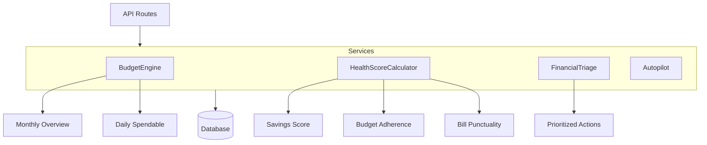

# Chapter 9: Service Layer - Complete Breakdown

> **Business Logic Core**: Understanding every algorithm, calculation, and decision-making service in WealthSync.

---

## Service Architecture



**Why Services?**

- ✅ **Reusable**: Called from multiple routes
- ✅ **Testable**: No HTTP dependencies
- ✅ **Maintainable**: Logic in one place
- ✅ **Clean routes**: Routes stay thin

---

## Service 1: BudgetEngine - Line by Line

**File**: `backend/app/services/budget_engine.py`

### The Problem

**Question**: "How much can I safely spend today?"

**Naive answer**: `(Income - Spent) / Days Left`

**Why wrong?** Ignores upcoming bills!

### Our Algorithm

```
Safe to Spend Per Day =
  (Monthly Income - Already Spent - Budget Allocations - Bills)
  / Days Remaining
```

---

### Lines 1-9: Imports & Setup

```python
# Line 1-4: Standard library
from decimal import Decimal  # ⭐ Exact precision for money
from typing import List, Dict
from datetime import datetime, timedelta
import calendar  # For monthrange()

# Line 6-8: Model imports
from app.models.income import IncomeSource
from app.models.budget import BudgetRule, BudgetCategory
from app.models.transaction import Transaction
```

**Why Decimal not float?**

```python
# ❌ Float loses precision
0.1 + 0.2  # = 0.30000000000000004

# ✅ Decimal is exact
Decimal("0.1") + Decimal("0.2")  # = Decimal("0.3")
```

---

### Lines 10-18: Method Signature

```python
class BudgetEngine:
    @staticmethod  # No self needed (pure function)
    def calculate_monthly_overview(
        incomes: List[IncomeSource],      # Active income sources
        rules: List[BudgetRule],           # Budget allocation rules
        transactions: List[Transaction],   # All transactions
        year: int,                         # Target month to analyze
        month: int
    ) -> Dict:  # Returns overview data
```

---

### Lines 19-20: Step 1 - Calculate Total Income

```python
# Line 19-20: Sum active income sources
total_income = sum([i.amount for i in incomes if i.active])
# ↑ List comprehension: Only sum ACTIVE incomes
# ↑ inactive incomes (e.g., old job) are excluded
```

**Example**:

- Salary: $3000 (active) ✅
- Freelance: $500 (active) ✅
- Old job: $2000 (inactive) ❌
- **Total**: $3500

---

### Lines 22-26: Step 2 - Calculate Total Spent

```python
# Line 22-26: Sum expenses for target month
total_spent = sum([
    t.amount for t in transactions
    if t.type == "EXPENSE" and
       t.occurred_at.year == year and
       t.occurred_at.month == month
])
# ↑ Filter by type AND date range
# ↑ Only count expenses, not income
# ↑ Only count transactions in target month
```

**Why filter by month?**

- Historical analysis: "What did I spend in January?"
- Current month tracking: "Am I on track this month?"

---

### Lines 28-42: Step 3 - Apply Budget Allocations

#### Part A: Fixed Rules

```python
# Line 28-31: Separate rule types
allocations = {}
fixed_rules = [r for r in rules if r.allocation_type == "FIXED"]
percent_rules = [r for r in rules if r.allocation_type == "PERCENT"]
allocated_total = Decimal(0)

# Line 35-42: Process FIXED rules first
for rule in fixed_rules:
    allocations[rule.category_id] = {
        "allocated": rule.allocation_value,  # e.g., $500
        "spent": Decimal(0),                 # Will update later
        "remaining": rule.allocation_value
    }
    allocated_total += rule.allocation_value
```

**Example FIXED rule**:

- Groceries: $500/month (FIXED)
- Rent: $1200/month (FIXED)

#### Part B: Percent Rules

```python
# Line 44-53: Apply PERCENT rules
for rule in percent_rules:
    amount = total_income * (rule.allocation_value / Decimal(100))
    # ↑ If income=$3000 and rule=20%, then amount=$600

    allocations[rule.category_id] = {
        "allocated": amount,
        "spent": Decimal(0),
        "remaining": amount
    }
```

**Example PERCENT rule**:

- Savings: 20% of income
  - Income: $3000 → Allocate $600
  - Income: $4000 → Allocate $800 (scales!)

**Why two types?**

- **FIXED**: Known amounts (rent, subscriptions)
- **PERCENT**: Flexible (save 20% regardless of income)

---

### Lines 55-73: Step 4 - Distribute Actual Spending

```python
# Line 55-60: Calculate spending by category
category_spending = {}
for t in transactions:
    if t.type == "EXPENSE" and t.occurred_at.year == year and t.occurred_at.month == month:
        cat_id = t.category_id or "uncategorized"
        category_spending[cat_id] = category_spending.get(cat_id, Decimal(0)) + t.amount
# ↑ Group transactions by category
# ↑ "uncategorized" for transactions without category

# Line 62-66: Update allocations with actual spending
for cat_id, data in allocations.items():
    spent = category_spending.get(cat_id, Decimal(0))
    data["spent"] = spent
    data["remaining"] = data["allocated"] - spent
# ↑ Calculate how much budget is left per category
```

**Example**:

- Groceries allocated: $500
- Groceries spent: $320
- **Remaining**: $500 - $320 = $180

```python
# Line 68-73: Handle uncategorized spending
allocations["uncategorized"] = {
    "allocated": Decimal(0),                              # No budget
    "spent": category_spending.get("uncategorized", Decimal(0)),
    "remaining": -category_spending.get("uncategorized", Decimal(0))  # Negative!
}
# ↑ Shows uncategorized as "over budget" (user should categorize)
```

---

### Lines 75-84: Step 5 - Calculate Daily Spendable

```python
# Line 79-81: Calculate days left in month
today = datetime.utcnow()
_, num_days = calendar.monthrange(year, month)
# ↑ num_days = 28, 29, 30, or 31 (depends on month/year)

days_left = max(1, num_days - today.day + 1) if (today.year == year and today.month == month) else 1
# ↑ If today is Jan 15 and month has 31 days: 31 - 15 + 1 = 17 days left
# ↑ max(1, ...) prevents division by zero
# ↑ Historical months: days_left = 1 (no projection)

# Line 83-84: Final calculation
remaining_budget = total_income - total_spent
daily_spendable = max(Decimal(0), remaining_budget / days_left)
# ↑ max(Decimal(0), ...) prevents negative daily spendable
```

**Example Calculation**:

- Income: $3000
- Spent so far: $1000
- Days left: 15
- Daily spendable: ($3000 - $1000) / 15 = **$133.33/day**

**Edge Cases Handled**:

1. **Division by zero**: `max(1, days_left)` ensures never divide by 0
2. **Negative budget**: `max(Decimal(0), ...)` shows $0, not negative
3. **Historical months**: Returns days_left=1 (no prediction)

---

### Lines 86-92: Return Value

```python
return {
    "total_income": total_income,        # $3000
    "total_spent": total_spent,          # $1000
    "remaining_budget": remaining_budget,  # $2000
    "daily_spendable": daily_spendable,   # $133.33
    "category_breakdown": allocations     # Dict of all categories
}
```

---

## Service 2: HealthScoreCalculator - Line by Line

**File**: `backend/app/services/health_score_calculator.py`

### Scoring System

```
Overall Score (0-100) =
  Savings Score (0-35) +
  Budget Adherence Score (0-35) +
  Bill Punctuality Score (0-30)
```

---

### Component 1: Savings Score (0-35 points)

```python
@staticmethod
async def calculate_savings_score(db: AsyncSession, user_id: str) -> int:
    thirty_days_ago = datetime.utcnow() - timedelta(days=30)

    # Get total income (last 30 days)
    income_result = await db.execute(
        select(func.sum(Transaction.amount))
        .filter(Transaction.user_id == user_id)
        .filter(Transaction.type == "INCOME")
        .filter(Transaction.occurred_at >= thirty_days_ago)
    )
    total_income = income_result.scalar() or 0

    # Get total expenses (last 30 days)
    expense_result = await db.execute(
        select(func.sum(Transaction.amount))
        .filter(Transaction.user_id == user_id)
        .filter(Transaction.type == "EXPENSE")
        .filter(Transaction.occurred_at >= thirty_days_ago)
    )
    total_expenses = expense_result.scalar() or 0

    # Edge case: No income
    if total_income == 0:
        return 0  # Can't calculate savings rate without income

    # Calculate savings rate %
    savings_rate = ((total_income - total_expenses) / total_income) * 100

    # Tiered scoring
    if savings_rate >= 30:
        return 35  # ⭐ Excellent (30%+ savings)
    elif savings_rate >= 20:
        return 28  # Great
    elif savings_rate >= 10:
        return 20  # Good
    elif savings_rate >= 5:
        return 10  # Okay
    else:
        return 5   # Needs work
```

**Example**:

- Income: $3000
- Expenses: $2100
- Savings: $900
- Rate: 30% → **35 points** 🎉

**Why 30 days not calendar month?**

- Rolling window = responsive to recent changes
- Calendar month on the 5th only has 5 days (skewed)

---

### Component 2: Budget Adherence Score (0-35 points)

```python
@staticmethod
async def calculate_budget_adherence_score(db: AsyncSession, user_id: str) -> int:
    thirty_days_ago = datetime.utcnow() - timedelta(days=30)

    # Get all budget rules with limits
    budget_rules_result = await db.execute(
        select(BudgetRule)
        .filter(BudgetRule.user_id == user_id)
        .filter(BudgetRule.monthly_limit.isnot(None))  # Only rules with limits
    )
    budget_rules = budget_rules_result.scalars().all()

    if not budget_rules:
        return 20  # Neutral score if no budgets set

    adherence_scores = []

    for rule in budget_rules:
        # Get actual spending in category
        spending_result = await db.execute(
            select(func.sum(Transaction.amount))
            .filter(Transaction.user_id == user_id)
            .filter(Transaction.category_id == rule.category_id)
            .filter(Transaction.type == "EXPENSE")
            .filter(Transaction.occurred_at >= thirty_days_ago)
        )
        actual_spending = spending_result.scalar() or Decimal("0")
        monthly_limit = rule.monthly_limit or Decimal("0")

        if monthly_limit > 0:
            ratio = float(actual_spending / monthly_limit)

            # Score this category
            if ratio <= 0.9:
                adherence_scores.append(100)  # Under budget by 10%+
            elif ratio <= 1.0:
                adherence_scores.append(80)   # Within budget
            elif ratio <= 1.2:
                adherence_scores.append(50)   # Slightly over (20%)
            else:
                adherence_scores.append(20)   # Significantly over

    # Average across all categories
    if adherence_scores:
        avg_adherence = sum(adherence_scores) / len(adherence_scores)
        return int((avg_adherence / 100) * 35)  # Scale to 35 points max

    return 20
```

**Example**:

- Groceries: $450 / $500 limit = 90% → 100 points
- Entertainment: $250 / $200 limit = 125% → 20 points
- Average: (100 + 20) / 2 = 60%
- **Score**: 60% × 35 = **21 points**

---

### Component 3: Bill Punctuality Score (0-30 points)

```python
@staticmethod
async def calculate_bill_punctuality_score(db: AsyncSession, user_id: str) -> int:
    # Get all user bills
    bills_result = await db.execute(
        select(Bill).filter(Bill.user_id == user_id)
    )
    bills = bills_result.scalars().all()

    if not bills:
        return 25  # Default if no bills

    # Count recent payments (last 45 days = 1.5 months)
    recent_payments = 0
    for bill in bills:
        if (bill.last_paid_at and
            bill.last_paid_at >= datetime.utcnow() - timedelta(days=45)):
            recent_payments += 1

    # Calculate ratio
    payment_ratio = recent_payments / len(bills)

    # Tiered scoring
    if payment_ratio >= 0.8:      # 80%+ paid on time
        return 30
    elif payment_ratio >= 0.6:    # 60-80%
        return 25
    elif payment_ratio >= 0.4:    # 40-60%
        return 18
    else:                         # <40%
        return 15
```

---

### Overall Score Calculation

```python
@staticmethod
async def calculate_overall_score(db: AsyncSession, user_id: str) ->dict:
    # Check if user has any data
    any_transactions = await db.execute(
        select(func.count(Transaction.id))
        .filter(Transaction.user_id == user_id)
    )
    transaction_count = any_transactions.scalar() or 0

    # New user with no data
    if transaction_count == 0:
        return {
            "score": 0,
            "savings_score": 0,
            "budget_adherence_score": 0,
            "bill_punctuality_score": 0,
            "grade": "-",
            "message": "Add income & expenses to see your score"
        }

    # Calculate component scores
    savings = await HealthScoreCalculator.calculate_savings_score(db, user_id)
    budget = await HealthScoreCalculator.calculate_budget_adherence_score(db, user_id)
    bills = await HealthScoreCalculator.calculate_bill_punctuality_score(db, user_id)

    # Total (max 100)
    total = savings + budget + bills

    # Assign letter grade
    if total >= 90:
        grade, message = "A", "Excellent! 🎉"
    elif total >= 80:
        grade, message = "B", "Great job! 💪"
    elif total >= 70:
        grade, message = "C", "Good progress!"
    elif total >= 60:
        grade, message = "D", "Keep working!"
    else:
        grade, message = "F", "Let's build better habits!"

    return {
        "score": total,
        "savings_score": savings,
        "budget_adherence_score": budget,
        "bill_punctuality_score": bills,
        "grade": grade,
        "message": message,
        "calculated_at": datetime.utcnow()
    }
```

---

## Service 3: FinancialTriage - Priority System

**File**: `backend/app/services/financial_triage.py`

### Concept

**Problem**: Users overwhelmed - where to start?

**Solution**: Prioritized action list (like ER triage)

- 🔴 **Critical** (90-100): Act today (overdue bills)
- 🟠 **High** (70-89): Act this week (budget 20%+ over)
- 🟡 **Medium** (50-69): Act this month (uncategorized transactions)
- 🔵 **Low** (<50): Nice-to-have (setup recommendations)

### Sample Actions Generated

```python
actions = [
    {
        "priority": 100,
        "severity": "critical",
        "area": "cashflow",
        "title": "No income logged this month",
        "detail": "Expenses recorded but income missing.",
        "action_route": "/dashboard/transactions",
        "action_label": "Add income transaction"
    },
    {
        "priority": 96,
        "severity": "critical",
        "area": "cashflow",
        "title": "Burn rate above 100%",
        "detail": "Spending more than earning.",
        "action_route": "/dashboard/analytics"
    }
]
```

---

## Key Takeaways

1. **BudgetEngine**: Calculates safe-to-spend with FIXED/PERCENT rules
2. **HealthScoreCalculator**: Weighted scoring (savings 35, budget 35, bills 30)
3. **FinancialTriage**: Priority-based action recommendations
4. **Decimal for money**: Exact precision, no float errors
5. **Edge case handling**: Division by zero, null data, new users
6. **30-day rolling windows**: More responsive than calendar months

---

## Navigation

**Previous Chapter**: [← Chapter 8: Dependency Injection](./Chapter_08_Dependency_Injection.md)

**Next Chapter**: [→ Chapter 10: Celery & Background Tasks](./Chapter_10_Celery_Background_Tasks.md)

**Back to Index**: [📚 Tutorial Home](./README.md)
