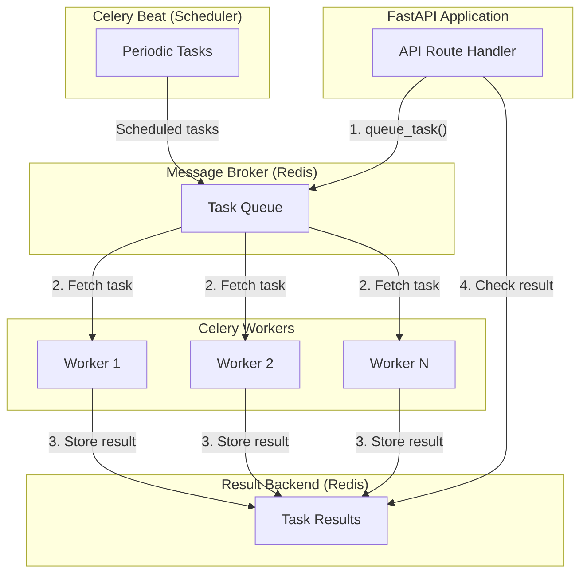
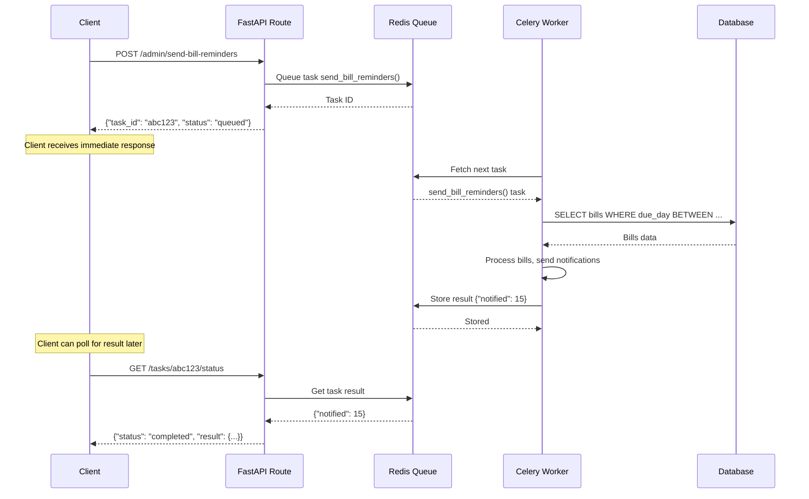

# Chapter 10: Celery & Background Tasks

> **Asynchronous Processing**: Moving heavy work outside the request-response cycle for better performance and scalability.

---

## Why Background Tasks?

**Problem**: Some operations are too slow for HTTP requests

- Sending emails (200-500ms)
- Generating PDFs (1-3 seconds)
- Processing large datasets (minutes)
- Scheduled recurring tasks (daily reports)

**HTTP Timeout**: Most servers timeout after 30-60 seconds

- User waits → Bad UX
- Server resources locked → Poor scalability

**Solution**: Background tasks

1. HTTP request starts task → Returns immediately (200 OK)
2. Task runs asynchronously in background worker
3. Results stored/emailed/pushed to user later

---

## Async vs Background Tasks

### Async (FastAPI async/await)

```python
@app.get("/transactions")
async def get_transactions(db: AsyncSession = Depends(get_db)):
    result = await db.execute(select(Transaction))
    # ↑ Async: Non-blocking I/O (waiting for database)
    # ↑ Same process, same request-response cycle
    # ↑ Still bounded by HTTP timeout
    return result.scalars().all()
```

**Async**: Non-blocking I/O within request

- Good for: Database queries, HTTP API calls
- Still in HTTP request-response cycle
- Fast operations (< 1 second)

### Background Tasks (Celery)

```python
@app.post("/reports/generate")
def generate_annual_report(user_id: str):
    # Start background task
    task = generate_report_task.delay(user_id)
    # ↑ Returns immediately, task runs in separate process
    return {"task_id": task.id, "status": "processing"}

@celery_app.task
def generate_report_task(user_id: str):
    # Runs in background worker
    # Not bounded by HTTP timeout
    # Can take minutes/hours
    report = expensive_calculation(user_id)
    send_email(user_id, report)
```

**Background Tasks**: Separate process

- Good for: Long-running operations, scheduled jobs
- Outside HTTP request-response cycle
- Can take minutes/hours

---

## Celery Architecture



**Components**:

1. **Task Producer** (FastAPI): Creates tasks
2. **Message Broker** (Redis): Queue holding pending tasks
3. **Workers** (Celery): Execute tasks in background
4. **Result Backend** (Redis): Store task results
5. **Celery Beat** (Scheduler): Trigger periodic tasks

---

## WealthSync Use Cases

### 1. Bill Payment Reminders

**Scenario**: Send notification 3 days before bill due date

```python
# tasks/bill_tasks.py

from celery import Celery
from datetime import datetime, timedelta

celery_app = Celery('wealthsync', broker='redis://localhost:6379/0')

@celery_app.task
def send_bill_reminders():
    """
    Background task: Find bills due soon, send notifications.

    Runs daily at 9 AM (configured in Celery Beat).
    """
    # Pseudo-code (actual implementation would use database)
    bills_due_soon = get_bills_due_in_days(3)

    for bill in bills_due_soon:
        send_notification(
            user_id=bill.user_id,
            type="bill_reminder",
            title=f"{bill.name} due in 3 days",
            message=f"${bill.amount_estimated} due on {bill.due_day}",
            action_url=f"/bills/{bill.id}"
        )

    return {"notified": len(bills_due_soon)}
```

**Celery Beat Schedule**:

```python
# core/celery_app.py

from celery.schedules import crontab

celery_app.conf.beat_schedule = {
    'send-bill-reminders-daily': {
        'task': 'tasks.bill_tasks.send_bill_reminders',
        'schedule': crontab(hour=9, minute=0),  # 9 AM daily
    },
}
```

### 2. Health Score Calculation

**Scenario**: Calculate financial health score (CPU-intensive)

```python
# API route
@router.get("/dashboard/health-score")
async def get_health_score(user_id: str = Depends(get_current_user)):
    # Check if calculation is recent
    cached_score = get_cached_score(user_id)
    if cached_score and cached_score.age < timedelta(hours=6):
        return cached_score

    # Start background calculation
    task = calculate_health_score_task.delay(user_id)

    # Return cached score + task ID
    return {
        "score": cached_score.score if cached_score else None,
        "calculating": True,
        "task_id": task.id
    }

# Background task
@celery_app.task
def calculate_health_score_task(user_id: str):
    """
    Calculate financial health score (slow: 5-10 seconds).

    Metrics:
    - Savings rate
    - Budget adherence
    - Bill punctuality
    - Emergency fund coverage
    """
    # CPU-intensive calculations
    savings_score = analyze_savings_rate(user_id)
    budget_score = analyze_budget_adherence(user_id)
    bill_score = analyze_bill_payments(user_id)

    overall_score = (
        savings_score * 0.35 +
        budget_score * 0.30 +
        bill_score * 0.35
    )

    # Store in database
    save_health_score(user_id, overall_score)

    return {
        "user_id": user_id,
        "score": overall_score,
        "calculated_at": datetime.utcnow()
    }
```

### 3. Autopilot Payment Processing

**Scenario**: Auto-pay bills on due date (requires user approval)

```python
@celery_app.task
def process_autopilot_payments():
    """
    Background task: Create autopilot payment records for bills due today.

    Runs daily at midnight.
    """
    today = datetime.utcnow().date()

    # Find bills due today with autopay enabled
    bills_due_today = get_bills_due_on_day(today.day, autopay_enabled=True)

    for bill in bills_due_today:
        # Create autopilot payment record (requires user approval)
        create_autopilot_payment(
            user_id=bill.user_id,
            source_type="bill",
            source_id=bill.id,
            amount=bill.amount_estimated,
            due_on=today,
            status="pending_approval"
        )

        # Notify user
        send_notification(
            user_id=bill.user_id,
            type="autopilot_pending",
            title=f"{bill.name} autopilot payment ready",
            message=f"Approve ${bill.amount_estimated} payment in app"
        )

    return {"created": len(bills_due_today)}
```

---

## Task Execution Flow

### Sequence Diagram



---

## Setting Up Celery with FastAPI

### 1. Installation

```bash
pip install celery redis
```

### 2. Celery App Configuration

```python
# core/celery_app.py

from celery import Celery
from app.core.config import settings

celery_app = Celery(
    'wealthsync',
    broker=settings.CELERY_BROKER_URL,  # redis://localhost:6379/0
    backend=settings.CELERY_RESULT_BACKEND  # redis://localhost:6379/0
)

# Configuration
celery_app.conf.update(
    task_serializer='json',
    result_serializer='json',
    accept_content=['json'],
    timezone='UTC',
    enable_utc=True,

    # Task execution limits
    task_soft_time_limit=300,  # 5 minutes soft limit
    task_time_limit=600,  # 10 minutes hard limit

    # Retry configuration
    task_acks_late=True,  # Ack after task completes (not when started)
    task_reject_on_worker_lost=True,  # Retry if worker crashes
)
```

### 3. Task Definition

```python
# tasks/health_score_tasks.py

from app.core.celery_app import celery_app
from app.services.health_score_calculator import HealthScoreCalculator

@celery_app.task(bind=True, max_retries=3)
def calculate_health_score(self, user_id: str):
    """
    Celery task for calculating health score.

    Args:
        user_id: User ID to calculate score for

    Returns:
        dict: Score results

    Raises:
        Retry: If calculation fails (up to 3 retries)
    """
    try:
        score = HealthScoreCalculator.calculate_overall_score(user_id)
        return {
            "user_id": user_id,
            "score": score,
            "status": "success"
        }
    except Exception as exc:
        # Retry with exponential backoff: 1min, 2min, 4min
        raise self.retry(exc=exc, countdown=60 * (2 ** self.request.retries))
```

### 4. Running Workers

```bash
# Start Celery worker
celery -A app.core.celery_app worker --loglevel=info

# Start Celery Beat (scheduler)
celery -A app.core.celery_app beat --loglevel=info

# Start both together
celery -A app.core.celery_app worker --beat --loglevel=info
```

---

## Monitoring with Flower

**Flower** = Web-based monitoring tool for Celery

```bash
# Install
pip install flower

# Run
celery -A app.core.celery_app flower

# Access: http://localhost:5555
```

**Features**:

- View active tasks
- Task history
- Worker statistics
- Task success/failure rates
- Retry counts

---

## Error Handling & Retries

### Automatic Retries

```python
@celery_app.task(
    bind=True,
    max_retries=5,
    default_retry_delay=60  # 1 minute
)
def send_email_task(self, user_id: str, subject: str, body: str):
    try:
        email_service.send(user_id, subject, body)
    except EmailServiceDown as exc:
        # Retry up to 5 times
        raise self.retry(exc=exc)
    except InvalidEmail:
        # Don't retry for invalid email
        logger.error(f"Invalid email for user {user_id}")
        return {"status": "failed", "reason": "invalid_email"}
```

### Exponential Backoff

```python
@celery_app.task(bind=True, max_retries=10)
def api_call_task(self, url: str):
    try:
        response = requests.get(url)
        response.raise_for_status()
        return response.json()
   except requests.RequestException as exc:
        # Exponential backoff: 1s, 2s, 4s, 8s, 16s, ...
        countdown = 2 ** self.request.retries
        raise self.retry(exc=exc, countdown=countdown, max_retries=10)
```

---

## Production Considerations

### 1. Worker Scaling

```bash
# Run multiple workers
celery multi start worker1 worker2 worker3 \
    -A app.core.celery_app \
    --loglevel=info

# Auto-scale workers (min=2, max=10)
celery -A app.core.celery_app worker --autoscale=10,2
```

### 2. Task Priority

```python
# High priority task (bill payments)
@celery_app.task(priority=9)
def process_bill_payment(bill_id: str):
    ...

# Low priority task (analytics)
@celery_app.task(priority=1)
def generate_monthly_report(user_id: str):
    ...
```

### 3. Rate Limiting

```python
# Max 10 emails per minute
@celery_app.task(rate_limit='10/m')
def send_email_task(user_id: str, subject: str):
    ...
```

### 4. Result Expiration

```python
celery_app.conf.result_expires = 3600  # Results expire after 1 hour
```

---

## Key Takeaways

1. **Background Tasks**: Move slow operations outside HTTP cycle
2. **Celery Architecture**: Producer → Broker → Workers → Result Backend
3. **Celery Beat**: Periodic task scheduler (cron-like)
4. **Error Handling**: Automatic retries with exponential backoff
5. **Monitoring**: Flower for web-based task monitoring
6. **Scaling**: Run multiple workers for parallel processing
7. **Use Cases**: Bill reminders, health score calc, autopilot payments

---

## Navigation

**Previous Chapter**: [← Chapter 9: Service Layer Complete](./Chapter_09_Service_Layer.md)

**Next Chapter**: [→ Chapter 11: Authentication & Authorization](./Chapter_11_Authentication.md)

**Back to Index**: [📚 Tutorial Home](./README.md)
