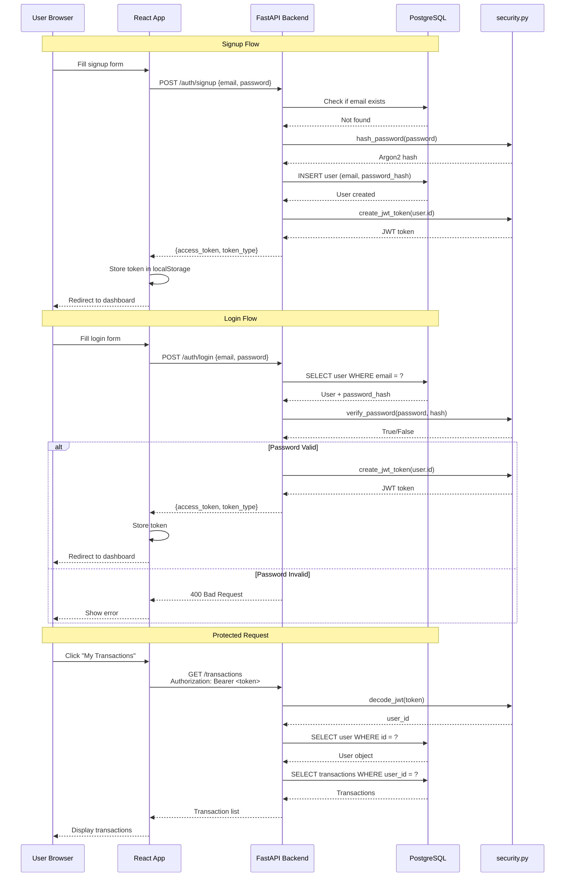

# Chapter 11: Authentication & Authorization

> **Security Fundamentals**: Protecting user data and ensuring only authorized access to resources.

---

## Authentication vs Authorization

**Authentication** = "Who are you?"

- Verify user identity (email + password)
- Issue JWT token as proof of identity

**Authorization** = "What can you do?"

- Check permissions (is user admin?)
- Enforce access control (can user view this transaction?)

**Analogy**: Airport security

- **Authentication**: Check passport (verify identity)
- **Authorization**: Check boarding pass (verify access to flight)

---

## WealthSync Authentication Flow



---

## Password Security

### Argon2 Hashing

```python
# core/security.py

from passlib.context import CryptContext

# Password hashing context
pwd_context = CryptContext(
    schemes=["argon2"],
    deprecated="auto"
)

def get_password_hash(password: str) -> str:
    """
    Hash password using Argon2.

    Argon2 = Password Hashing Competition winner (2015)
    Resistant to GPU/ASIC attacks
    Memory-hard algorithm

    Parameters:
    - memory_cost: 65536 KB (~64 MB)
    - time_cost: 3 iterations
    - parallelism: 4 threads

    Example output:
    $argon2id$v=19$m=65536,t=3,p=4$salt$hash
    """
    return pwd_context.hash(password)

def verify_password(plain_password: str, hashed_password: str) -> bool:
    """
    Verify password against hash.

    Timing: ~300ms (intentionally slow to prevent brute force)

    Returns:
        True if password matches hash
        False otherwise
    """
    return pwd_context.verify(plain_password, hashed_password)
```

**Why Argon2?**

- ✅ Memory-hard (requires RAM, expensive for attackers)
- ✅ Resistant to GPU/ASIC attacks
- ✅ Configurable difficulty
- ❌ Slower than bcrypt (but that's good for security!)

**Alternative**: bcrypt (also good, widely used)

---

## JWT (JSON Web Tokens)

### Token Structure

```
eyJhbGciOiJIUzI1NiIsInR5cCI6IkpXVCJ9.eyJzdWIiOiJ1c2VyMTIzIiwiZXhwIjoxNjk5OTk5OTk5fQ.signature
│─────────── Header ───────────│─────────── Payload ────────────│─ Signature ─│
```

**Header** (Base64):

```json
{
  "alg": "HS256",
  "typ": "JWT"
}
```

**Payload** (Base64):

```json
{
  "sub": "user123", // Subject (user ID)
  "exp": 1699999999 // Expiration timestamp
}
```

**Signature** (HMAC-SHA256):

```
HMAC-SHA256(
  base64(header) + "." + base64(payload),
  SECRET_KEY
)
```

### Creating JWT

```python
# core/security.py

from datetime import datetime, timedelta
from jose import jwt

ALGORITHM = "HS256"

def create_access_token(subject: str, expires_delta: timedelta | None = None) -> str:
    """
    Create JWT access token.

    Args:
        subject: User ID (stored in 'sub' claim)
        expires_delta: Token lifetime (default: 8 days)

    Returns:
        Signed JWT token string
    """
    if expires_delta:
        expire = datetime.utcnow() + expires_delta
    else:
        expire = datetime.utcnow() + timedelta(
            minutes=settings.ACCESS_TOKEN_EXPIRE_MINUTES  # 11520 = 8 days
        )

    # Token payload
    to_encode = {
        "exp": expire,  # Expiration time
        "sub": str(subject)  # User ID
    }

    # Sign with secret key
    encoded_jwt = jwt.encode(
        to_encode,
        settings.SECRET_KEY,
        algorithm=ALGORITHM
    )

    return encoded_jwt
```

### Validating JWT

```python
# api/deps.py

from jose import jwt, JWTError

async def get_current_user(
    token: Annotated[str, Depends(oauth2_scheme)],
    db: Annotated[AsyncSession, Depends(get_db)]
) -> User:
    """
    Validate JWT and return current user.

    Steps:
    1. Extract token from Authorization header
    2. Decode and verify signature
    3. Extract user ID from 'sub' claim
    4. Fetch user from database
    5. Return user (or raise 401 if invalid)
    """
    credentials_exception = HTTPException(
        status_code=401,
        detail="Could not validate credentials",
        headers={"WWW-Authenticate": "Bearer"},
    )

    try:
        # Decode JWT (verifies signature)
        payload = jwt.decode(
            token,
            settings.SECRET_KEY,
            algorithms=[ALGORITHM]
        )
        # ↑ Raises JWTError if:
        #   - Signature invalid (token tampered)
        #   - Token expired
        #   - Malformed token

        # Extract user ID
        user_id: str = payload.get("sub")
        if user_id is None:
            raise credentials_exception

    except JWTError:
        raise credentials_exception

    # Fetch user from database
    result = await db.execute(
        select(User).filter(User.id == user_id)
    )
    user = result.scalars().first()

    if user is None:
        # User deleted after token was issued
        raise credentials_exception

    return user
```

---

## OAuth2 Password Flow

FastAPI uses OAuth2 Password Flow for token authentication:

```python
# api/v1/auth.py

from fastapi.security import OAuth2PasswordRequestForm

@router.post("/login", response_model=Token)
async def login(
    db: Annotated[AsyncSession, Depends(get_db)],
    form_data: Annotated[OAuth2PasswordRequestForm, Depends()]
    # ↑ OAuth2 standard format:
    #   - username: Actually email in our case
    #   - password: Plain password
    #   - Content-Type: application/x-www-form-urlencoded
):
    # Verify credentials
    user = await authenticate_user(db, form_data.username, form_data.password)
    if not user:
        raise HTTPException(status_code=400, detail="Incorrect credentials")

    # Create token
    access_token = create_access_token(subject=user.id)

    return {
        "access_token": access_token,
        "token_type": "bearer"
    }
```

**OAuth2PasswordBearer**:

```python
# api/deps.py

from fastapi.security import OAuth2PasswordBearer

oauth2_scheme = OAuth2PasswordBearer(tokenUrl="/api/v1/auth/login")
# ↑ Tells FastAPI:
#   - Tokens obtained from POST /api/v1/auth/login
#   - Extract token from: Authorization: Bearer <token>
#   - Automatically shows "Authorize" button in OpenAPI docs
```

---

## Protected Routes

### Pattern 1: Single User Protection

```python
@router.get("/transactions")
async def get_transactions(
    current_user: Annotated[User, Depends(get_current_user)]
):
    """
    Protected route: Requires authentication.

    Without valid JWT → 401 Unauthorized
    """
    # Only returns transactions for authenticated user
    result = await db.execute(
        select(Transaction).filter(Transaction.user_id == current_user.id)
    )
    return result.scalars().all()
```

### Pattern 2: Resource Ownership Check

```python
@router.delete("/transactions/{transaction_id}")
async def delete_transaction(
    transaction_id: str,
    current_user: Annotated[User, Depends(get_current_user)],
    db: Annotated[AsyncSession, Depends(get_db)]
):
    """
    Protected route with authorization check.

    Ensures user can only delete their own transactions.
    """
    # Fetch transaction
    result = await db.execute(
        select(Transaction).filter(Transaction.id == transaction_id)
    )
    transaction = result.scalars().first()

    if not transaction:
        raise HTTPException(status_code=404, detail="Transaction not found")

    # Authorization check
    if transaction.user_id != current_user.id:
        raise HTTPException(status_code=403, detail="Not authorized")

    # User owns transaction → allow deletion
    await db.delete(transaction)
    await db.commit()

    return {"status": "deleted"}
```

---

## Frontend Session Management

### Storing Token

```javascript
// frontend/src/lib/auth.jsx

// After successful login/signup
const handleLogin = async (email, password) => {
  const response = await api.post("/auth/login", { email, password });

  // Store token in localStorage
  localStorage.setItem("token", response.data.access_token);

  // Update auth context
  setUser(response.data.user);
  setAuthenticated(true);
};
```

### Adding Token to Requests

```javascript
// frontend/src/lib/api.js

import axios from "axios";

const api = axios.create({
  baseURL: import.meta.env.VITE_API_BASE_URL,
});

// Request interceptor: Add token to every request
api.interceptors.request.use((config) => {
  const token = localStorage.getItem("token");
  if (token) {
    config.headers.Authorization = `Bearer ${token}`;
  }
  return config;
});

// Response interceptor: Handle 401 Unauthorized
api.interceptors.response.use(
  (response) => response,
  (error) => {
    if (error.response?.status === 401) {
      // Token expired or invalid
      localStorage.removeItem("token");
      window.location.href = "/login";
    }
    return Promise.reject(error);
  },
);
```

---

## Security Best Practices

### 1. Password Policies

```python
# schemas/auth.py

from pydantic import Field

class UserCreate(BaseModel):
    email: EmailStr
    password: str = Field(
        min_length=settings.PASSWORD_MIN_LENGTH,  # 8 characters
        max_length=128,
        description="Password must be at least 8 characters"
    )
```

### 2. Rate Limiting

```python
# core/middleware.py

from slowapi import Limiter
from slowapi.util import get_remote_address

limiter = Limiter(key_func=get_remote_address)

# Apply to auth routes
@router.post("/signup")
@limiter.limit("3/minute")  # Max 3 signups per minute
async def signup(...):
    ...

@router.post("/login")
@limiter.limit("5/minute")  # Max 5 login attempts per minute
async def login(...):
    ...
```

### 3. HTTPS Only

```python
# main.py

if settings.ENVIRONMENT == "production":
    app.add_middleware(
        HTTPSRedirectMiddleware
    )
```

### 4. Secure Cookies (if using cookies instead of localStorage)

```python
response.set_cookie(
    key="access_token",
    value=token,
    httponly=True,  # JavaScript can't access
    secure=True,     # HTTPS only
    samesite="lax"   # CSRF protection
)
```

### 5. Token Expiration

```python
# Tokens expire after 8 days
ACCESS_TOKEN_EXPIRE_MINUTES = 11520
```

### 6. XSS Protection

```javascript
// ❌ Bad: Vulnerable to XSS
document.innerHTML = user.name;

/  / ✅ Good: React escapes automatically
<div>{user.name}</div>
```

### 7. CSRF Protection

```python
# For cookie-based auth, use CSRF tokens
# For JWT in Authorization header, CSRF not needed
# (can't be sent cross-origin by browsers)
```

---

## Authorization Patterns

### Role-Based Access Control (RBAC)

```python
# models/user.py

class User(Base):
    # ...
    role = Column(String, default="user")  # "user" or "admin"

# Dependency for admin routes
async def get_admin_user(
    current_user: Annotated[User, Depends(get_current_user)]
) -> User:
    if current_user.role != "admin":
        raise HTTPException(status_code=403, detail="Admin access required")
    return current_user

# Admin-only route
@router.delete("/users/{user_id}")
async def delete_user(
    user_id: str,
    admin: Annotated[User, Depends(get_admin_user)]
):
    # Only admins can delete users
    ...
```

---

## Key Takeaways

1. **Authentication**: JWT tokens for stateless auth
2. **Password Security**: Argon2 hashing (memory-hard)
3. **Token Flow**: Login → JWT → Store → Include in requests
4. **Protected Routes**: Depends(get_current_user)
5. **Authorization**: Check ownership/role before action
6. **Rate Limiting**: Prevent brute force attacks
7. **HTTPS**: Required in production
8. **Token Expiration**: 8-day lifetime

---

## Navigation

**Previous Chapter**: [← Chapter 10: Celery & Background Tasks](./Chapter_10_Celery_Background_Tasks.md)

**Next Chapter**: [→ Chapter 12: API Routes Complete](./Chapter_12_API_Routes.md)

**Back to Index**: [📚 Tutorial Home](./README.md)
