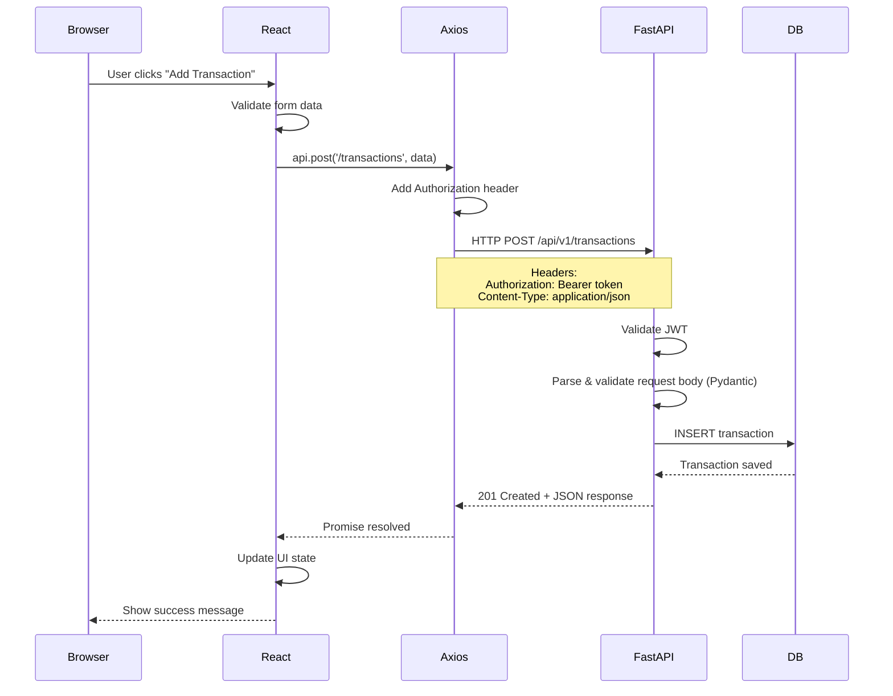
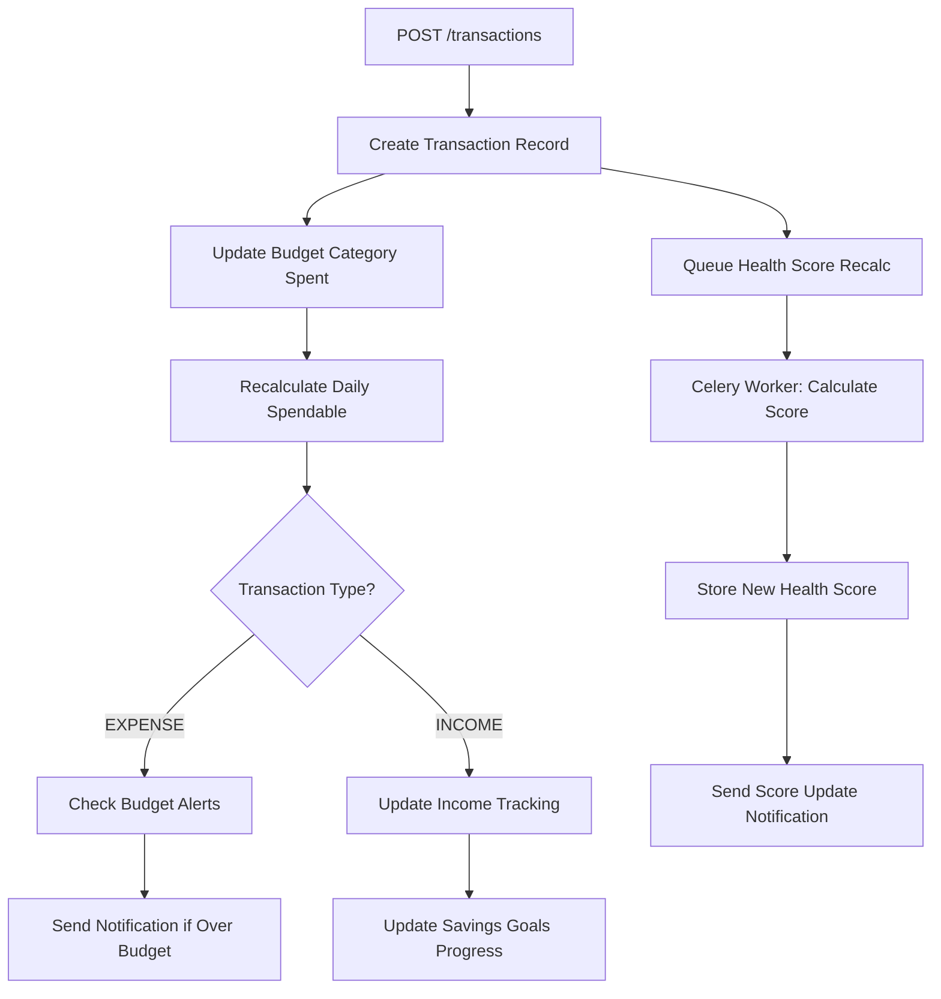

# Chapter 13: Complete API Flow & Communication Architecture

> **🏭 INDUSTRIAL-LEVEL DOCUMENTATION**: Comprehensive catalog of all 50+ API endpoints, integration patterns, and communication architecture.

---

## Table of Contents

1. [HTTP Fundamentals](#http-fundamentals)
2. [Complete API Endpoint Catalog](#complete-api-endpoint-catalog)
3. [Frontend-Backend Integration](#frontend-backend-integration)
4. [Cascading Effects Analysis](#cascading-effects-analysis)
5. [Error Handling Architecture](#error-handling-architecture)
6. [Performance Optimization](#performance-optimization)
7. [Security Flows](#security-flows)

---

## HTTP Fundamentals

### Request-Response Cycle



### HTTP Methods Used

| Method | Purpose          | Idempotent? | Safe?  |
| ------ | ---------------- | ----------- | ------ |
| GET    | Fetch resources  | ✅ Yes      | ✅ Yes |
| POST   | Create resource  | ❌ No       | ❌ No  |
| PUT    | Update (replace) | ✅ Yes      | ❌ No  |
| PATCH  | Update (partial) | ❌ No\*     | ❌ No  |
| DELETE | Remove resource  | ✅ Yes      | ❌ No  |

\*PATCH can be idempotent depending on implementation

---

## Complete API Endpoint Catalog

### 1. Authentication & Users (5 endpoints)

#### POST /api/v1/auth/signup

**Purpose**: Create new user account

**Request**:

```json
{
  "email": "user@example.com",
  "password": "SecurePass123!"
}
```

**Response** (201 Created):

```json
{
  "access_token": "eyJhbGciOi...",
  "token_type": "bearer"
}
```

**Errors**:

- `400`: Email already registered
- `422`: Validation error (weak password, invalid email)

---

#### POST /api/v1/auth/login

**Purpose**: Authenticate user and issue JWT

**Request**:

```json
{
  "username": "user@example.com",
  "password": "SecurePass123!"
}
```

**Response** (200 OK):

```json
{
  "access_token": "eyJhbGciOi...",
  "token_type": "bearer"
}
```

**Errors**:

- `400`: Invalid credentials
- `429`: Rate limit exceeded (5 attempts/minute)

---

#### GET /api/v1/auth/me

**Purpose**: Fetch current authenticated user

**Headers**: `Authorization: Bearer <token>`

**Response** (200 OK):

```json
{
  "id": "uuid-here",
  "email": "user@example.com",
  "full_name": "John Doe",
  "avatar_url": null,
  "is_active": true
}
```

**Errors**:

- `401`: Invalid/expired token

---

#### PUT /api/v1/users/me

**Purpose**: Update user profile

**Request**:

```json
{
  "full_name": "Jane Doe",
  "avatar_url": "https://..."
}
```

**Response** (200 OK): Updated user object

---

#### PUT /api/v1/users/me/password

**Purpose**: Change password

**Request**:

```json
{
  "current_password": "OldPass123!",
  "new_password": "NewPass456!"
}
```

**Response** (200 OK):

```json
{
  "message": "Password updated successfully"
}
```

**Errors**:

- `400`: Incorrect current password
- `422`: New password too weak

---

### 2. Transactions (7 endpoints)

#### GET /api/v1/transactions

**Purpose**: List user's transactions (paginated, filtered)

**Query Params**:

- `skip`: Offset (default: 0)
- `limit`: Max results (default: 100, max: 1000)
- `type`: Filter by "INCOME" or "EXPENSE"
- `category_id`: Filter by category
- `start_date`: Filter by date range (ISO 8601)
- `end_date`: Filter by date range

**Response** (200 OK):

```json
[
  {
    "id": "txn-uuid",
    "user_id": "user-uuid",
    "amount": "123.45",
    "type": "EXPENSE",
    "description": "Grocery shopping",
    "occurred_at": "2024-01-15T10:30:00Z",
    "created_at": "2024-01-15T10:31:00Z",
    "category": {
      "id": "cat-uuid",
      "name": "Groceries",
      "color": "#4CAF50"
    }
  }
]
```

---

#### POST /api/v1/transactions

**Purpose**: Create new transaction

**Request**:

```json
{
  "amount": "50.00",
  "type": "EXPENSE",
  "description": "Coffee",
  "category_id": "cat-uuid",
  "occurred_at": "2024-01-15T14:00:00Z"
}
```

**Response** (201 Created): Transaction object

**Cascading Effects**:

1. Updates budget category spent amount
2. Recalculates daily spendable
3. Triggers health score recalculation (async)
4. Updates dashboard statistics

---

#### GET /api/v1/transactions/{id}

**Purpose**: Fetch single transaction by ID

**Response** (200 OK): Transaction object

**Errors**:

- `404`: Transaction not found
- `403`: Not authorized (doesn't belong to user)

---

#### PUT /api/v1/transactions/{id}

**Purpose**: Update transaction

**Request**: Partial transaction data

**Cascading Effects**: Same as POST (recalc budgets, health score)

---

#### DELETE /api/v1/transactions/{id}

**Purpose**: Delete transaction

**Response** (200 OK):

```json
{
  "message": "Transaction deleted"
}
```

**Cascading Effects**:

1. Decrements category spent amount
2. Recalculates budgets
3. Updates health score

---

#### GET /api/v1/transactions/summary

**Purpose**: Get transaction summary for date range

**Query Params**:

- `start_date`: ISO 8601 date
- `end_date`: ISO 8601 date

**Response** (200 OK):

```json
{
  "total_income": "5000.00",
  "total_expenses": "3200.50",
  "net": "1799.50",
  "by_category": [
    {
      "category_id": "cat-uuid",
      "category_name": "Groceries",
      "total": "500.00",
      "count": 12
    }
  ]
}
```

---

#### POST /api/v1/transactions/bulk

**Purpose**: Create multiple transactions (CSV import)

**Request**:

```json
{
  "transactions": [
    { "amount": "100", "type": "EXPENSE", ... },
    { "amount": "50", "type": "EXPENSE", ... }
  ]
}
```

**Response** (201 Created):

```json
{
  "created": 25,
  "failed": 2,
  "errors": [...]
}
```

---

### 3. Budget Categories (5 endpoints)

#### GET /api/v1/categories

**Purpose**: List all budget categories for user

**Response** (200 OK):

```json
[
  {
    "id": "cat-uuid",
    "name": "Groceries",
    "color": "#4CAF50",
    "user_id": "user-uuid"
  }
]
```

---

#### POST /api/v1/categories

**Purpose**: Create budget category

**Request**:

```json
{
  "name": "Entertainment",
  "color": "#FF5722"
}
```

**Response** (201 Created): Category object

---

#### PUT /api/v1/categories/{id}

**Purpose**: Update category

---

#### DELETE /api/v1/categories/{id}

**Purpose**: Delete category

**Cascading Effects**:

1. Un-categorizes all transactions (sets category_id = NULL)
2. Deletes associated budget rules

---

#### GET /api/v1/categories/{id}/transactions

**Purpose**: Get all transactions in category

---

### 4. Budget Rules (5 endpoints)

#### GET /api/v1/budgets

**Purpose**: Get all budget rules

**Response** (200 OK):

```json
[
  {
    "id": "rule-uuid",
    "category_id": "cat-uuid",
    "allocation_type": "FIXED",
    "allocation_value": "500.00",
    "monthly_limit": null,
    "category": { "name": "Groceries", ... }
  }
]
```

---

#### POST /api/v1/budgets

**Purpose**: Create budget rule

**Request**:

```json
{
  "category_id": "cat-uuid",
  "allocation_type": "PERCENT",
  "allocation_value": "30",
  "monthly_limit": "2000.00"
}
```

---

#### GET /api/v1/budgets/overview

**Purpose**: Get budget overview for current month

**Response** (200 OK):

```json
{
  "total_income": "5000.00",
  "total_spent": "3200.00",
  "remaining_budget": "1800.00",
  "daily_spendable": "60.00",
  "category_breakdown": [
    {
      "category_id": "cat-uuid",
      "category_name": "Groceries",
      "allocated": "500.00",
      "spent": "425.30",
      "remaining": "74.70",
      "percent_used": 85.06
    }
  ]
}
```

**Complexity**: High (aggregates transactions, applies rules, calculates metrics)

---

#### PUT /api/v1/budgets/{id}

---

#### DELETE /api/v1/budgets/{id}

---

### 5. Bills (6 endpoints)

#### GET /api/v1/bills

**Purpose**: List all bills

---

#### POST /api/v1/bills

**Purpose**: Create bill

**Request**:

```json
{
  "name": "Electric Bill",
  "amount_estimated": "120.00",
  "due_day": 15,
  "frequency": "monthly",
  "autopay_enabled": false,
  "category_id": "cat-uuid"
}
```

**Cascading Effects**:

1. Creates notification for bill due date
2. If autopay enabled, schedules autopilot payment

---

#### GET /api/v1/bills/{id}

---

#### PUT /api/v1/bills/{id}

---

#### DELETE /api/v1/bills/{id}

---

#### POST /api/v1/bills/{id}/pay

**Purpose**: Mark bill as paid (create transaction)

**Request**:

```json
{
  "amount": "125.50",
  "occurred_at": "2024-01-15T00:00:00Z"
}
```

**Response** (201 Created): Transaction object

**Cascading Effects**:

1. Creates EXPENSE transaction
2. Updates bill.last_paid_at
3. Updates budget category
4. Triggers health score update

---

### 6. Subscriptions (6 endpoints)

#### GET /api/v1/subscriptions

---

#### POST /api/v1/subscriptions

**Request**:

```json
{
  "name": "Netflix",
  "amount": "15.99",
  "billing_cycle": "monthly",
  "next_billing_date": "2024-02-01",
  "category_id": "cat-uuid",
  "is_active": true
}
```

---

#### GET /api/v1/subscriptions/{id}

---

#### PUT /api/v1/subscriptions/{id}

---

#### DELETE /api/v1/subscriptions/{id}

---

#### POST /api/v1/subscriptions/{id}/track-usage

**Purpose**: Increment usage counter

**Cascading Effects**: Calculates cost-per-use metric

---

### 7. Savings Goals (7 endpoints)

#### GET /api/v1/savings/goals

---

#### POST /api/v1/savings/goals

**Request**:

```json
{
  "name": "Emergency Fund",
  "target_amount": "10000.00",
  "current_amount": "2500.00",
  "monthly_contribution": "500.00",
  "target_date": "2025-12-31",
  "priority": 1
}
```

---

#### GET /api/v1/savings/goals/{id}

---

#### PUT /api/v1/savings/goals/{id}

---

#### DELETE /api/v1/savings/goals/{id}

---

#### POST /api/v1/savings/goals/{id}/contribute

**Purpose**: Add contribution to goal

**Request**:

```json
{
  "amount": "100.00",
  "note": "Bonus deposit"
}
```

**Response** (201 Created): SavingsLog entry

**Cascading Effects**:

1. Increments goal.current_amount
2. Creates SavingsLog record
3. Creates INCOME transaction (optional)

---

#### GET /api/v1/savings/goals/{id}/logs

**Purpose**: Get contribution history

---

### 8. Income Sources (5 endpoints)

#### GET /api/v1/income

---

#### POST /api/v1/income

**Request**:

```json
{
  "amount": "5000.00",
  "frequency": "monthly",
  "payday": "Last",
  "active": true
}
```

---

#### GET /api/v1/income/{id}

---

#### PUT /api/v1/income/{id}

---

#### DELETE /api/v1/income/{id}

---

### 9. Health Score (3 endpoints)

#### GET /api/v1/health/score

**Purpose**: Get latest health score

**Response** (200 OK):

```json
{
  "overall_score": 78,
  "savings_score": 82,
  "budget_score": 75,
  "bill_score": 77,
  "calculated_at": "2024-01-15T10:00:00Z",
  "trend": "improving"
}
```

---

#### GET /api/v1/health/history

**Purpose**: Get score history for charts

**Query Params**:

- `days`: Number of days (default: 30)

**Response** (200 OK):

```json
[
  {
    "date": "2024-01-01",
    "score": 75
  },
  {
    "date": "2024-01-08",
    "score": 78
  }
]
```

---

#### POST /api/v1/health/recalculate

**Purpose**: Trigger score recalculation (admin/manual)

---

### 10. Autopilot Payments (4 endpoints)

#### GET /api/v1/autopilot

**Purpose**: Get pending autopilot payments

---

#### POST /api/v1/autopilot/{id}/approve

**Purpose**: Approve and execute payment

**Cascading Effects**:

1. Creates transaction
2. Updates bill/subscription
3. Deletes autopilot record

---

#### POST /api/v1/autopilot/{id}/reject

**Purpose**: Reject payment

---

#### DELETE /api/v1/autopilot/{id}

---

### 11. Notifications (4 endpoints)

#### GET /api/v1/notifications

**Purpose**: Get user notifications (unread count, list)

---

#### GET /api/v1/notifications/unread-count

---

#### PUT /api/v1/notifications/{id}/read

**Purpose**: Mark as read

---

#### DELETE /api/v1/notifications/{id}

---

### 12. Dashboard (1 endpoint)

#### GET /api/v1/dashboard

**Purpose**: Get complete dashboard data (composite endpoint)

**Response** (200 OK):

```json
{
  "user": { ... },
  "safe_to_spend": "245.67",
  "total_income": "5000.00",
  "total_expenses": "3200.00",
  "recent_transactions": [...],
  "upcoming_bills": [...],
  "health_score": 78,
  "budget_overview": {...},
  "savings_progress": [...]
}
```

**Performance**: Cached for 5 minutes

---

## Frontend-Backend Integration

### Axios Instance Configuration

```javascript
// frontend/src/lib/api.js

import axios from "axios";

const api = axios.create({
  baseURL: import.meta.env.VITE_API_BASE_URL || "http://localhost:8000/api/v1",
  timeout: 30000, // 30 second timeout
  headers: {
    "Content-Type": "application/json",
  },
});

// Request interceptor: Add auth token
api.interceptors.request.use((config) => {
  const token = localStorage.getItem("token");
  if (token) {
    config.headers.Authorization = `Bearer ${token}`;
  }
  return config;
});

// Response interceptor: Handle errors
api.interceptors.response.use(
  (response) => response,
  (error) => {
    if (error.response?.status === 401) {
      // Unauthorized: Clear token, redirect to login
      localStorage.removeItem("token");
      window.dispatchEvent(new Event("auth:unauthorized"));
    }
    return Promise.reject(error);
  },
);

export default api;
```

---

## Cascading Effects Analysis

### Example: Creating a Transaction



**Affected Entities**:

1. `transactions` table: New row
2. Budget category: `spent` amount updated
3. Dashboard: `safe_to_spend` recalculated
4. Notifications: Alert if budget exceeded
5. Health score: Async recalculation queued
6. Recent activity log: New entry

---

## Error Handling Architecture

### Standard Error Response Format

```json
{
  "detail": "Human-readable error message",
  "error_code": "MACHINE_READABLE_CODE",
  "field_errors": {
    "email": ["Invalid email format"],
    "password": ["Too short"]
  }
}
```

### HTTP Status Codes Used

| Code | Meaning               | Example                               |
| ---- | --------------------- | ------------------------------------- |
| 200  | OK                    | GET request succeeded                 |
| 201  | Created               | POST created resource                 |
| 400  | Bad Request           | Invalid input data                    |
| 401  | Unauthorized          | Missing/invalid token                 |
| 403  | Forbidden             | Valid token, insufficient permissions |
| 404  | Not Found             | Resource doesn't exist                |
| 422  | Unprocessable Entity  | Validation failed (Pydantic)          |
| 429  | Too Many Requests     | Rate limit exceeded                   |
| 500  | Internal Server Error | Unexpected server error               |

---

## Performance Optimization

### 1. Response Caching

```python
from functools import lru_cache

@lru_cache(maxsize=1000)
@router.get("/dashboard")
async def get_dashboard(user_id: str):
    # Dashboard data cached for repeated requests
    ...
```

### 2. Database Query Optimization

```python
# ❌ Bad: N+1 query problem
transactions = await db.execute(select(Transaction))
for txn in transactions:
    category = await db.execute(select(Category).filter(Category.id == txn.category_id))
    # ↑ 1 query per transaction!

# ✅ Good: Eager loading with joinedload
transactions = await db.execute(
    select(Transaction).options(joinedload(Transaction.category))
)
# ↑ Single query with JOIN
```

### 3. Pagination

```python
@router.get("/transactions")
async def get_transactions(skip: int = 0, limit: int = 100):
    # Never return all transactions (could be millions!)
    result = await db.execute(
        select(Transaction).offset(skip).limit(min(limit, 1000))
    )
    return result.scalars().all()
```

---

## Security Flows

### 1. Authentication Flow

See [Chapter 11: Authentication](#) for complete details.

### 2. Authorization Checks

```python
# Resource ownership check
transaction = await get_transaction(transaction_id)
if transaction.user_id != current_user.id:
    raise HTTPException(status_code=403, detail="Not authorized")
```

### 3. Input Validation

```python
# Pydantic automatically validates
class TransactionCreate(BaseModel):
    amount: Decimal = Field(gt=0, le=999999999.99)  # Positive, reasonable
    type: Literal["INCOME", "EXPENSE"]  # Only these values allowed
    description: str = Field(max_length=500)  # Prevent massive strings
```

---

## Key Takeaways

1. **13 API modules**, **50+ endpoints** total
2. **Cascading effects**: Single action updates multiple entities
3. **Error handling**: Standard format, meaningful status codes
4. **Performance**: Caching, eager loading, pagination
5. **Security**: JWT auth, ownership checks, input validation
6. **Integration**: Axios interceptors for tokens and errors

---

## Navigation

**Previous Chapter**: [← Chapter 12: API Routes Complete](./Chapter_12_API_Routes.md)

**Next Chapter**: [→ Chapter 14: React Setup & Architecture](./Chapter_14_React_Setup.md)

**Back to Index**: [📚 Tutorial Home](./README.md)
