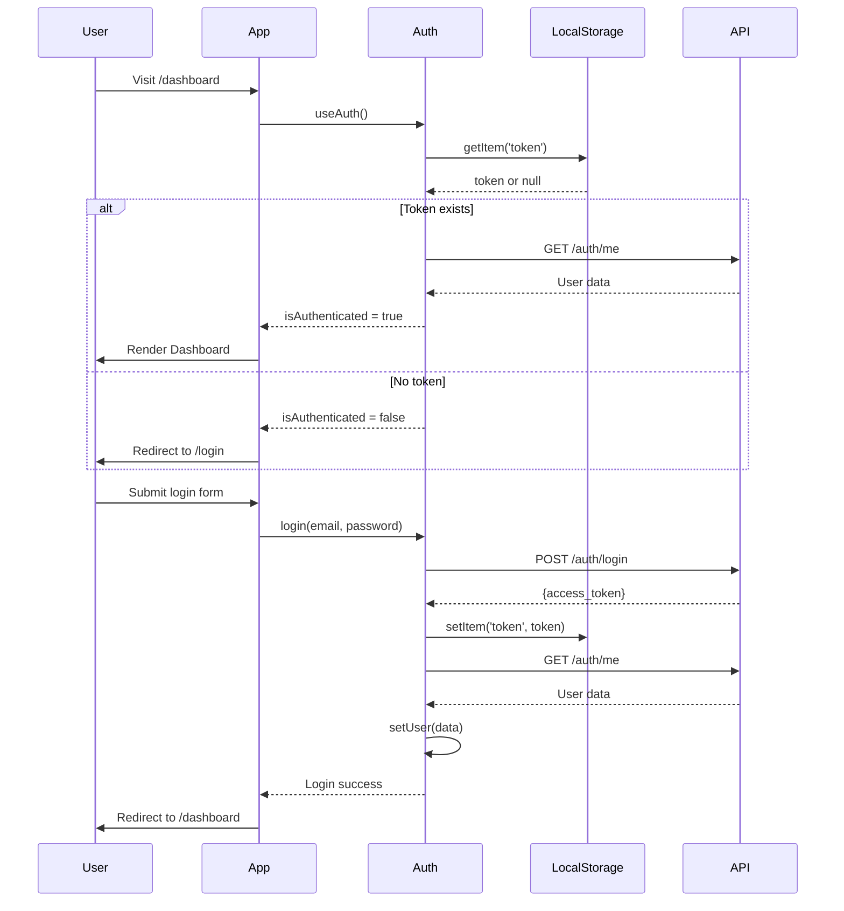

# Chapter 14: React Setup & Architecture

> **Frontend Foundation**: Understanding React 18, routing, and authentication flow.

---

## Application Structure

```
frontend/src/
├── main.jsx              # Entry point ⭐
├── App.jsx               # Router & route guards ⭐
├── layouts/
│   └── MainLayout.jsx    # Authenticated layout
├── pages/
│   ├── Landing.jsx       # Public homepage
│   ├── Login.jsx         # Auth
│   ├── Signup.jsx        # Auth
│   └── dashboard/        # Protected pages
├── components/           # Reusable UI
├── lib/
│   ├── auth.jsx          # AuthProvider ⭐
│   └── api.js            # Axios instance
└── services/             # API clients
```

---

## File 1: main.jsx - Application Entry Point

### Lines 1-11: React 18 Setup

```jsx
// Line 1-2: React 18 imports
import React from "react";
import ReactDOM from "react-dom/client";

// Line 3-5: Routing
import { BrowserRouter } from "react-router-dom";
import App from "./App.jsx";

// Line 6: Global styles
import "./index.css"; // Tailwind CSS

// Line 8-11: Render app
ReactDOM.createRoot(document.getElementById("root")).render(
  <React.StrictMode>
    <BrowserRouter>
      <App />
    </BrowserRouter>
  </React.StrictMode>,
);
```

**Key Decisions**:

- **React 18**: Uses `createRoot` (concurrent features)
- **StrictMode**: Double-renders in dev (catches bugs)
- **BrowserRouter**: HTML5 History API (clean URLs, no `#`)

---

## File 2: App.jsx - Routing & Route Guards

### Lines 1-14: Imports

```jsx
// Line 1-13: Routing & pages
import { Navigate, Route, Routes, useLocation } from "react-router-dom";
import Landing from "./pages/Landing.jsx";
import Login from "./pages/Login.jsx";
import Signup from "./pages/Signup.jsx";
import MainLayout from "./layouts/MainLayout.jsx";
import Dashboard from "./pages/dashboard/Dashboard.jsx";
import Transactions from "./pages/dashboard/Transactions.jsx";
// ... (other dashboard pages)

// Line 14: Auth context
import { useAuth } from "./lib/auth.jsx";
```

---

### Lines 16-34: RequireAuth Guard (Protected Routes)

```jsx
// Line 16-18: Component definition
function RequireAuth({ children }) {
  const { isAuthenticated, isLoading } = useAuth();
  const location = useLocation();

  // Line 19-27: Loading state
  if (isLoading) {
    return (
      <div className="min-h-screen flex items-center justify-center bg-[#09090b]">
        <div className="flex items-center gap-3 text-zinc-400">
          <div className="w-5 h-5 rounded-full border-2 border-zinc-700 border-t-violet-600 animate-spin" />
          <span className="text-sm font-medium">Loading WealthSync...</span>
        </div>
      </div>
    );
  }
  // ↑ Show spinner while checking auth
  // ↑ Prevents flash of login page

  // Line 29-31: Redirect if not authenticated
  if (!isAuthenticated) {
    const from = `${location.pathname}${location.search}`;
    return <Navigate to="/login" replace state={{ from }} />;
  }
  // ↑ Save current URL to redirect back after login
  // ↑ replace: Don't add to history (can't go "back" to protected page)

  // Line 33: Render children if authenticated
  return children;
}
```

**Flow**:

1. User visits `/dashboard`
2. `RequireAuth` checks `isAuthenticated`
3. If no: Redirect to `/login?from=/dashboard`
4. If yes: Render `<Dashboard />`

---

### Lines 36-50: RequireGuest Guard (Login/Signup Only)

```jsx
// Line 36-37: Component definition
function RequireGuest({ children }) {
  const { isAuthenticated, isLoading } = useAuth();

  // Line 38-46: Loading state
  if (isLoading) {
    return (
      <div className="min-h-screen flex items-center justify-center bg-[#09090b]">
        <div className="flex items-center gap-3 text-zinc-400">
          <div className="w-5 h-5 rounded-full border-2 border-zinc-700 border-t-violet-600 animate-spin" />
          <span className="text-sm font-medium">Loading...</span>
        </div>
      </div>
    );
  }

  // Line 48: Redirect if already authenticated
  if (isAuthenticated) return <Navigate to="/dashboard" replace />;
  // ↑ Logged-in users can't access /login or /signup

  return children;
}
```

**Why needed?** Prevents logged-in users from seeing login page.

---

### Lines 52-95: Routes Definition

```jsx
// Line 52-54: Main app component
function App() {
  return (
    <Routes>
      {/* PUBLIC ROUTES */}
      <Route path="/" element={<Landing />} />
      // ↑ No auth required
      {/* GUEST-ONLY ROUTES */}
      <Route
        path="/login"
        element={
          <RequireGuest>
            <Login />
          </RequireGuest>
        }
      />
      // ↑ Only accessible if NOT logged in
      <Route
        path="/signup"
        element={
          <RequireGuest>
            <Signup />
          </RequireGuest>
        }
      />
      {/* PROTECTED ROUTES */}
      <Route
        path="/dashboard"
        element={
          <RequireAuth>
            <MainLayout />
          </RequireAuth>
        }
      >
        {/* Nested routes */}
        <Route index element={<Dashboard />} />
        // ↑ /dashboard → Dashboard component
        <Route path="transactions" element={<Transactions />} />
        // ↑ /dashboard/transactions
        <Route path="budgets" element={<Budget />} />
        <Route path="bills" element={<Bills />} />
        <Route path="goals" element={<Goals />} />
        <Route path="subscriptions" element={<Subscriptions />} />
        <Route path="analytics" element={<Analytics />} />
        <Route path="settings" element={<Settings />} />
      </Route>
    </Routes>
  );
}
```

**Routing Patterns**:

- **Nested routes**: `/dashboard` wraps all dashboard pages in `<MainLayout>`
- **index route**: `/dashboard` with no path renders `<Dashboard />`
- **Route nesting**: All dashboard pages share sidebar, header

---

## File 3: lib/auth.jsx - Auth Context (Line by Line)

### Complete AuthProvider

```jsx
import { createContext, useContext, useEffect, useState } from "react";
import api from "./api.js";

const AuthContext = createContext(null);

export function AuthProvider({ children }) {
  const [user, setUser] = useState(null);
  const [isLoading, setIsLoading] = useState(true);

  // On mount: Check if token exists & fetch user
  useEffect(() => {
    const initAuth = async () => {
      const token = localStorage.getItem("token");
      if (!token) {
        setIsLoading(false);
        return;
      }
      // ↑ No token = not logged in

      try {
        // Fetch current user
        const response = await api.get("/auth/me");
        setUser(response.data);
      } catch (error) {
        // Token expired/invalid
        localStorage.removeItem("token");
      } finally {
        setIsLoading(false);
      }
    };

    initAuth();
  }, []);

  // Listen for unauthorized events (from api.js interceptor)
  useEffect(() => {
    const handleUnauthorized = () => {
      setUser(null);
      window.location.href = "/login";
    };

    window.addEventListener("auth:unauthorized", handleUnauthorized);
    return () =>
      window.removeEventListener("auth:unauthorized", handleUnauthorized);
  }, []);

  const login = async (email, password) => {
    const formData = new FormData();
    formData.append("username", email); // OAuth2 spec uses "username"
    formData.append("password", password);

    const response = await api.post("/auth/login", formData, {
      headers: { "Content-Type": "application/x-www-form-urlencoded" },
    });

    localStorage.setItem("token", response.data.access_token);

    // Fetch user data
    const userResponse = await api.get("/auth/me");
    setUser(userResponse.data);
  };

  const logout = () => {
    localStorage.removeItem("token");
    setUser(null);
    window.location.href = "/";
  };

  return (
    <AuthContext.Provider
      value={{
        user,
        isAuthenticated: !!user,
        isLoading,
        login,
        logout,
      }}
    >
      {children}
    </AuthContext.Provider>
  );
}

export const useAuth = () => {
  const context = useContext(AuthContext);
  if (!context) {
    throw new Error("useAuth must be used within AuthProvider");
  }
  return context;
};
```

**Key Features**:

1. **Persistent login**: Checks token on page load
2. **Auto-logout**: Handles 401 responses
3. **Global state**: All components access via `useAuth()`

---

## File 4: lib/api.js - Axios Instance

### Complete Setup

```jsx
import axios from "axios";

export const API_BASE_URL =
  import.meta.env.VITE_API_BASE_URL || "http://localhost:8000/api/v1";

const api = axios.create({
  baseURL: API_BASE_URL,
  headers: {
    "Content-Type": "application/json",
  },
  withCredentials: true,
  timeout: 15000, // 15 seconds
});

// Request interceptor: Add auth token
api.interceptors.request.use((config) => {
  const token = localStorage.getItem("token");
  if (token) {
    config.headers.Authorization = `Bearer ${token}`;
  }
  return config;
});

// Response interceptor: Handle 401
api.interceptors.response.use(
  (response) => response,
  (error) => {
    const status = error?.response?.status;
    if (status === 401) {
      localStorage.removeItem("token");
      window.dispatchEvent(new CustomEvent("auth:unauthorized"));
    }
    return Promise.reject(error);
  },
);

export default api;
```

**Why interceptors?**

- **Request**: Automatically add JWT to every request
- **Response**: Global 401 handling (logout everywhere)

---

## Authentication Flow Diagram



---

## Key Takeaways

1. **React 18**: `createRoot`, StrictMode
2. **Route guards**: `RequireAuth`, `RequireGuest`
3. **Context API**: Global auth state
4. **Axios interceptors**: Auto-add tokens, handle 401s
5. **Persistent auth**: Check token on mount
6. **Nested routing**: Dashboard pages share layout

---

## Navigation

**Previous Chapter**: [← Chapter 13: API Flow](./Chapter_13_API_Flow_Communication.md)

**Next Chapter**: [→ Chapter 15: Frontend Libraries](./Chapter_15_Frontend_Libraries.md)

**Back to Index**: [📚 Tutorial Home](./README.md)
