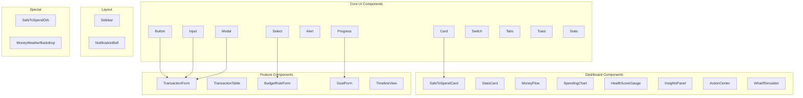

# Chapter 16: UI Components Library

> **Reusable Components**: Complete catalog of all 34 React components powering WealthSync's interface.

---

## Component Architecture



---

## 1. Core UI Components

### Button Component

**Path**: `components/ui/Button.jsx`

**Purpose**: Reusable button with variants and states

**Props**:

```typescript
interface ButtonProps {
  variant?: "primary" | "secondary" | "danger" | "ghost";
  size?: "sm" | "md" | "lg";
  disabled?: boolean;
  loading?: boolean;
  icon?: ReactNode;
  onClick?: () => void;
  children: ReactNode;
}
```

**Usage**:

```jsx
<Button variant="primary" size="lg" onClick={handleSubmit}>
  Save Transaction
</Button>

<Button variant="danger" icon={<TrashIcon />} loading={isDeleting}>
  Delete
</Button>
```

**Variants**:

- `primary`: Blue, main actions
- `secondary`: Gray, secondary actions
- `danger`: Red, destructive actions
- `ghost`: Transparent, subtle actions

**Accessibility**:

- Disabled state prevents clicks
- Loading spinner with aria-label
- Keyboard navigation (Tab, Enter, Space)

---

### Input Component

**Path**: `components/ui/Input.jsx`

**Purpose**: Form input with label, error states, validation

**Props**:

```typescript
interface InputProps {
  label?: string;
  type?: "text" | "email" | "password" | "number" | "date";
  value: string;
  onChange: (value: string) => void;
  error?: string;
  placeholder?: string;
  required?: boolean;
  disabled?: boolean;
  icon?: ReactNode;
}
```

**Usage**:

```jsx
<Input
  label="Email Address"
  type="email"
  value={email}
  onChange={setEmail}
  error={errors.email}
  required
  placeholder="you@example.com"
/>
```

**Features**:

- Error state styling (red border)
- Required indicator (\*)
- Icon support (e.g., search icon)
- Auto-focus on mount (optional)

---

### Card Component

**Path**: `components/ui/Card.jsx`

**Purpose**: Container with shadow, border, padding

**Usage**:

```jsx
<Card>
  <Card.Header>
    <h2>Safe to Spend</h2>
  </Card.Header>
  <Card.Body>
    <p>$245.67</p>
  </Card.Body>
  <Card.Footer>
    <Button>View Details</Button>
  </Card.Footer>
</Card>
```

**Variants**:

- Default: White background, subtle shadow
- Highlighted: Colored border (e.g., green for positive balance)
- Flat: No shadow (for nested cards)

---

### Modal Component

**Path**: `components/ui/Modal.jsx`

**Purpose**: Overlay dialog for forms, confirmations

**Props**:

```typescript
interface ModalProps {
  isOpen: boolean;
  onClose: () => void;
  title: string;
  children: ReactNode;
  footer?: ReactNode;
}
```

**Usage**:

```jsx
<Modal
  isOpen={showModal}
  onClose={() => setShowModal(false)}
  title="Add Transaction"
  footer={
    <>
      <Button onClick={handleSave}>Save</Button>
      <Button variant="ghost" onClick={() => setShowModal(false)}>
        Cancel
      </Button>
    </>
  }
>
  <TransactionForm onSubmit={handleSave} />
</Modal>
```

**Features**:

- Backdrop click to close
- ESC key to close
- Focus trap (keyboard navigation stays in modal)
- Scroll lock on body while open
- Smooth fade-in animation

---

### Alert Component

**Path**: `components/ui/Alert.jsx`

**Purpose**: Info/warning/error messages

**Props**:

```typescript
interface AlertProps {
  type: "info" | "success" | "warning" | "error";
  title?: string;
  message: string;
  onClose?: () => void;
}
```

**Usage**:

```jsx
<Alert
  type="warning"
  title="Budget Exceeded"
  message="You've spent $520 out of $500 budgeted for Groceries."
/>
```

**Design**:

- Color-coded (blue=info, green=success, yellow=warning, red=error)
- Optional close button
- Icon per type (ℹ️, ✅, ⚠️, ❌)

---

### Select Component

**Path**: `components/ui/Select.jsx`

**Purpose**: Dropdown select with search

**Props**:

```typescript
interface SelectProps {
  options: Array<{ value: string; label: string }>;
  value: string;
  onChange: (value: string) => void;
  placeholder?: string;
  searchable?: boolean;
}
```

**Usage**:

```jsx
<Select
  options={categories.map((c) => ({ value: c.id, label: c.name }))}
  value={selectedCategory}
  onChange={setSelectedCategory}
  placeholder="Select category"
  searchable
/>
```

**Features**:

- Search/filter options (if searchable=true)
- Keyboard navigation (Arrow keys, Enter to select)
- Clear button

---

### Progress Component

**Path**: `components/ui/Progress.jsx`

**Purpose**: Progress bar for goals, budgets

**Props**:

```typescript
interface ProgressProps {
  value: number; // 0-100
  max?: number;
  color?: string;
  showLabel?: boolean;
}
```

**Usage**:

```jsx
<Progress value={75} color="green" showLabel />
// Renders: [███████████████░░░░░] 75%
```

---

### Switch Component

**Path**: `components/ui/Switch.jsx`

**Purpose**: Toggle switch (on/off)

**Usage**:

```jsx
<Switch
  checked={autopayEnabled}
  onChange={setAutopayEnabled}
  label="Enable Autopay"
/>
```

---

### Tabs Component

**Path**: `components/ui/Tabs.jsx`

**Purpose**: Tab navigation

**Usage**:

```jsx
<Tabs>
  <Tabs.Tab label="Transactions">
    <TransactionTable />
  </Tabs.Tab>
  <Tabs.Tab label="Bills">
    <BillList />
  </Tabs.Tab>
</Tabs>
```

---

### Toast Component

**Path**: `components/ui/Toast.jsx`

**Purpose**: Temporary notification (bottom-right corner)

**Usage**:

```jsx
// In component
const { showToast } = useToast();

showToast({
  type: "success",
  message: "Transaction saved!",
  duration: 3000,
});
```

**Features**:

- Auto-dismiss after duration
- Stacks multiple toasts
- Slide-in animation

---

### Stats Component

**Path**: `components/ui/Stats.jsx`

**Purpose**: Stat display (number + label)

**Usage**:

```jsx
<Stats
  value="$3,245"
  label="Total Saved"
  trend="up"
  change="+12%"
  icon={<TrendingUpIcon />}
/>
```

---

## 2. Dashboard Components

### SafeToSpendCard

**Path**: `components/dashboard/SafeToSpendCard.jsx`

**Purpose**: Display daily spendable amount

**Features**:

- Large number display
- Trend indicator
- Breakdown modal (click for details)

**Data Flow**:

```jsx
const { safetospend } = useDashboard();
// → GET /api/v1/dashboard
// → Backend calculates: (income - spent - bills) / days_left
```

---

### StatsCard

**Path**: `components/dashboard/StatsCard.jsx`

**Purpose**: Generic stat card (total income, expenses, etc.)

**Props**:

```typescript
interface StatsCardProps {
  title: string;
  value: string;
  icon: ReactNode;
  trend?: "up" | "down" | "neutral";
  change?: string;
}
```

---

### MoneyFlow

**Path**: `components/dashboard/MoneyFlow.jsx`

**Purpose**: Sankey diagram showing income → expenses → categories

**Library**: Recharts or D3.js

**Visual**:

```
Income ($5000) ──┬──> Groceries ($500)
                 ├──> Rent ($1200)
                 ├──> Entertainment ($300)
                 └──> Savings ($2000)
```

---

### SpendingChart

**Path**: `components/dashboard/SpendingChart.jsx`

**Purpose**: Line/bar chart for spending over time

**Types**:

- Line chart: Daily spending trend
- Bar chart: Spending by category

**Library**: Recharts

---

### HealthScoreGauge

**Path**: `components/HealthScoreGauge.jsx`

**Purpose**: Circular gauge showing health score (0-100)

**Visual**: Half-circle/radial gauge

- 0-40: Red (Poor)
- 41-70: Yellow (Fair)
- 71-100: Green (Good)

---

### InsightsPanel

**Path**: `components/dashboard/InsightsPanel.jsx`

**Purpose**: AI-generated insights (e.g., "You spent 20% more on dining than last month")

**Data**: Calculated by backend health score calculator

---

### ActionCenter

**Path**: `components/dashboard/ActionCenter.jsx`

**Purpose**: Action cards (pay bill, approve autopilot, add transaction)

**Layout**: Grid of clickable cards

---

### WhatIfSimulator

**Path**: `components/dashboard/WhatIfSimulator.jsx`

**Purpose**: "What if I save $X more?" scenario simulator

**UI**:

- Slider for amount
- Shows projected savings date
- Updates in real-time

---

## 3. Feature Components

### TransactionForm

**Path**: `components/transactions/TransactionForm.jsx`

**Purpose**: Form to create/edit transaction

**Fields**:

- Amount (number)
- Type (select: income/expense)
- Category (select)
- Description (text)
- Date (date picker)

**Validation**:

- Amount > 0
- Type required
- Date not in future (optional)

**Submit Flow**:

```jsx
const handleSubmit = async (data) => {
  const response = await api.post("/transactions", data);
  showToast({ type: "success", message: "Transaction saved!" });
  onClose();
  refreshDashboard();
};
```

---

### TransactionTable

**Path**: `components/transactions/TransactionTable.jsx`

**Purpose**: List transactions with sorting, filtering

**Features**:

- Sort by date, amount, category
- Filter by type, category, date range
- Pagination
- Row actions (edit, delete)
- Bulk actions (select multiple, delete)

**Performance**:

- Virtualized scrolling for 1000+ rows
- Lazy loading (fetch more on scroll)

---

### BudgetRuleForm

**Path**: `components/budget/BudgetRuleForm.jsx`

**Purpose**: Create/edit budget rule

**Fields**:

- Category (select)
- Allocation type (select: FIXED/PERCENT)
- Allocation value (number)
- Monthly limit (number, optional)

**Dynamic UI**:

- If FIXED: Show "$" prefix
- If PERCENT: Show "%" suffix

---

### GoalForm

**Path**: `components/goals/GoalForm.jsx`

**Purpose**: Create/edit savings goal

**Fields**:

- Name (text)
- Target amount (number)
- Current amount (number)
- Monthly contribution (number)
- Target date (date)
- Priority (1-5)

**Visual Feedback**:

- Progress bar (current/target)
- Estimated completion date

---

### TimelineView

**Path**: `components/timeline/TimelineView.jsx`

**Purpose**: Visual timeline of past/future transactions

**Layout**:

```
Today
├─ 10:00 AM: Coffee ($5)
├─ 2:00 PM: Lunch ($15)
Tomorrow
├─ Bill due: Electric ($120)
└─ Autopilot pending: Netflix ($15.99)
```

---

## 4. Layout Components

### Sidebar

**Path**: `components/layout/Sidebar.jsx`

**Purpose**: Main navigation sidebar

**Items**:

- Dashboard
- Transactions
- Budgets
- Bills
- Subscriptions
- Savings Goals
- Settings
- Logout

**Features**:

- Active state highlighting
- Collapsible (mobile)
- Badge for notifications

---

### NotificationBell

**Path**: `components/notifications/NotificationBell.jsx`

**Purpose**: Notification dropdown

**Features**:

- Unread count badge
- Dropdown list of notifications
- Mark as read
- Click to navigate

---

## 5. Special Components

### SafeToSpendOrb

**Path**: `components/orb/SafeToSpendOrb.jsx`

**Purpose**: Animated 3D orb visualization

**Technology**: Three.js or CSS 3D transforms

**Visual**:

- Glowing orb
- Color changes based on amount (green=high, yellow=medium, red=low)
- Pulsing animation

---

### MoneyWeatherBackdrop

**Path**: `components/dashboard/MoneyWeatherBackdrop.jsx`

**Purpose**: Background animation ("financial weather")

**States**:

- Sunny: Budget on track
- Cloudy: Overspending
- Rainy: Significant overspending

---

## Component Patterns

### 1. Compound Components

```jsx
<Card>
  <Card.Header>Title</Card.Header>
  <Card.Body>Content</Card.Body>
  <Card.Footer>Actions</Card.Footer>
</Card>
```

**Benefits**:

- Flexible composition
- Clear structure
- Type-safe props

---

### 2. Render Props

```jsx
<DataTable
  data={transactions}
  renderRow={(txn) => (
    <tr>
      <td>{txn.amount}</td>
      <td>{txn.description}</td>
    </tr>
  )}
/>
```

---

### 3. Custom Hooks

```jsx
const useTransactions = () => {
  const [transactions, setTransactions] = useState([]);
  const [loading, setLoading] = useState(true);

  useEffect(() => {
    fetchTransactions()
      .then(setTransactions)
      .finally(() => setLoading(false));
  }, []);

  return { transactions, loading };
};

// Usage
const { transactions, loading } = useTransactions();
```

---

## Accessibility (a11y)

### Keyboard Navigation

- All interactive elements focusable
- Tab order logical
- Enter/Space to activate buttons
- ESC to close modals

### Screen Readers

- Semantic HTML (`<button>`, `<nav>`, `<main>`)
- ARIA labels for icons
- Live regions for dynamic updates

### Color Contrast

- WCAG AA minimum (4.5:1 for text)
- Not relying solely on color

---

## Key Takeaways

1. **34 components** organized by category
2. **Core UI**: Reusable primitives (Button, Input, Card)
3. **Dashboard**: Complex visualizations (Charts, Gauges)
4. **Feature**: Domain-specific forms and tables
5. **Patterns**: Compound components, render props, custom hooks
6. **Accessibility**: Keyboard, screen readers, contrast

---

## Navigation

**Previous Chapter**: [← Chapter 15: Frontend Libraries](./Chapter_15_Frontend_Libraries.md)

**Next Chapter**: [→ Chapter 17: Pages Complete](./Chapter_17_Pages.md)

**Back to Index**: [📚 Tutorial Home](./README.md)
