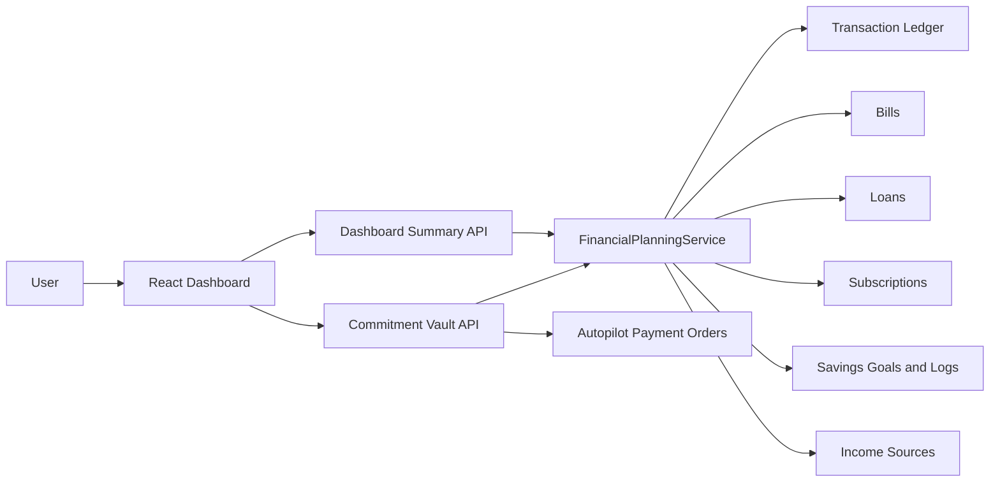

# Commitment Vault: Architecture and Implementation Plan

**Status:** Proposed

**Owner:** WealthSync product and engineering

**Scope:** Deterministic, explainable allocation of a user's tracked balance into Protected, Future, and Free. This is not a bank account, payment rail, or AI feature.

---

## 1. Product Intent

WealthSync must help users understand that a bank or tracked balance is not automatically spendable money. Commitment Vault makes the purpose of every rupee visible before the user spends it.

```text
Tracked balance: Rs. 72,000

Protected: Rs. 31,500  Bills, EMIs, and subscriptions due before the next income date
Future:    Rs. 12,000  Remaining planned contributions to active savings goals
Free:      Rs. 28,500  Money not required by the above commitments
```

The experience must answer three questions without requiring the user to interpret charts:

1. What money is already spoken for?
2. What money is being set aside for my future?
3. What is genuinely free for me to use?

Every amount must be traceable to a saved bill, loan, subscription, goal, or completed transaction. The product must never imply that it moved money or knows a user's bank balance unless an account integration exists.

---

## 2. Principles and Boundaries

### Product principles

- **Ledger first:** The tracked transaction ledger is the V1 balance source.
- **Explainable by default:** Each vault has a visible itemized calculation.
- **No double counting:** A paid commitment reduces the tracked balance but is no longer reserved.
- **No hidden judgement:** V1 reports covered, shortfall, or incomplete data. It does not generate advice or opaque scores.
- **Read-only calculation:** Opening a vault never creates transactions, reserves, payment orders, or goal contributions.
- **User control:** Existing bills, loans, subscriptions, and goals remain the place where users edit the underlying plan.

### Explicit V1 non-goals

- Bank-account aggregation, balance sync, or direct bank access.
- Real transfers between virtual buckets.
- Automatic payment approval or execution.
- Manual per-item reserve overrides, shared household vaults, and goal pausing.
- AI chat, financial advice, predictive recommendations, or black-box risk scoring.

---

## 3. Existing Foundation

The feature should extend the current architecture, not create a parallel finance engine.

| Existing capability | Current owner | Commitment Vault use |
| --- | --- | --- |
| Tracked balance from completed transactions | `dashboard.py` | V1 source for total balance |
| Bills and recurring due dates | `Bill`, `AutopilotService` | Protected items |
| Active loan EMIs | `Loan`, `AutopilotService` | Protected items |
| Active subscriptions and next billing date | `Subscription`, `AutopilotService` | Protected items |
| Active goal contributions and priorities | `SavingsGoal`, `SavingsLog` | Future items |
| Planning calculations and confidence reasons | `FinancialPlanningService` | Shared calculation conventions |
| Dashboard summary | `GET /api/v1/dashboard/summary` | Fast snapshot for the primary dashboard |
| Timeline and payment state | `GET /api/v1/autopilot/timeline` | Detail links and payment context |

The main architectural choice is to keep the vault **derived**. V1 requires no new database table or migration.

---

## 4. Calculation Contract

### 4.1 Planning horizon

The vault starts today and ends at the next expected income date. This makes the question practical: "What must remain protected until I am paid again?"

1. Read active `IncomeSource` records with a valid `payday`.
2. Resolve the nearest future salary date.
3. Use that date as `horizon_end`.
4. If no valid payday exists, fall back to the final day of the current calendar month and expose `horizon_source: "month_end_fallback"`.

The date helpers currently owned by `AutopilotService` should become pure shared helpers so the vault and timeline use identical rules for day 29, 30, and 31.

### 4.2 Tracked balance

```text
tracked_balance = sum(completed income transactions) - sum(completed expense transactions)
```

Only `completed` transactions and legacy transactions with `status = NULL` count. Pending and cancelled transactions are excluded.

V1 labels this number **Tracked balance**, not **Bank balance**. It includes only money represented in WealthSync's ledger.

### 4.3 Protected vault

Protected contains unpaid obligations with a due date within the planning horizon:

- Bills: use the next recurring due date; exclude a bill already paid in the current due cycle.
- Loans: use the next EMI due date; exclude a loan already paid in the current due cycle.
- Subscriptions: use `next_billing_date` when present, otherwise resolve the next recurring billing date.

```text
protected_amount = sum(unpaid scheduled bills + unpaid EMIs + active subscription renewals)
```

Each item includes its type, source id, name, amount, due date, and current payment-order status when one exists. An amount remains Protected until the corresponding source has a completed payment record or the source is marked paid according to the existing model.

### 4.4 Future vault

Future contains the portion of each active goal's scheduled contribution that is still planned in this horizon.

```text
remaining_goal_reserve = max(0, planned contribution - logged contribution in the horizon)
future_amount = sum(remaining_goal_reserve for active goals)
```

`SavingsGoal.current_amount` is never subtracted from the tracked balance. It describes progress toward a goal, not a new cash source. This avoids subtracting money twice.

For V1, a contribution is considered completed only when a corresponding `SavingsLog` exists. A later hardening pass may add an explicit transaction-to-goal link; that work is not needed to launch the derived vault.

### 4.5 Free vault and integrity

```text
reserve_total = protected_amount + future_amount
raw_free_amount = tracked_balance - reserve_total
free_amount = max(0, raw_free_amount)
shortfall_amount = max(0, -raw_free_amount)
```

V1 integrity states:

| State | Rule | User-facing meaning |
| --- | --- | --- |
| `covered` | tracked balance >= reserve total | Every scheduled reserve is covered. |
| `shortfall` | tracked balance < reserve total | The plan needs more money by `shortfall_amount`. |
| `incomplete` | no meaningful balance basis or no horizon source | Add transactions and income timing for an accurate vault. |

`daily_free_amount = free_amount / max(1, days_until_horizon_end)` is displayed as context only. The V1 Free number is the unreserved balance, while the existing Safe-to-Spend calculation remains available as a separate daily-budget signal until both systems are deliberately unified.

---

## 5. Target Architecture



### Responsibilities

- **React dashboard:** renders the snapshot, opens the detail drawer, and routes users to the source record. It does not calculate money values.
- **Dashboard API:** returns a compact vault snapshot with the normal summary response.
- **Commitment Vault API:** returns the complete, itemized vault document for details and refreshes.
- **FinancialPlanningService:** owns the pure, deterministic vault calculation and source-item normalization.
- **Autopilot payment orders:** are read only, used to show payment status where available. They do not change the vault calculation.
- **Database:** remains the source of truth. No `vaults`, `allocations`, or `reserve transfers` tables are added in V1.

---

## 6. API Design

### 6.1 Detailed endpoint

Add:

```http
GET /api/v1/autopilot/commitment-vault
```

The route follows existing safe-to-spend and timeline endpoints, requires the current user, and performs no writes.

### 6.2 Response contract

```json
{
  "generated_at": "2026-09-28T10:00:00Z",
  "basis": {
    "balance_source": "tracked_ledger",
    "horizon_start": "2026-09-28",
    "horizon_end": "2026-10-01",
    "horizon_source": "next_income_date",
    "next_income_date": "2026-10-01",
    "included_transaction_statuses": ["completed", "legacy_null"]
  },
  "tracked_balance": 72000.0,
  "vaults": {
    "protected": {
      "amount": 31500.0,
      "item_count": 4,
      "items": [
        {
          "source_type": "BILL",
          "source_id": "bill-id",
          "name": "Rent",
          "amount": 18000.0,
          "due_on": "2026-10-01",
          "payment_status": "approval_required"
        }
      ]
    },
    "future": {
      "amount": 12000.0,
      "item_count": 2,
      "items": [
        {
          "goal_id": "goal-id",
          "name": "Emergency Fund",
          "planned_amount": 10000.0,
          "completed_amount": 0.0,
          "reserved_amount": 10000.0,
          "target_date": "2027-03-01"
        }
      ]
    },
    "free": {
      "amount": 28500.0,
      "daily_amount": 950.0,
      "days_remaining": 30
    }
  },
  "integrity": {
    "state": "covered",
    "reserve_total": 43500.0,
    "shortfall_amount": 0.0,
    "coverage_percent": 100.0,
    "message": "All scheduled commitments are covered by your tracked balance."
  },
  "data_quality": {
    "state": "ready",
    "reasons": []
  }
}
```

### 6.3 Dashboard summary integration

Add an optional `commitment_vault` field to `DashboardStats` and the `GET /api/v1/dashboard/summary` response. It contains only:

- `tracked_balance`
- protected, future, and free amounts
- integrity state and shortfall amount
- horizon end date

The dashboard uses this compact snapshot on first load. Opening the vault details requests the full endpoint only when needed.

### 6.4 Schemas

Create `backend/app/schemas/commitment_vault.py` with typed Pydantic models for:

- `VaultBasis`
- `ProtectedVaultItem`
- `FutureVaultItem`
- `VaultBucket`
- `VaultIntegrity`
- `CommitmentVaultResponse`
- `CommitmentVaultSnapshot`

Money values are serialized as `Decimal` at the service boundary and validated in schemas. Conversion to a JSON number happens only in the FastAPI response encoder.

---

## 7. Backend Implementation Plan

### Step 1: Share date and recurrence helpers

Create `backend/app/services/planning_dates.py` for pure helpers:

- `monthly_multiplier(frequency)`
- `safe_day(year, month, day)`
- `next_recurring_date(now, day)`
- `parse_payday(payday)`
- `next_income_date(now, income_sources)`

Refactor `AutopilotService` and `FinancialPlanningService` to use these helpers. Existing timeline behavior for due-day 31 must remain unchanged.

### Step 2: Add derived vault calculation

Add `FinancialPlanningService.calculate_commitment_vault(session, user_id, *, now=None)`.

The method must:

1. Resolve the horizon.
2. Calculate the tracked balance using completed and legacy-null transactions.
3. Build each Protected item once, using the source record and resolved date.
4. Build each Future item once, netting relevant goal logs against its planned contribution.
5. Calculate Free and integrity from the formula in Section 4.
6. Return a typed dictionary that can feed both the detailed endpoint and compact dashboard snapshot.

Do not call `calculate_comprehensive_overview` from this method. The existing overview is salary-plan oriented, while the vault is current-balance oriented. Both may reuse shared helpers, but they must not silently mix a monthly income basis with a ledger balance basis.

### Step 3: Expose routes

In `backend/app/api/v1/autopilot.py`:

- import `CommitmentVaultResponse`
- add `GET /commitment-vault`
- call `FinancialPlanningService.calculate_commitment_vault`

In `backend/app/api/v1/dashboard.py`:

- add the compact snapshot to `DashboardStats`
- calculate it alongside the existing planning overview
- avoid any payment preparation, approval, or transaction mutation during summary load

### Step 4: Preserve payment-state links

For a Protected item, look up an existing `AutopilotPayment` only to attach status and `provider_action_url`. The item remains a reserve until its source is genuinely paid. A payment merely being approved must not reduce Protected.

### Step 5: No migration in V1

No schema migration is required. Add a migration only in a later phase when WealthSync supports one of these persisted concepts:

- account-level balances and account ownership
- user-created manual reserve overrides
- explicit transaction-to-goal contribution links
- historical vault snapshots

---

## 8. Frontend Experience

### 8.1 Dashboard placement

Add `frontend/src/components/dashboard/CommitmentVault.jsx`.

On desktop, place it directly below the dashboard header and before the current statistics row. On mobile, place it after the greeting and before all secondary metrics. The vault is the primary interpretation of money; charts remain secondary.

The initial state shows one total and three stable visual columns or rows:

```text
Tracked balance
Rs. 72,000

Protected  Rs. 31,500     Future  Rs. 12,000     Free  Rs. 28,500
```

Each vault is a button with an icon, amount, one-line meaning, and a count. The Free vault is visually primary but never presented as a bank balance.

### 8.2 Details drawer

Create `frontend/src/components/dashboard/CommitmentVaultDetails.jsx` using the existing modal or drawer pattern.

- **Protected tab:** amount, due date, payment status, and link to Bills, Loans, or Subscriptions.
- **Future tab:** goal contribution reserved this cycle, completed amount, target date, and link to Goals.
- **Free tab:** calculation equation, days until horizon end, daily context, and a clear explanation that it is based on tracked transactions.
- **Why this number?:** persistent basis block showing the balance source, horizon, and any fallback.

### 8.3 States

| State | UI behavior |
| --- | --- |
| Loading | Fixed-height skeleton; no shifting dashboard layout. |
| Covered | Show the three amounts and "Commitments covered" integrity label. |
| Shortfall | Show zero Free, the exact gap, and source links. Do not hide the negative reality. |
| Incomplete | Explain the missing setup: recorded balance, scheduled income date, or commitments. |
| Endpoint error | Keep the rest of the dashboard usable and offer a retry icon button. |

### 8.4 Client integration

- Extend `frontend/src/services/dashboard.js` types or response handling for `commitment_vault`.
- Add `autopilotService.getCommitmentVault()` for lazy detail loading.
- Use the existing `formatCurrency`, `Button`, `Card`, modal, and Lucide icon patterns.
- Refetch the summary after `transactions:changed`; refetch the detailed drawer after a bill, loan, subscription, or goal mutation.
- Do not perform financial arithmetic in React beyond display-safe percentages and formatting.

### 8.5 Copy rules

Use factual copy:

- "Tracked balance" instead of "Your money"
- "Reserved for upcoming commitments" instead of "locked"
- "Free after scheduled reserves" instead of "spend without limits"
- "Based on recorded transactions" whenever balance data may be incomplete

---

## 9. Edge Cases and Integrity Rules

| Case | Required behavior |
| --- | --- |
| No transactions | `tracked_balance = 0`; show incomplete setup rather than a misleading healthy state. |
| No income payday | Use month-end fallback and display that fallback. |
| Due day 31 in a short month | Clamp to the final valid calendar day. |
| Bill or EMI already paid | Exclude it from Protected for the matching cycle. |
| Subscription inactive | Exclude it. |
| Goal completed | Exclude it from Future. |
| Goal contribution partially logged | Reserve only the remaining planned amount. |
| Pending/cancelled transaction | Exclude from tracked balance and explain pending data in `data_quality`. |
| Negative ledger balance | Show shortfall; Free remains zero. |
| Duplicate payment records | Never reduce a reserve based solely on payment-order creation or approval. |
| Currency | V1 uses the application default currency formatting; all amounts remain Decimal in backend calculations. |

---

## 10. Test Strategy

### Backend unit and API tests

Add `backend/tests/test_commitment_vault.py` and use a fixed `now` value for deterministic date behavior.

- A covered balance produces exact Protected, Future, and Free amounts.
- A balance below reserves produces a zero Free bucket and an exact shortfall.
- Paid bills and paid EMIs are excluded from the matching cycle.
- Inactive subscriptions and completed goals are excluded.
- Partial `SavingsLog` contributions reduce Future exactly once.
- Pending and cancelled transactions do not affect tracked balance.
- The next payday defines the horizon; absent payday uses month-end fallback.
- Day 31 recurrence works in short months.
- A payment order with status `approved` remains Protected; only a completed source payment changes the reserve.
- All endpoints enforce user isolation and require authentication.
- The compact dashboard snapshot equals the corresponding fields in the detailed endpoint.

### Frontend tests

- Vault component renders covered, shortfall, incomplete, loading, and error states.
- Amounts retain layout with long localized currency strings.
- Clicking a vault opens its detail view and links to the correct source page.
- Dashboard refreshes the vault after a transaction event.
- Mobile layout keeps the vault visible before charts and does not overflow.

### Manual acceptance checklist

1. Create income, a bill, a loan, a subscription, and two goals.
2. Record income and verify tracked balance.
3. Confirm all unpaid obligations appear once in Protected.
4. Log a bill payment and confirm it leaves Protected only after the real paid state is saved.
5. Add a goal log and confirm Future decreases by that amount.
6. Spend more than Free and confirm the vault exposes an exact shortfall.
7. Navigate to Timeline and confirm the same due dates appear there.

---

## 11. Delivery Sequence

### Milestone 1: Calculation foundation

- Extract shared date helpers.
- Implement the pure vault service and schemas.
- Add unit tests for formulas, dates, and double-counting rules.

**Exit condition:** The detailed endpoint returns correct results for covered, shortfall, and incomplete users.

### Milestone 2: API and dashboard snapshot

- Add `GET /autopilot/commitment-vault`.
- Add compact `commitment_vault` to dashboard summary.
- Add endpoint tests and contract assertions.

**Exit condition:** Summary and detailed endpoint agree, with no database writes during reads.

### Milestone 3: Primary dashboard experience

- Build `CommitmentVault.jsx` and details drawer.
- Place it above existing summary cards on desktop and mobile.
- Add responsive and empty/error states.

**Exit condition:** A user can understand each amount and open its itemized explanation in two taps or fewer.

### Milestone 4: Reconciliation hardening

- Confirm bill, loan, subscription, and goal updates refresh the vault.
- Verify timeline/payment state consistency.
- Complete manual acceptance scenarios and regression tests.

**Exit condition:** No paid item remains reserved, no unpaid item disappears, and no money is counted twice.

---

## 12. Deferred Evolution

After V1 is stable and trusted, evaluate these separately:

1. **Account-backed balance:** replace `tracked_balance` with named cash accounts while retaining the same vault formula.
2. **Historical snapshots:** store daily vault snapshots for a transparent month replay.
3. **Manual reserve overrides:** allow an explicit extra reserve with an expiry date and audit trail.
4. **Goal-to-transaction links:** formally reconcile a savings log to the outgoing transfer that funded it.
5. **Vault horizon control:** let users compare next payday, month end, and a selected date without changing the default decision view.

None of these are needed to make the first Commitment Vault release useful and distinctive.

---

## 13. Definition of Done

Commitment Vault is ready to release when:

- The dashboard shows Protected, Future, and Free from a single deterministic calculation.
- Every displayed reserve can be opened and traced to a source record.
- The app clearly labels its balance as ledger-based in V1.
- The shortfall state is accurate, visible, and never disguised as a zero balance.
- The existing safe-to-spend, timeline, payment, and dashboard tests remain green.
- No AI behavior, financial advice, or opaque scoring is introduced.

