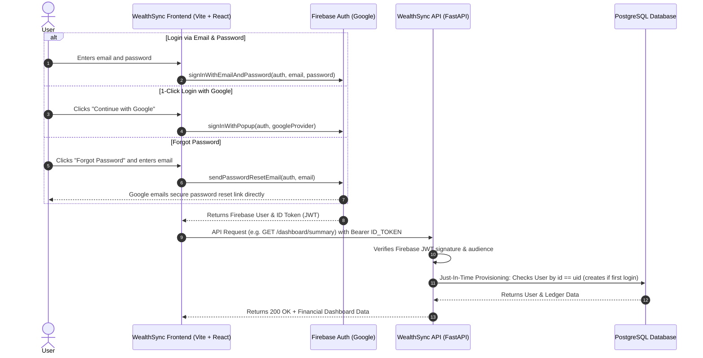

# Firebase Authentication Migration Plan

**Product:** WealthSync  
**Status:** Implemented & Verified (Production Ready)  
**Target:** Replace custom password/auth management with Google Firebase Authentication (Free Forever Tier)  
**Document Reference:** `docs/Firebase_Auth_Migration_Plan.md`  

---

## 1. Executive Summary & Objectives

WealthSync currently relies on custom password hashing (bcrypt), token issuance (PyJWT), and local storage of credentials in PostgreSQL. This architecture has notable gaps:
- **No Password Reset:** Users who forget their password lose access to all financial records.
- **No Social Sign-in:** Users must manually manage and remember passwords.
- **Maintenance Burden:** Building custom email dispatch (SMTP), secure reset tokens, anti-enumeration, and brute-force defenses requires ongoing infrastructure.

By migrating to **Firebase Authentication (Spark Free Tier)**:
1. **Password Reset is Automated & Free:** A single SDK call (`sendPasswordResetEmail`) uses Google's mail servers to deliver branded password reset links with zero SMTP setup.
2. **1-Click "Continue with Google":** Users can log in with their Google accounts with zero password friction.
3. **Unlimited Email/Password & Google Accounts:** The Firebase Spark plan provides unlimited users for standard authentication methods without monthly active user (MAU) caps.
4. **PostgreSQL Continuity:** All financial data (Commitment Vault, bills, loans, transactions, subscriptions) remains safely in PostgreSQL, linked to the user's permanent Firebase `uid`.

---

## 2. Target System Architecture



---

## 3. Step-by-Step Implementation Plan

### Step 1: Firebase Project Setup (One-time Developer Action)
1. Go to [Firebase Console](https://console.firebase.google.com/) and create a free project: `wealthsync-app`.
2. Under **Build -> Authentication -> Sign-in method**:
   - Enable **Email/Password**.
   - Enable **Google**.
3. Under **Project Settings -> General -> Your apps**, register a Web App and obtain the `firebaseConfig`:
   ```javascript
   const firebaseConfig = {
     apiKey: "AIzaSy...",
     authDomain: "wealthsync-app.firebaseapp.com",
     projectId: "wealthsync-app",
     storageBucket: "wealthsync-app.appspot.com",
     messagingSenderId: "...",
     appId: "..."
   };
   ```
4. Place these values into `frontend/.env`:
   ```env
   VITE_FIREBASE_API_KEY=AIzaSy...
   VITE_FIREBASE_AUTH_DOMAIN=wealthsync-app.firebaseapp.com
   VITE_FIREBASE_PROJECT_ID=wealthsync-app
   VITE_FIREBASE_STORAGE_BUCKET=wealthsync-app.appspot.com
   VITE_FIREBASE_MESSAGING_SENDER_ID=...
   VITE_FIREBASE_APP_ID=...
   ```

---

### Step 2: Frontend Implementation (`frontend/`)

#### 2.1 Dependencies
```bash
npm install firebase
```

#### 2.2 Firebase Client Instance (`frontend/src/lib/firebase.js`)
Initialize Firebase and export `auth` and `googleProvider`:
```javascript
import { initializeApp } from 'firebase/app';
import { getAuth, GoogleAuthProvider } from 'firebase/auth';

const firebaseConfig = {
  apiKey: import.meta.env.VITE_FIREBASE_API_KEY,
  authDomain: import.meta.env.VITE_FIREBASE_AUTH_DOMAIN,
  projectId: import.meta.env.VITE_FIREBASE_PROJECT_ID,
  storageBucket: import.meta.env.VITE_FIREBASE_STORAGE_BUCKET,
  messagingSenderId: import.meta.env.VITE_FIREBASE_MESSAGING_SENDER_ID,
  appId: import.meta.env.VITE_FIREBASE_APP_ID,
};

export const app = initializeApp(firebaseConfig);
export const auth = getAuth(app);
export const googleProvider = new GoogleAuthProvider();
```

#### 2.3 Revamped `AuthProvider` (`frontend/src/lib/auth.jsx`)
Update `auth.jsx` to listen to Firebase's `onAuthStateChanged`. When authenticated, automatically retrieve the Firebase ID token and attach it:
```javascript
import { 
  signInWithEmailAndPassword, 
  createUserWithEmailAndPassword, 
  signInWithPopup, 
  signOut, 
  sendPasswordResetEmail,
  onAuthStateChanged 
} from 'firebase/auth';
import { auth, googleProvider } from './firebase';
```
- **Login:** Calls `signInWithEmailAndPassword(auth, email, password)`.
- **Google Login:** Calls `signInWithPopup(auth, googleProvider)`.
- **Signup:** Calls `createUserWithEmailAndPassword(auth, email, password)`.
- **Password Reset:** Calls `sendPasswordResetEmail(auth, email)`.
- **Token Management:** Uses `await user.getIdToken()` to pass fresh tokens to Axios in `api.js`.

#### 2.4 Updated `Login.jsx` & `Signup.jsx`
- Add a prominent **"Continue with Google"** button with official Google branding.
- Add a **"Forgot Password?"** button opening a clean password reset modal.
- Eliminate manual form encoded `x-www-form-urlencoded` payloads in favor of Firebase SDK.

---

### Step 3: Backend Implementation (`backend/`)

#### 3.1 Dependencies
```bash
pip install firebase-admin
```

#### 3.2 Configuration (`backend/app/core/config.py`)
Add Firebase configuration settings:
```python
FIREBASE_PROJECT_ID: str | None = None
FIREBASE_CREDENTIALS_PATH: str | None = None  # Optional service-account JSON path
```

#### 3.3 Token Verification & Just-In-Time Provisioning (`backend/app/api/deps.py`)
Update `get_current_user` to verify Firebase ID tokens while maintaining backward compatibility with internal test tokens:
```python
import firebase_admin
from firebase_admin import auth as firebase_auth

# Initialize Firebase Admin once
if not firebase_admin._apps:
    firebase_admin.initialize_app()

async def get_current_user(
    token: Annotated[str, Depends(oauth2_scheme)],
    db: Annotated[AsyncSession, Depends(get_db)]
) -> User:
    try:
        # 1. Attempt verification as Firebase ID token
        decoded_token = firebase_auth.verify_id_token(token)
        uid = decoded_token["uid"]
        email = decoded_token.get("email")
        name = decoded_token.get("name")
        picture = decoded_token.get("picture")

        # 2. Just-In-Time (JIT) provisioning in PostgreSQL
        result = await db.execute(select(User).filter(User.id == uid))
        user = result.scalars().first()

        if not user:
            # Check if user exists by email (for migration)
            email_result = await db.execute(select(User).filter(User.email == email))
            user = email_result.scalars().first()

            if user:
                # Migrate existing user to new Firebase UID
                user.id = uid
            else:
                # Create brand new user record
                user = User(
                    id=uid,
                    email=email,
                    full_name=name,
                    avatar_url=picture,
                    is_active=True,
                    password_hash="FIREBASE_AUTH"
                )
                db.add(user)
                await db.commit()
                await db.refresh(user)
                # Seed default categories for new user
                await seed_default_categories(db, user.id)

        return user

    except Exception:
        # Fallback to local JWT verification for existing tests and CLI scripts
        return await verify_local_jwt_token(token, db)
```

#### 3.4 Removing Password Hashing Overhead on User Model
The `users.password_hash` column becomes optional or can be set to `"FIREBASE_AUTH"` since passwords are never stored in your local PostgreSQL database anymore.

---

### Step 4: Existing Account Migration (`sample@example.com`)

To ensure your demo data (`sample@example.com`) remains intact:
1. Create a script `backend/scripts/migrate_user_to_firebase.py`.
2. When `sample@example.com` is created in Firebase Console or via Firebase Admin SDK, map the PostgreSQL user `id` to the new Firebase `uid` (or rely on the auto-migration logic in `deps.py`).
3. All existing bills, loans, transactions, and commitment vault records remain 100% connected.

---

## 4. Test Suite Compatibility Strategy

To ensure zero regressions across all 17+ backend tests in `tests/test_calendar.py`, `tests/test_bill_cascade.py`, `tests/test_autopilot.py`, and `tests/test_commitment_vault.py`:
- In `deps.py`, the token validator checks for local test JWTs generated by `tests/conftest.py`.
- Automated test runs continue to execute synchronously and offline in `pytest` without needing a live internet connection to Google's servers.

---

## 5. Security & Privacy Audit

| Dimension | Standard Custom Auth | Firebase Auth Integration |
| :--- | :--- | :--- |
| **Password Storage** | Stored in PostgreSQL (bcrypt hash) | **Never stored on WealthSync servers**. Handled by Google Identity infrastructure. |
| **Password Reset** | Vulnerable to token timing attacks & lack of SMTP | **Google cryptographic email verification**. Instant single-use reset links. |
| **Token Validity** | 8-day fixed JWT | 1-hour short-lived ID token with automated background refresh by Firebase client SDK. |
| **Brute Force Protection** | Requires custom IP rate limiting | Handled automatically by Google security intelligence. |
| **Financial Privacy** | Ledger stored in PostgreSQL | **Unchanged**. Google only handles identity (email, name, uid); all financial data stays exclusively in your private PostgreSQL database. |

---

## 6. Implementation Deliverables

1. `frontend/src/lib/firebase.js` - Firebase client SDK initialization.
2. `frontend/src/lib/auth.jsx` - Refactored `AuthProvider` supporting Email/Password, Google Sign-in, and Password Reset.
3. `frontend/src/pages/Login.jsx` & `Signup.jsx` - Added "Continue with Google" button and "Forgot Password?" dialog.
4. `backend/app/api/deps.py` - Token verification supporting Firebase ID Tokens + JIT auto-provisioning.
5. `backend/scripts/migrate_user_to_firebase.py` - Migration script for existing test users.
6. Documentation & setup guide for creating the free Firebase Web App credentials.
