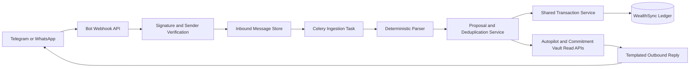

# PRD: Zero-App-Open Companion

**Product:** WealthSync

**Status:** Proposed

**Primary channels:** Telegram and WhatsApp

**Product principle:** A user can record a transaction or check a factual money value without opening the web app, while WealthSync never makes an uncertain financial change on their behalf.

---

## 1. Executive Summary

The Zero-App-Open Companion brings the smallest, highest-frequency WealthSync actions to messaging channels:

- log a verified bank-SMS transaction;
- record a transaction with a strict text command;
- check tracked balance, daily safe-to-spend, and upcoming obligations;
- confirm or reject a proposed transaction from the conversation.

The companion is an ingestion and query channel, not a financial adviser. It does not generate advice, invent categories, or make opaque inferences. It turns a message into a transparent, auditable proposal and writes a transaction only when the parse and user authorization rules are satisfied.

The release sequence intentionally starts with deterministic parsing. Optional voice transcription is deferred and must always show a transcript and transaction preview for confirmation; it is not required for the initial product value.

---

## 2. Problem and Objective

### Problem

Personal-finance tracking fails when users must stop what they are doing, open an app, and complete a form for every small expense. Bank SMS messages and short text notes already contain much of the needed information, but manually moving that information into a ledger is repetitive and error-prone.

### Objective

Allow a verified user to log transactions, query their recorded money picture, and review upcoming commitments without opening the WealthSync web app.

### Success statement

Within a messaging conversation, a user can forward a supported bank SMS, confirm the resulting transaction, and receive a factual acknowledgment with their refreshed daily safe-to-spend amount.

---

## 3. Scope

### V1 in scope

- Telegram bot webhook and verified Telegram chat linking.
- WhatsApp webhook and verified sender linking after the provider account and template requirements are ready.
- Forwarded Indian bank-SMS parsing for a supported, tested set of patterns.
- Strict text commands for expense, income, balance, free amount, daily safe-to-spend, and upcoming dues.
- Transaction preview and confirmation before a write by default.
- Idempotent transaction creation and duplicate-message prevention.
- Deterministic category suggestion using user-owned category mappings and exact merchant matches.
- Two-line factual replies with source-based money values.
- In-app channel connection, unlinking, and auto-log preference controls.

### Deferred scope

- Voice-note transcription and audio upload handling.
- PDF statement ingestion, OCR, or image parsing.
- General free-form natural-language understanding.
- Automated category learning without a user-confirmed mapping.
- Money transfers, payment approval, payment execution, debt collection, or financial advice.
- Group chats, shared household accounts, and multi-user message ownership.

### Explicit non-goals

- No AI chat assistant or investment, debt, or spending advice.
- No implicit permission to access a user's bank account or private SMS inbox.
- No transaction creation for an ambiguous message.
- No financial arithmetic implemented in a messaging provider webhook.

---

## 4. Personas and Jobs

| Persona | Job to be done | Companion value |
| --- | --- | --- |
| Busy UPI user | "I just paid; record it before I forget." | Forward a bank SMS and confirm in one interaction. |
| Salary planner | "Tell me what is still available today." | Ask `free` or `today` and receive a factual calculation. |
| Manual tracker | "I paid cash and have no bank SMS." | Send a strict command such as `spent 250 auto` and confirm it. |
| Careful user | "I need control over every write." | Preview, confirm, edit in-app, or reject every proposed transaction. |

---

## 5. User Experience

### 5.1 Channel connection

1. User opens Settings in WealthSync and selects Telegram or WhatsApp.
2. WealthSync displays a short-lived one-time linking code or deep link.
3. User sends the code from the intended messaging account.
4. WealthSync verifies that channel identity and confirms the connection in both places.
5. The user chooses one of two write modes:
   - **Confirm every transaction** (default)
   - **Auto-log high-confidence bank SMS** (optional, enabled only after the user has confirmed the channel and explicitly accepts the setting)

An identity belongs to exactly one WealthSync user. A user may unlink it at any time; unlinked messages are not processed as financial data.

### 5.2 Forwarded bank SMS

```text
User forwards a bank SMS
        |
        v
Webhook verifies provider signature and sender identity
        |
        v
Message is deduplicated and stored as an inbound event
        |
        v
Deterministic parser produces a transaction proposal
        |
        +-- low confidence or incomplete -> ask for correction; do not write
        |
        +-- confirmed / eligible auto-log -> create one transaction
        |
        v
Reply with transaction result and refreshed safe-to-spend value
```

Example confirmation:

```text
I found an expense of Rs. 450 at Swiggy today.
Reply YES to log it, NO to discard it, or EDIT to change it in WealthSync.
```

Example completion:

```text
Logged Rs. 450 expense: Swiggy.
Daily safe-to-spend: Rs. 950, based on your recorded data.
```

### 5.3 Strict text commands

V1 supports a documented grammar, not open-ended interpretation.

| Intent | Accepted examples | Result |
| --- | --- | --- |
| Expense | `spent 250 auto`, `paid 450 for groceries` | Create an expense proposal. |
| Income | `received 5000 freelance`, `income 65000 salary` | Create an income proposal. |
| Balance | `balance` | Return recorded tracked balance. |
| Free amount | `free` | Return the Commitment Vault Free amount when available; otherwise explain that the vault is not configured. |
| Daily allowance | `today` | Return daily safe-to-spend and days remaining. |
| Upcoming dues | `due` | Return the next three scheduled obligations. |
| Help | `help` | Return short supported-command examples. |

Unknown text receives a concise help response. It must not be passed to an opaque financial classifier in V1.

### 5.4 Category behavior

The parser may suggest a category only when it has an explicit, auditable basis:

1. a user-owned exact merchant mapping;
2. an existing matching bill or subscription; or
3. a user-provided category token in a strict command.

Otherwise, the transaction is created or proposed as Uncategorized. The reply asks the user to categorize it later in WealthSync; it never silently guesses Food, Travel, or another category.

### 5.5 Voice notes (deferred)

Voice transcription is a later opt-in channel. It may use a hosted transcription provider or a local worker, but it has these non-negotiable rules:

- show the transcript and parsed fields to the user;
- require confirmation before writing a transaction;
- discard the audio after processing according to the retention policy;
- never use audio to answer financial questions or produce advice.

---

## 6. Functional Requirements

### FR-1: Verified channel identity

- WealthSync must bind the provider sender identity to a user through an in-app initiated linking flow.
- WhatsApp identities are normalized as E.164 phone numbers; Telegram identities use the stable provider user and chat identifiers.
- A webhook sender alone is not sufficient authorization to modify a user's ledger.
- Link codes expire in 10 minutes, are single-use, and are stored only as secure hashes.

### FR-2: Webhook acceptance

- Every provider webhook must pass its provider-specific verification and signature or secret-token check before processing.
- The synchronous webhook response must acknowledge receipt quickly; parsing, database work, and outbound replies run asynchronously.
- The application records provider event ids and rejects replayed events without creating another transaction.

### FR-3: SMS parser

- The parser extracts amount, direction, merchant or counterparty, and an optional date.
- Amount and direction are mandatory for a transaction proposal.
- When the message date is missing or invalid, use provider-received time and mark `date_source: "received_at"`.
- The parser must return confidence and reason codes, never only a boolean result.
- Unsupported messages remain in `unrecognized` state and cannot write a transaction.

Initial patterns are deliberately conservative and are evaluated case-insensitively after whitespace normalization:

```python
PATTERNS = [
    # HDFC / ICICI / Axis style debit notification
    r"(?:Rs\\.?|INR)\\s*([0-9,]+(?:\\.\\d{1,2})?)\\s*debited\\b.*?\\b(?:to|at)\\s+([A-Za-z0-9 .,&'@_-]+)",
    # SBI style debit notification
    r"\\bdebited\\s*(?:by|INR|Rs\\.?)\\s*([0-9,]+(?:\\.\\d{1,2})?).*?\\btransfer to\\s+([A-Za-z0-9 .,&'@_-]+)",
    # Generic UPI transfer notification
    r"\\bsent\\s*(?:Rs\\.?|INR)\\s*([0-9,]+(?:\\.\\d{1,2})?)\\s*to\\s+([A-Za-z0-9 .,&'@_-]+)",
]
```

Each pattern needs a fixture from a redacted real example before being enabled. Pattern ownership, examples, and false-positive reports belong in a versioned parser test suite.

### FR-4: Proposal and confirmation

- Default behavior is `awaiting_confirmation` for every proposed transaction.
- Telegram uses callback buttons or command replies; WhatsApp uses the provider's supported interactive reply mechanism or clear text replies.
- `YES` confirms only the latest active proposal for that channel identity and within a 10-minute expiry window.
- `NO` discards the proposal.
- A proposal can be confirmed exactly once.
- Auto-log is allowed only for a verified channel, an enabled user preference, a supported bank-SMS pattern, complete mandatory fields, and a high-confidence result.
- Even with auto-log enabled, a detected duplicate, ambiguous amount, malformed date, or unrecognized sender must create no transaction.

### FR-5: Transaction creation

- Bot-originated transactions use the same ownership, category, date, status, link, and amount validation as web-originated transactions.
- The created transaction stores provenance through its linked inbound message rather than overloading the user-visible description.
- Transaction creation is idempotent against the inbound message id and payload fingerprint.
- Completion triggers the same dashboard refresh data paths used by a normal transaction.

### FR-6: Factual queries

- `balance` returns the ledger-derived tracked balance and states that it is based on recorded transactions.
- `today` calls the existing daily safe-to-spend calculation and returns its amount, days remaining, and status text.
- `free` depends on the Commitment Vault endpoint. Until Commitment Vault is released, the bot explains that this value is unavailable rather than substituting a different number.
- `due` uses the existing timeline or a dedicated query to return only current-user scheduled obligations.

### FR-7: Outbound replies

- Every reply is assembled from templates and verified calculated values.
- Replies contain no full account number, card number, raw bank-SMS text, or internal identifiers.
- The service respects provider delivery rules, opt-out, and rate limits.

---

## 7. Architecture



### Core components

| Component | Responsibility |
| --- | --- |
| `bot.py` route | Accept and verify provider webhooks; enqueue work; return quickly. |
| `ChannelIdentity` model | Bind a verified provider identity to one user and hold consent settings. |
| `InboundMessage` model | Store idempotency data, processing state, redacted metadata, parsed result, and transaction link. |
| `BotIngestionService` | Normalize messages, perform sender lookup, coordinate parse and proposal state. |
| `SmsParser` | Run deterministic regex and date parsing; return fields plus confidence reasons. |
| `CommandParser` | Parse the small V1 command grammar. |
| `TransactionService` | Shared, validated transaction creation for web and bot callers. |
| `BotReplyService` | Compose templates, query factual values, and send through an adapter. |
| `ChannelAdapter` | Provider-specific inbound normalization and outbound delivery. |
| Celery task | Isolate parsing, reply delivery, retries, and attachment handling from webhook latency. |

### Provider adapters

Define a stable interface so messaging providers do not leak into core financial logic:

```python
class ChannelAdapter(Protocol):
    def verify_request(self, request) -> VerifiedProviderEvent: ...
    def normalize_event(self, event) -> NormalizedInboundMessage: ...
    async def send_reply(self, identity, reply: ReplyPayload) -> DeliveryResult: ...
```

Implement `TelegramAdapter` first for controlled development and integration tests. Implement `WhatsAppAdapter` after the provider account, callback verification, and outbound message policy are configured. Neither adapter may create transactions directly.

---

## 8. Data Model

### 8.1 `channel_identities`

Purpose: verified mapping between a user and a messaging account.

| Column | Notes |
| --- | --- |
| `id` | UUID primary key |
| `user_id` | Foreign key to `users`, indexed |
| `channel` | `telegram` or `whatsapp` |
| `external_user_id` | Provider-stable sender identifier; normalized and unique per channel |
| `external_chat_id` | Required for outbound replies where distinct from sender id |
| `phone_e164` | Nullable; used only when applicable and encrypted at rest |
| `status` | `pending`, `verified`, `revoked` |
| `auto_log_enabled` | Default false |
| `verified_at`, `revoked_at` | Audit timestamps |
| `created_at`, `updated_at` | Standard timestamps |

Constraints:

- unique `(channel, external_user_id)`;
- one identity cannot belong to two users;
- `auto_log_enabled` requires `status = verified` in service validation.

### 8.2 `inbound_messages`

Purpose: audit the ingestion lifecycle and prevent duplicate writes.

| Column | Notes |
| --- | --- |
| `id` | UUID primary key |
| `channel_identity_id` | Nullable until sender verification resolves |
| `channel` | Provider channel |
| `provider_message_id` | Required external id; unique with channel |
| `provider_event_id` | Optional provider event id for replay defense |
| `payload_fingerprint` | SHA-256 of normalized relevant message content for secondary dedupe |
| `message_type` | `text`, `forwarded_sms`, `audio`, or future attachment type |
| `raw_payload_encrypted` | Optional encrypted payload, retention-limited; never logged |
| `redacted_preview` | Small safe audit preview |
| `status` | Lifecycle state below |
| `parse_result_json` | Parsed fields, confidence, and reason codes; no secrets |
| `proposal_expires_at` | Required for confirmation flow |
| `transaction_id` | Nullable foreign key to `transactions`, unique when set |
| `received_at`, `processed_at`, `created_at` | Audit timestamps |

Lifecycle:

```text
received -> verified -> parsed -> awaiting_confirmation -> committed
                                       |                    |
                                       +-> unrecognized     +-> duplicate
                                       +-> rejected         +-> failed
```

### 8.3 Transaction provenance

Add `inbound_message_id` as a nullable, unique foreign key on `transactions`, or use the unique `inbound_messages.transaction_id` link as the single source of provenance. Choose one representation during migration design; do not maintain two writable links.

The recommended V1 choice is `inbound_messages.transaction_id` because it preserves the existing `Transaction` model and supports one inbound event creating at most one transaction.

### 8.4 Linking codes

Use a short-lived `channel_link_tokens` table rather than a `phone` field on `users`.

- Store only a secure token hash.
- Include requested channel, user id, expiry, consumed timestamp, and attempt count.
- A link token is created in the authenticated web session and consumed only by a verified provider webhook.

---

## 9. API and Service Contracts

### Public provider endpoints

```http
POST /api/v1/bot/telegram/webhook/{webhook_secret}
GET  /api/v1/bot/whatsapp/webhook
POST /api/v1/bot/whatsapp/webhook
```

The exact verification handshake is adapter-owned. Each endpoint must be publicly reachable only through a deployment with HTTPS, request-size limits, rate limiting, and configured provider secrets.

### Authenticated application endpoints

```http
POST   /api/v1/bot/link-tokens
GET    /api/v1/bot/channels
PATCH  /api/v1/bot/channels/{identity_id}
DELETE /api/v1/bot/channels/{identity_id}
GET    /api/v1/bot/messages
```

`PATCH` is limited to user-controlled settings such as `auto_log_enabled`. It cannot reassign a channel identity.

### Internal service contract

```python
async def create_from_inbound_message(
    session: AsyncSession,
    *,
    user_id: str,
    inbound_message_id: str,
    proposal: TransactionProposal,
) -> Transaction:
    """Create exactly one validated transaction for an approved inbound proposal."""
```

This service must reuse the existing category ownership, timestamp, source-link, and automatic bill/subscription linking rules. The web transaction route should call this shared service where feasible, preventing rule drift between channels.

---

## 10. Security, Privacy, and Trust

### Security requirements

- Verify provider signatures, webhook secrets, and delivery challenge requests before queueing work.
- Reject duplicate provider message ids and replayed event ids.
- Validate linking tokens, identity state, sender identity, proposal expiry, and user ownership on every write.
- Use scoped configuration values for provider secrets; never commit them to the repository.
- Limit webhook payload size, supported message types, and attachment size before storing or queueing.
- Rate-limit linking attempts, commands, confirmations, and outbound replies per identity.
- Keep bot endpoints outside the normal JWT flow but protect them with provider authentication and idempotency controls.

### Privacy requirements

- Raw incoming text is never written to application logs, exception traces, analytics, or notifications.
- Store only redacted previews by default. Encrypted raw payload retention is optional, documented, and deleted after 30 days.
- Do not retain voice files in V1. A future transcription flow deletes the file after the configured processing window.
- Let users unlink a channel and delete retained message history from Settings, subject to required operational audit retention.
- Outbound replies reveal only the minimum information necessary for the requested action.

### Trust requirements

- Every transaction reply shows the amount, type, merchant/description, and date that will be saved.
- The bot names the source of every financial query: "based on recorded transactions" or "based on your planned commitments."
- The user can always correct or delete the resulting transaction in the app.
- No money-related action is taken from a raw message when parsing confidence is below the channel policy threshold.

---

## 11. Implementation Plan

### Milestone 0: Foundation and local simulation

- Add a provider-neutral normalized inbound-message fixture format.
- Build parser fixtures from redacted SMS samples and strict text commands.
- Create a local fake channel adapter for integration tests.
- Add configuration placeholders and startup validation for channel settings.

**Exit condition:** The parser can be exercised locally without real credentials or a real provider webhook.

### Milestone 1: Identity and ingestion persistence

Files to add or change:

- `backend/app/models/channel_identity.py`
- `backend/app/models/inbound_message.py`
- `backend/app/models/channel_link_token.py`
- `backend/app/models/__init__.py`
- `backend/app/schemas/bot.py`
- `backend/alembic/versions/<revision>_add_bot_ingestion.py`
- `backend/app/core/config.py`

Implement migrations, constraints, encrypted-payload policy, link-token lifecycle, and user-owned channel management endpoints.

**Exit condition:** A user can create a link token, a simulated webhook can verify it, and exactly one verified identity is bound to the user.

### Milestone 2: Deterministic parsing and proposal state

Files to add:

- `backend/app/services/bot_ingestion.py`
- `backend/app/services/sms_parser.py`
- `backend/app/services/command_parser.py`
- `backend/app/services/bot_reply.py`
- `backend/app/services/channel_adapters/base.py`
- `backend/app/tasks/bot_ingestion.py`

Implement normalized message handling, SMS regex parser, strict command parser, proposal expiry, duplicate detection, and templated replies.

**Exit condition:** A supported forwarded SMS produces one auditable `awaiting_confirmation` proposal and an unsupported SMS creates no transaction.

### Milestone 3: Safe transaction write path

Files to add or refactor:

- `backend/app/services/transactions.py`
- `backend/app/api/v1/transactions.py`
- `backend/app/api/v1/bot.py`

Extract reusable transaction creation validation from the web route. Confirmed bot proposals call the shared service, not the HTTP route, then link the created transaction to the inbound message in the same database transaction.

**Exit condition:** Duplicate confirmation attempts and duplicate webhook deliveries produce one transaction at most.

### Milestone 4: Telegram release path

- Add `TelegramAdapter` and its webhook route.
- Add command and confirmation interactions.
- Add reply templates for balance, daily safe-to-spend, dues, and transaction confirmations.
- Instrument privacy-safe operational metrics.

**Exit condition:** A verified Telegram user can forward a supported SMS, confirm it, and receive a refreshed daily safe-to-spend reply end-to-end.

### Milestone 5: Settings and web integration

Files to add or change:

- `frontend/src/pages/dashboard/Settings.jsx`
- `frontend/src/services/bot.js`
- `frontend/src/components/settings/ChannelConnectionPanel.jsx`

Add channel connection status, linking instructions, auto-log preference, unlink action, and recent ingestion history. Do not build a second chat UI inside the web app.

**Exit condition:** The user can fully control channel access and auto-log behavior from Settings.

### Milestone 6: WhatsApp release path

- Add `WhatsAppAdapter`, verified callback handling, outbound delivery, and provider-compliant confirmation controls.
- Run provider sandbox testing, request-signature tests, and delivery-retry tests.
- Enable WhatsApp only after policy, opt-in, and template constraints have been confirmed for the deployment account.

**Exit condition:** A verified WhatsApp sender receives the same safe, idempotent behavior as Telegram.

### Milestone 7: Optional transcription evaluation

Only begin after V1 channel accuracy and consent metrics are stable.

- Define a `TranscriptionProvider` interface separate from parsing and transaction creation.
- Add audio validation, transcript preview, confirmation, deletion, and retention tests.
- Select a hosted or local provider after a separate privacy, cost, and accuracy review.

**Exit condition:** Voice notes cannot create a transaction without a visible transcript and explicit user confirmation.

---

## 12. Testing Strategy

### Parser tests

- Supported HDFC, ICICI, Axis, SBI, and generic UPI examples parse expected amount, direction, merchant, and date.
- Near-miss text does not create a false proposal.
- Amount formats with commas and one or two decimal digits are normalized correctly.
- Debit, credit, reversed, failed, and pending bank messages are distinguished or rejected explicitly.
- Parser fixture content is redacted and contains no production identifiers.

### Webhook and identity tests

- Invalid signature or secret is rejected before persistence.
- Invalid or expired link token cannot bind an identity.
- A linked sender cannot access another user's records.
- Duplicate event ids and duplicate provider message ids result in at most one inbound-message record and one transaction.
- Unlinked senders receive no sensitive financial reply.

### Transaction integrity tests

- Confirmation writes exactly one valid transaction.
- `YES` cannot confirm an expired, rejected, or already committed proposal.
- Auto-log requires all policy conditions and never bypasses ownership validation.
- Bill/subscription auto-linking behaves exactly as it does for a web-created transaction.
- A transaction failure leaves the inbound message retry-safe and does not send a success reply.

### Query and reply tests

- `balance`, `today`, `due`, and `free` return only user-owned calculated values.
- Replies include the correct currency formatting and data-source disclosure.
- When Commitment Vault is unavailable, `free` does not invent a substitute amount.
- Outbound retries are idempotent and do not create additional transactions.

### Operational tests

- Celery task retries are bounded with dead-letter or failed-state visibility.
- Provider outage does not block web application requests.
- No raw payload appears in logs, exception records, or metric dimensions.
- Payload-size, rate-limit, and unsupported-attachment rejection paths are covered.

---

## 13. Metrics and Release Gates

### Product metrics

- Verified channel connections.
- Supported-message parse rate.
- Confirmation rate.
- Auto-log opt-in rate.
- Median time from inbound message to completed transaction.
- Bot-created transactions later edited or deleted by users.

### Safety metrics

- Duplicate deliveries blocked.
- Low-confidence parses prevented from writing.
- Transaction creation failures.
- Webhook verification failures.
- Unlinked-sender attempts.

Do not include raw message content, merchant names, phone numbers, or transaction amounts in analytics dimensions.

### Release gates

1. Parser fixture suite passes with no known false-positive write path.
2. Duplicate and replay tests prove exactly-once transaction behavior.
3. Channel-linking and unlinking flows pass manual security review.
4. Telegram pilot completes with confirmation-by-default enabled.
5. WhatsApp release requires separate provider account verification and policy validation.
6. Voice is not enabled until transcript-confirmation tests and privacy review pass.

---

## 14. Definition of Done

The Zero-App-Open Companion V1 is ready when:

- A user can securely link and unlink a Telegram identity from WealthSync.
- A supported forwarded SMS creates a clear transaction proposal without opening the web app.
- A confirmed proposal creates exactly one validated transaction and returns an accurate daily safe-to-spend response.
- Ambiguous, duplicate, unlinked, malformed, or replayed messages never create a transaction.
- All queries disclose that values are based on recorded data and current planned commitments.
- Raw financial message content is not exposed through logs or analytics.
- The web transaction flow, dashboard summary, Autopilot calculations, and Commitment Vault contract remain regression-tested.
- No AI advice, black-box classification, or automatic financial decision-making has been introduced.

