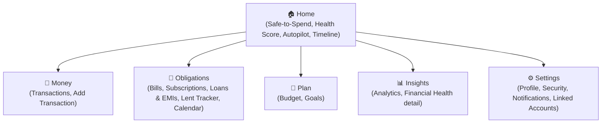
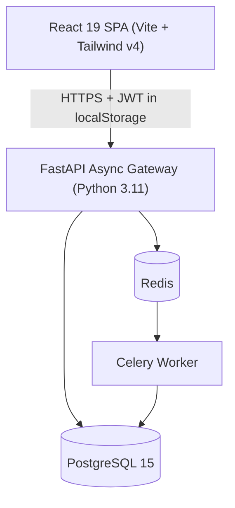
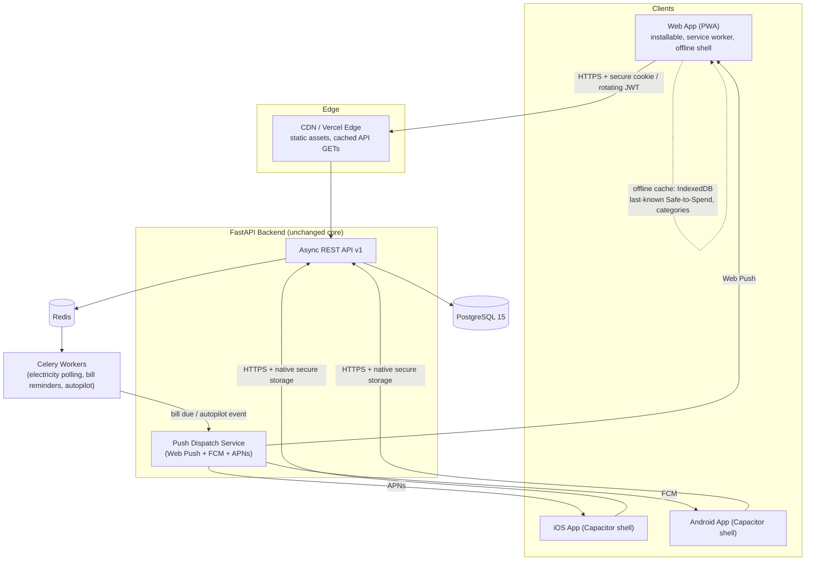
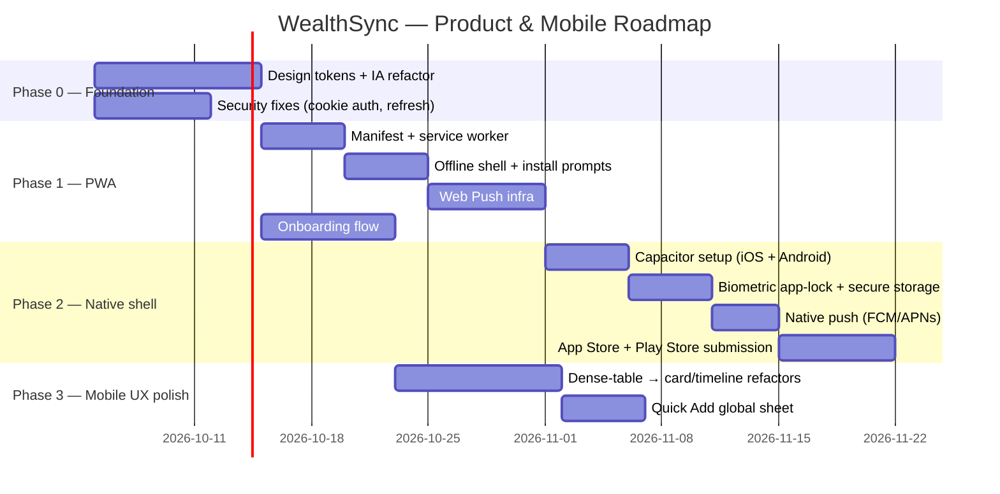

# WealthSync — Product Requirements Document
### From Project to Product: A Cross-Platform, Mobile-First Personal Finance App

| | |
|---|---|
| **Document type** | Product Requirements Document (PRD) |
| **Product** | WealthSync — Personal Finance & Cashflow Platform |
| **Repo** | `SatyaTejaChukka/wealth_sync` |
| **Prepared as** | Product Manager + Senior UI/UX Designer + Senior Frontend Architect |
| **Status** | Draft v1.0 — ready for scoping |
| **Scope of this doc** | Product strategy, information architecture, mobile app strategy, target system architecture, design system, screen-level UX specs, non-functional requirements, and a phased implementation roadmap |

---

## Table of Contents

1. [Executive Summary](#1-executive-summary)
2. [Current State Audit](#2-current-state-audit)
3. [Product Vision & Strategy](#3-product-vision--strategy)
4. [Goals, Non-Goals & Success Metrics](#4-goals-non-goals--success-metrics)
5. [Information Architecture](#5-information-architecture)
6. [Mobile Strategy & Platform Decision](#6-mobile-strategy--platform-decision)
7. [Target System Architecture](#7-target-system-architecture)
8. [Design System Specification](#8-design-system-specification)
9. [Mobile UX Design — Screen by Screen](#9-mobile-ux-design--screen-by-screen)
10. [Interaction, Motion & Content Guidelines](#10-interaction-motion--content-guidelines)
11. [Non-Functional Requirements](#11-non-functional-requirements)
12. [Security & Privacy Plan](#12-security--privacy-plan)
13. [Implementation Roadmap](#13-implementation-roadmap)
14. [Risks & Open Questions](#14-risks--open-questions)
15. [Appendix — Reference Implementations](#15-appendix--reference-implementations)

---

## 1. Executive Summary

WealthSync is already a genuinely differentiated personal finance engine: multi-source income tracking, a live Sankey cashflow visualization, an algorithmic Financial Health Score, an "Autopilot" payment planner, a Safe-to-Spend daily engine, and two features almost no mainstream finance app has — **automated Indian electricity board bill fetching** (APSPDCL/BESCOM/TSSPDCL/MSEDCL) and a **peer-to-peer lending ledger** with Indian-style "₹ per ₹100/month" interest models. The backend (FastAPI + async SQLAlchemy + Celery) is production-grade. The frontend already has real responsive engineering — a mobile bottom nav, `useMediaQuery`-driven layout branches, and a distinctive dark violet glassmorphic identity with a signature "Safe-to-Spend Orb" interaction.

What it isn't yet is a **product**. It's a well-built project: a single responsive website with no installable mobile app, no onboarding, no design system documentation, an inconsistent density between simple pages (Analytics, Transactions) and very dense ones (Loans.jsx at 1,058 lines, Lent.jsx at 805 lines), a security model (`localStorage` JWT, unused refresh flow) that isn't mobile-app-appropriate, and zero go-to-market framing.

This PRD treats "mobile" the way the requirement was clarified: **an actual app for mobile users** — installable, app-store-distributable, with native affordances (biometric lock, push notifications, offline resilience) — not merely a responsive web page. It recommends a **PWA-first, Capacitor-shell-second** strategy that reuses ~90% of the existing React codebase rather than a native rewrite, paired with an information-architecture cleanup, a formal design system built on the existing visual identity, and a phased 5-sprint roadmap.

---

## 2. Current State Audit

### 2.1 What's already strong (keep and build on this)

| Area | Evidence in repo | Verdict |
|---|---|---|
| Backend architecture | FastAPI async, SQLAlchemy 2.0 (asyncio), Alembic migrations, Celery+Redis for electricity polling, Argon2 + JWT auth, SlowAPI rate limiting, 30+ pytest tests | Production-grade. Not a rewrite target. |
| Feature depth | 17 backend modules (auth, income, transactions, budgets, bills, electricity, subscriptions, goals, loans, lent money, calendar, dashboard, notifications, health, autopilot) | Rare for a solo project. This is the moat — protect it, don't dilute it. |
| Visual identity | `index.css` defines a coherent dark zinc-950 + violet-500 glassmorphic theme, Inter/Outfit type pairing, a full custom keyframe library (orb pulse/shake, salary celebration, money-weather drift), and `prefers-reduced-motion` handling already wired in | A real design point of view exists. Formalize it — don't replace it. |
| Mobile-aware engineering | `useMediaQuery` hook, `MobileBottomNav` with a 4-tab + "More" bottom sheet, `CollapsibleCard`, mobile-specific tab state in `Dashboard.jsx`, `useDeviceShake` for the Safe-to-Spend Orb | This is genuinely ahead of most solo-built SPAs. The gap is *app-ness*, not responsiveness. |
| Component library seed | `components/ui/` already has Button, Card, Modal, Input, Toast, Select, Tabs, Switch, Progress, Alert, ConfirmDialog, Stats | A design system already exists in embryo — it needs tokens, docs, and consistent adoption, not invention from scratch. |

### 2.2 Gaps that block "product-first" and "real mobile app"

| Gap | Detail | Why it matters |
|---|---|---|
| **No installable app** | No `manifest.json`, no service worker, no `vite-plugin-pwa`, no Capacitor/native project. It's a browser tab today. | The explicit ask — "an app for mobile users" — isn't met by a responsive website alone. |
| **Insecure token storage for a finance app** | `lib/api.js` and `lib/auth.jsx` store the JWT in `localStorage` and attach it via `Authorization` header; any XSS reads the token. The backend already exposes `POST /auth/refresh`, but the frontend never calls it — sessions just die at `ACCESS_TOKEN_EXPIRE_MINUTES` (8 days) with no rotation. | Non-negotiable to fix before "product" framing — this is money data. |
| **No onboarding** | Signup → empty dashboard. No income setup, no category setup, no notification/biometric permission flow. | First-run experience is the #1 driver of activation in finance apps. |
| **Inconsistent density** | `Loans.jsx` (1,058 lines) and `Lent.jsx` (805 lines) are almost certainly desktop-table-first; `Analytics.jsx` is 101 lines. There's no shared rule for "how does a dense financial table become a mobile screen." | Without a rule, every dense page gets a bespoke, inconsistent mobile hack. |
| **No design tokens beyond CSS variables** | Color/spacing/radius exist as CSS vars, but there's no documented type scale, spacing scale, elevation scale, or component states (hover/active/disabled/loading) written down anywhere. | Every new screen re-invents spacing and hierarchy by eye. |
| **Flat 11-item navigation** | Sidebar renders all 11 routes as one flat list with no grouping; only the mobile bottom nav has an implicit "primary vs. more" split. | Desktop and mobile disagree on hierarchy — a groupless sidebar doesn't scale past ~7 items. |
| **No push notifications despite an in-app notification model** | `notifications.py` / `NotificationBell.jsx` exist, but they're pull-based (bell + list), not push. | The Autopilot, bill-due, and electricity-fetch features are exactly the kind of event that needs to reach the user outside the app. |
| **No offline behavior** | Every screen assumes a live network call to FastAPI. | Mobile networks drop; a "safe-to-spend" number that fails silently offline undermines trust. |
| **Single currency / single locale** | Electricity boards are India-specific (fine — keep as the differentiator), but currency formatting (`lib/format.js`) is not abstracted behind a locale service. | Not urgent, but worth architecting correctly now rather than retrofitting later if you ever want more than one country's boards. |
| **No analytics instrumentation, no crash reporting on the client** | Sentry DSN exists as a backend env var only; nothing on the frontend. | You can't run a product without knowing what breaks or what people actually use. |

---

## 3. Product Vision & Strategy

### 3.1 Positioning statement

> **For** people (starting with India-based salaried professionals and freelancers) **who** juggle multiple income sources, recurring bills, EMIs, and informal money lent to friends/family, **WealthSync is** a personal finance app **that** gives a single, always-current answer to "how much can I safely spend today" — **unlike** Mint-style trackers or spreadsheet templates, **WealthSync** automates India-specific obligations (electricity boards, EMIs, P2P lending with local interest conventions) and turns that into one daily number, one health score, and one autopilot plan.

### 3.2 Target personas

| Persona | Context | Core need | Primary surface |
|---|---|---|---|
| **"Salaried Sandeep"** — 26–38, salaried professional, 1–2 income streams, EMIs, SIPs/goals | Gets paid monthly, wants to know discretionary spend without a spreadsheet | Safe-to-Spend clarity, bill/EMI autopilot | Mobile, daily glance |
| **"Freelance Farha"** — 24–35, variable/multi-source income (gigs, dividends) | Irregular income makes fixed budgeting fail | Income smoothing, health score, flexible budget rules | Mobile + occasional desktop for deep analysis |
| **"Lender Lakshmi"** — any age, regularly lends small amounts to family/friends/colleagues | Tracks who owes what, at what informal interest, manually today (notebook/WhatsApp) | Trustworthy ledger with interest math and settlement history | Mobile-first, needs quick "log a loan" and "mark settled" |

### 3.3 Competitive landscape (brief)

| Product | Strength | Where WealthSync differentiates |
|---|---|---|
| YNAB / Copilot Money / Monarch Money | Polished budgeting UX, bank sync (Plaid) | No bank-linking dependency; works for India where Plaid-style aggregation is weaker; adds electricity-board + P2P lending, which none of these have |
| Walnut / INDmoney (India-focused) | SMS-based auto-tracking, investment tracking | WealthSync's P2P lending ledger with local interest conventions and the Autopilot/Safe-to-Spend framing is a distinct wedge, not a bank-data play |
| Spreadsheets / notebooks (the real incumbent for P2P lending) | Zero cost, total control | This is genuinely who "Lender Lakshmi" competes against today — the bar to beat is a notebook, not a competitor app |

*(This is directional market context to sharpen positioning, not a claim about current market share or user research — validate personas with real users before committing roadmap weeks to them.)*

### 3.4 Product principles (design philosophy)

1. **One number you can trust at a glance.** Safe-to-Spend is the north star metric of the home screen — everything else is one tap deeper.
2. **Mobile is the primary surface, not a shrunk desktop.** Every new screen is designed mobile-first; desktop is the "expanded" state, not the reference state.
3. **Delight without noise.** The Orb, celebrations, and weather backdrop are a real asset — keep them, but gate their frequency so they mark *meaningful* moments (salary landed, goal hit), not every render.
4. **Never lie about money.** No optimistic UI that could show a wrong balance; offline states are explicit, not silently stale.
5. **India-first, not India-only.** Keep the electricity-board/P2P-lending edge as the wedge, but don't hardcode currency/locale assumptions into the core data model.

---

## 4. Goals, Non-Goals & Success Metrics

### 4.1 Goals (this initiative)

- Ship an installable, app-store-distributable mobile app sharing one codebase with the web product.
- Establish a documented design system so every screen — old and new — follows the same rules.
- Redesign information architecture so 17 feature areas feel like 5, not 11.
- Close the security gaps that are unacceptable for a finance product (token storage, refresh flow, app-lock).
- Define measurable success criteria so "product-first" isn't just a feeling.

### 4.2 Non-goals (explicitly out of scope for this phase)

- Bank account aggregation / Plaid-style linking (large scope, separate PRD).
- Multi-currency support beyond architecting the *hooks* for it.
- A full native rewrite (React Native/Flutter/Swift+Kotlin) — see [Section 6](#6-mobile-strategy--platform-decision) for why.
- Monetization/billing implementation (positioning only, in case this becomes a real launch later).

### 4.3 Success metrics

| Metric | Baseline | Target (90 days post-launch of mobile app) |
|---|---|---|
| Activation: time from signup → first transaction logged | Unmeasured today | < 3 minutes, via onboarding wizard |
| D7 retention | Unmeasured | ≥ 35% |
| Home-screen install rate (of eligible mobile web visitors) | 0% (no manifest exists) | ≥ 20% |
| Crash-free session rate (mobile) | Unmeasured | ≥ 99.5% |
| Safe-to-Spend check frequency | Unmeasured | ≥ 4 sessions/week per retained user |
| Push notification opt-in rate | N/A (feature doesn't exist) | ≥ 50% |
| Mobile Lighthouse Performance score | Unmeasured | ≥ 90 on mid-tier Android |

---

## 5. Information Architecture

### 5.1 The problem

The sidebar today is a flat list of 11 items (Dashboard, Transactions, Bills, Subscriptions, Loans & EMIs, Lent Tracker, Calendar, Budget, Goals, Analytics, Settings). The mobile bottom nav already *implicitly* solves this with a 4-primary + "More" sheet split — but the grouping in that "More" sheet is arbitrary, and the desktop sidebar doesn't mirror it at all. Two surfaces, two mental models.

### 5.2 Proposed information architecture — 5 clusters



| Cluster | Contains | Rationale |
|---|---|---|
| **Home** | Dashboard, Safe-to-Spend, Health Score, Autopilot, Timeline | The daily-glance surface — unchanged as the anchor |
| **Money** | Transactions (list, add, edit, export) | The single highest-frequency action (logging spend) deserves its own top-level slot, not a buried "Activity" tab |
| **Obligations** | Bills, Subscriptions, Loans & EMIs, Lent Tracker, Calendar | Everything that's "money leaving on a schedule, whether owed by or to you" — Calendar becomes the aggregation view *of* this cluster, so it's grouped with it instead of standing alone |
| **Plan** | Budget, Goals | Forward-looking, intentional money decisions |
| **Insights** | Analytics, Health Score detail/history | Backward-looking analysis, for people who want to go deeper than the Home summary |
| **Settings** | Profile, Security & App Lock, Notifications, Linked Electricity Accounts, Appearance, Data Export | Consolidated account management |

### 5.3 Mobile navigation model

- **Bottom tab bar (5 items, always visible):** Home · Money · Obligations · Plan · Insights
- **Settings** moves to a profile-avatar entry point in the Home header (standard pattern — iOS Settings app, most fintech apps) rather than consuming a 6th bottom-tab slot.
- **Global Floating Action Button (FAB):** "+" persists above the tab bar on Home and Money screens → opens the **Quick Add** bottom sheet (transaction, bill, loan, lent-money entry — one sheet, tabbed by type). This is new; today "add" actions are buried per-page.
- Each cluster's landing screen is a **segmented sub-nav** (e.g., Obligations → Bills | Subscriptions | Loans | Lent | Calendar as horizontal pills), keeping the bottom bar stable at 5 items regardless of how many features live inside a cluster.

### 5.4 Desktop sidebar model

Mirror the same 5 clusters as collapsible sections with the sub-items indented underneath, replacing the flat 11-row list:

```
🏠 Home
💸 Money
📌 Obligations  ▾
    Bills
    Subscriptions
    Loans & EMIs
    Lent Tracker
    Calendar
🎯 Plan  ▾
    Budget
    Goals
📊 Insights
─────────────
⚙️ Settings          [bottom, pinned]
```

This is a small change with a high payoff: the two platforms now teach the same mental model, so a user who learns the app on mobile isn't relearning it on desktop.

---

## 6. Mobile Strategy & Platform Decision

The clarified requirement is explicit: **an app for mobile users**, not a mobile-responsive website. Here is the decision framework and recommendation.

### 6.1 Options considered

| Approach | Code reuse from current React app | App-store presence | Native capability (biometrics, push, widgets) | Effort (solo builder) | Ongoing maintenance |
|---|---|---|---|---|---|
| **A. PWA only** (manifest + service worker) | ~100% | Android: installable via Chrome; iOS: Add-to-Home-Screen only, no App Store listing | Partial — Web Push works on Android fully, iOS 16.4+ supports it for installed PWAs but with real limitations; no biometric API, no widgets | Low (days) | Very low — one codebase |
| **B. Capacitor/Ionic shell wrapping the existing React app** | ~90–95% | Yes — real iOS App Store + Google Play listing | Full — native plugins for biometrics (Face ID/Touch ID/Fingerprint), native push (APNs/FCM), secure Keychain/Keystore storage, haptics, share sheet | Medium (1–2 weeks after PWA groundwork) | Low — same React codebase, thin native shell |
| **C. React Native rewrite** | ~20–30% (business logic/services portable, all UI rewritten) | Yes | Full, and generally more "native-feeling" scroll/gesture physics than a WebView | High (months) | High — a second UI codebase to keep in sync forever |
| **D. Flutter rewrite** | ~0% (different language/framework entirely) | Yes | Full | Very high | Very high — third stack (Dart) alongside Python + React |
| **E. Fully native (Swift + Kotlin, two codebases)** | 0% | Yes | Maximum | Very high | Highest — two native codebases |

### 6.2 Recommendation: **A → B, phased.** PWA first, Capacitor shell second.

**Why not React Native/Flutter/native:** WealthSync's competitive edge is feature depth and calculation correctness (interest math, EMI amortization, health score), not novel touch gestures that need fully native rendering. A rewrite would freeze feature development for months to rebuild UI that already exists, and — for a solo/independent builder — permanently doubles the maintenance surface (every new feature now needs to be built twice). Capacitor gives ~95% of the native distribution and capability benefit for a fraction of the cost, because it ships the *same* React app inside a thin native WebView shell with a JS-to-native bridge for the few things the web genuinely can't do (biometrics, native push, secure storage, haptics).

**Why PWA first, not straight to Capacitor:** The PWA work (manifest, service worker, offline shell, installability, responsive polish) *is* the majority of Capacitor's frontend prerequisite work anyway. Ship it first as a fast, low-risk win — it already makes the product installable on Android and adds real value on iOS Safari — then wrap the same, now-PWA-ready app in Capacitor for official app-store listings and the native APIs a PWA can't reach.

> **Decision:** Phase 1 ships a fully installable PWA (Android install prompt, iOS Add-to-Home-Screen, offline shell, Web Push). Phase 2 wraps the same app in Capacitor for iOS App Store + Google Play, adding native biometric app-lock, native push, and secure token storage. Revisit React Native only if a future feature genuinely requires native-only capability (e.g., a home-screen widget with live Safe-to-Spend, which Capacitor cannot do — see [Section 14](#14-risks--open-questions)).

### 6.3 What changes in the codebase for each phase

| Phase | New additions | Existing code touched |
|---|---|---|
| PWA | `manifest.webmanifest`, service worker (via `vite-plugin-pwa`), install-prompt UI, offline fallback route, Web Push subscription flow | `index.html` (meta tags), `main.jsx` (SW registration), `lib/api.js` (offline-aware request queue) |
| Capacitor | `capacitor.config.ts`, `/ios` and `/android` native projects (generated, checked in), native plugin calls (`@capacitor/biometric`, `@capacitor/push-notifications`, `@capacitor/preferences`, `@capacitor/haptics`) | `lib/auth.jsx` (swap `localStorage` for `Capacitor Preferences`/Keychain on native, secure cookie on web), a thin `platform.js` abstraction so the same component code branches by `Capacitor.isNativePlatform()` |

---

## 7. Target System Architecture

### 7.1 Current architecture (as-is, from the repo)



### 7.2 Target architecture (product + mobile app)



### 7.3 New/changed components and their responsibility

| Component | Responsibility | Notes |
|---|---|---|
| Service worker (web) | Cache app shell + static assets; serve a "you're offline — showing last-synced data" state for GET-heavy screens (Dashboard, Transactions list) | `vite-plugin-pwa` with `workbox` `generateSW` strategy is the pragmatic choice — don't hand-roll Workbox config |
| Push Dispatch Service | New thin service layer in the backend that fans a domain event (bill due in 3 days, electricity bill fetched, salary detected, autopilot executed) out to Web Push / FCM / APNs subscriber records | Additive — plugs into existing Celery tasks and the existing `notifications.py` domain events; doesn't change core business logic |
| Offline cache (client) | IndexedDB (via `idb` or Dexie) holding the last successful Dashboard summary, category list, and pending "logged while offline" transaction queue | Read-mostly cache, not a full offline-first sync engine — that's a larger future investment, scoped out here (see Non-Goals) |
| Platform abstraction (`lib/platform.js`) | Single place that answers "are we native (Capacitor) or web" and routes token storage, biometric prompts, and push registration accordingly | Keeps every page component platform-agnostic |
| Secure token storage | Web: httpOnly, `Secure`, `SameSite=Lax` cookie set by the backend on login, no JS access at all. Native: `@capacitor/preferences` backed by iOS Keychain / Android Keystore | Replaces the current `localStorage` token. See [Section 12](#12-security--privacy-plan) |
| Refresh flow (finally wired up) | Frontend actually calls the existing `POST /auth/refresh` on a 401 before forcing logout | Backend already supports this; it's purely a frontend gap today |

---

## 8. Design System Specification

The goal here is **not** a new visual language — the dark zinc/violet glassmorphic identity is distinctive and should stay. The goal is to **document it as tokens** so every screen, old and new, draws from the same source instead of eyeballing values.

### 8.1 Color tokens

| Token | Value (existing) | Usage |
|---|---|---|
| `--background` | `#09090b` (zinc-950) | App background |
| `--card` | `#09090b` w/ `.glass-card` overlay | Card surfaces |
| `--primary` | `#8b5cf6` (violet-500) | Primary actions, active nav state, focus ring |
| `--secondary` / `--muted` / `--accent` | `#27272a` (zinc-800) | Secondary surfaces, chips, disabled states |
| `--muted-foreground` | `#a1a1aa` (zinc-400) | Secondary text |
| `--destructive` | `#7f1d1d` (red-900) bg / `#fef2f2` fg | Delete, overspend warnings |
| `--border` / `--input` | `#27272a` | Hairlines, input borders |

**New semantic tokens to add** (currently implied by ad-hoc Tailwind classes like `text-emerald-400`, not tokenized):

| New token | Suggested value | Usage |
|---|---|---|
| `--color-income` | emerald-400 `#34d399` | Income amounts, positive deltas |
| `--color-expense` | rose-400 `#fb7185` | Expense amounts, negative deltas |
| `--color-warning` | amber-400 `#fbbf24` | Bill due soon, budget nearing limit |
| `--color-info` | blue-400 `#60a5fa` | Neutral informational states |
| `--elevation-1` / `--elevation-2` | `.glass` / `.glass-card` (already exist) | Formalize as `elevation-1` (subtle) and `elevation-2` (modal/sheet) rather than two unnamed utility classes |

**Light mode:** Explicitly deferred (dark-only today, and dark fits a finance app's "serious, focused" tone well). Recommend defining light-mode token values as a fast-follow purely for accessibility (some users need light backgrounds for readability) and for OLED-vs-battery/contexts like bright outdoor use — not a Phase 1 requirement.

### 8.2 Typography scale

Keep the existing **Outfit** (display/headings) + **Inter** (body) pairing — it reads premium and is already loaded. Formalize the scale that's currently implicit in ad-hoc `text-sm`/`text-2xl` usage:

| Role | Font | Size / Line-height | Weight |
|---|---|---|---|
| Display (Safe-to-Spend hero number) | Outfit | 40px / 44px (mobile), 56px / 60px (desktop) | 700 |
| H1 (page title) | Outfit | 24px / 32px | 700 |
| H2 (section header) | Outfit | 18px / 26px | 600 |
| Body | Inter | 14px / 20px | 400–500 |
| Caption / label | Inter | 12px / 16px | 500, uppercase tracking-wide (matches existing "Signed in as" pattern) |
| Numeric/tabular (amounts in lists) | Inter, `font-variant-numeric: tabular-nums` | 14–16px | 600 |

### 8.3 Spacing & radius

- 4px base grid: `4 / 8 / 12 / 16 / 24 / 32 / 48`.
- Radius: keep existing `--radius: 0.75rem` (12px) for cards, `9999px` for pills/badges/FAB — already consistent in the codebase.
- **Touch targets:** standardize the minimum at **44×44px** (iOS HIG / Material baseline). The codebase already does this in places (`min-h-11`, `min-h-14` in `MobileBottomNav`) — make it a documented rule, not an accident, so dense screens like Loans/Lent don't regress.

### 8.4 Component inventory & responsive rules

| Component | Desktop behavior | Mobile behavior | Change needed |
|---|---|---|---|
| `Modal` | Centered dialog | **Bottom sheet** (slide up, drag-to-dismiss handle) | New: add a `Sheet` variant; route all "Add/Edit" forms through it on mobile instead of a centered modal |
| Data tables (Loans, Lent, Transactions) | Full table | **Card list** — one card per row, key fields promoted, secondary fields behind a "Details" expand (`CollapsibleCard` already exists — reuse it) | Refactor `Loans.jsx`/`Lent.jsx` to branch render via `useMediaQuery`, same pattern already used in `Dashboard.jsx` |
| Sankey Flow chart | Full interactive SVG Sankey | **Simplified flow bars** (Income → 3–4 top categories as horizontal bars) with a "View full flow" link to a dedicated full-screen chart view | Sankey diagrams need width to read; forcing one into 360px is a known anti-pattern |
| Sidebar | Grouped, collapsible sections (Section 5.4) | N/A (bottom nav instead) | Add section grouping |
| Bottom nav | N/A | 5 tabs + FAB (Section 5.3) | Reduce from 4+More to the 5-cluster model |
| Toast | Slide-in from top-right | Slide-in from top, full-width minus margin, respects safe-area | Existing `Toast.jsx` — verify safe-area padding |
| Charts (Recharts) | Full axis labels, legends | Larger touch targets on data points, simplified/rotated labels, horizontal scroll for long time ranges | Add a `compact` prop to shared chart wrappers |

### 8.5 Accessibility checklist (WCAG 2.1 AA target)

- Text contrast ≥ 4.5:1 on `--background`/`--foreground` pairs — audit the `zinc-500`/`zinc-400` muted text combos, which can dip under 4.5:1 on the darkest backgrounds.
- All interactive elements reachable via keyboard (web) with a visible focus ring using `--ring` (`violet-500`) — already themed, verify it's not suppressed anywhere via `outline-none` without a replacement.
- Icon-only buttons (nav, close, more) need `aria-label`s.
- Respect `prefers-reduced-motion` everywhere — already partially done in `index.css`; extend the same media query guard to Framer Motion transitions, not just CSS keyframes.
- Dynamic type: don't hardcode pixel heights on text containers; the existing `rem`-based Tailwind scale already helps here.

---

## 9. Mobile UX Design — Screen by Screen

This section is the "senior UI/UX designer" deliverable: concrete layouts for the highest-traffic and highest-complexity screens, shown as annotated wireframes. Grid/box widths are illustrative, not pixel-exact.

### 9.1 Onboarding (new — does not exist today)

**Why it's needed:** today, signup drops a user straight into an empty Dashboard with a zero-value Safe-to-Spend card. First-run is the single highest-leverage screen to add.

```
┌─────────────────────────────┐
│  ●───●───○───○───○  (steps) │
│                             │
│        [ Orb graphic ]      │
│                             │
│   "Let's set your Safe-     │
│    to-Spend baseline."      │
│                             │
│   Monthly income            │
│   ┌─────────────────────┐   │
│   │ ₹  ___________       │   │
│   └─────────────────────┘   │
│   + Add another source      │
│                             │
│                             │
│   [        Continue     ]   │
└─────────────────────────────┘
```

Flow: **Welcome → Income sources → Recurring bills (optional, skippable) → Notification permission → Biometric app-lock opt-in → Land on Home with a real (non-zero) Safe-to-Spend number.** Every step is skippable except income (the one number the whole app is built around).

### 9.2 Home (redesigned Dashboard)

```
┌─────────────────────────────┐
│  Hi, Satya 👋        🔔 👤  │  ← greeting + notif + avatar (→Settings)
│                             │
│   ┌───────────────────┐    │
│   │                   │    │
│   │   ₹1,240           │    │  ← Safe-to-Spend Orb, hero, tap→detail
│   │  safe to spend     │    │
│   │      today         │    │
│   └───────────────────┘    │
│                             │
│  Health Score  ●●●●○  78    │  ← tap → Insights
│                             │
│  ┌─────┐ ┌─────┐ ┌─────┐   │
│  │Income│ │Spent │ │Saved│  │  ← swipeable stat cards
│  └─────┘ └─────┘ └─────┘   │
│                             │
│  This month's flow          │
│  ▬▬▬▬▬▬▬▬░░░░  Rent 34%     │  ← simplified flow bars (8.4)
│  ▬▬▬▬░░░░░░░░  Food 18%     │
│  [ View full flow → ]       │
│                             │
│  Recent activity            │
│  • Swiggy        −₹340      │
│  • Salary       +₹85,000    │
│                             │
├─────────────────────────────┤
│  🏠   💸   📌   🎯   📊     │  ← 5-tab bar
└─────────────────────────────┘
                        (+)     ← global FAB, floats above tab bar
```

Key changes from today: greeting + avatar replaces a bare header; stat cards are swipeable instead of stacked (reduces initial scroll length); the Sankey is summarized with a link to the full chart instead of being force-fit into 360px; a global FAB is always present.

### 9.3 Quick Add (new global bottom sheet)

```
┌─────────────────────────────┐
│           ▬▬▬                │  ← drag handle
│  Transaction  Bill  Lent     │  ← segmented control
│                             │
│         −  ₹ 0  +            │  ← large numeric entry
│                             │
│  🍔 Food  🚗 Transport       │
│  🏠 Rent  🎬 Fun   + More    │  ← recent/frequent category chips
│                             │
│  Note (optional)             │
│  ┌─────────────────────┐    │
│  └─────────────────────┘    │
│                             │
│  [        Save          ]   │
└─────────────────────────────┘
```

Replaces the current pattern of navigating to a full page/modal per entity to log a single transaction — this is the single most frequent action in the app and deserves the lowest-friction path.

### 9.4 Obligations (Loans example — the densest screen today)

`Loans.jsx` at 1,058 lines is almost certainly a full amortization table on desktop. Mobile rule: **table → progress card + expandable timeline.**

```
┌─────────────────────────────┐
│  Bills  Subscriptions        │
│ [Loans] Lent   Calendar      │  ← segmented sub-nav
│                             │
│  Home Loan — HDFC            │
│  ₹18,40,000 remaining        │
│  ▬▬▬▬▬▬▬░░░░░░░░  42% paid   │
│  Next EMI: ₹24,500 · Mar 5   │
│  [ View schedule ▾ ]         │  ← expands to timeline, not a table
│                             │
│  ┊  Feb 2026   ₹24,500  ✓   │
│  ┊  Mar 2026   ₹24,500       │
│  ┊  Apr 2026   ₹24,500       │
│                             │
│  Car Loan — Axis             │
│  ...                        │
└─────────────────────────────┘
```

The amortization schedule becomes a **vertical timeline** (reusing the existing `TimelineView.jsx` pattern already built for the Calendar) instead of a scrollable table — same underlying data, a component that already exists in the codebase, applied consistently.

### 9.5 Insights (Analytics)

Convert the current single Analytics page into a **swipeable chart carousel** (trend → category breakdown → income vs. expense comparison), one full-width chart per swipe rather than several small charts stacked and squeezed — small multi-series charts are the hardest thing to read on a 360px screen, so give each one the full viewport.

### 9.6 Settings (consolidated)

```
Profile
  Name, email, avatar
Security
  App Lock (Face ID / Fingerprint)  [toggle]
  Change password
  Active sessions
Notifications
  Bill reminders          [toggle]
  Salary detected         [toggle]
  Autopilot executed      [toggle]
Linked Accounts
  Electricity boards (APSPDCL, BESCOM…)
Appearance
  Theme: Dark (default) / System
Data
  Export CSV
  Delete account
```

---

## 10. Interaction, Motion & Content Guidelines

- **Motion budget:** the Orb pulse/shake, salary celebration, and money-weather backdrop are the product's signature delight — keep them, but reserve the *big* animations (celebration, ripple) for genuinely meaningful events (salary landed, goal completed, debt paid off), not routine renders. Routine state changes (tab switch, card open) get the existing fast, subtle `fade-in`/`slide-up` only.
- **Tone:** encouraging, never shaming. An overspend day says *"You're ₹200 over today — tomorrow resets"*, not *"You failed your budget."*
- **Numbers:** always tabular-numeral, always ₹ with Indian digit grouping (₹1,24,000, not ₹124,000) — verify `lib/format.js` uses `Intl.NumberFormat('en-IN')`.
- **Empty states:** every list (Transactions, Bills, Lent) needs a designed empty state with a direct CTA ("No transactions yet — log your first one"), not a blank card.
- **Loading:** standardize on skeleton screens (matching each card's real layout) instead of spinners, so the layout doesn't jump when data arrives.
- **Errors:** a failed network call on mobile shows an inline retry affordance, never a silent console error — this is a trust-critical rule for a finance app.

---

## 11. Non-Functional Requirements

| Category | Requirement |
|---|---|
| Performance | Mobile Lighthouse Performance ≥ 90; route-level code splitting via React Router 7 lazy routes; largest bundle chunk < 200KB gzipped |
| Offline | Dashboard and Transactions list show last-synced data with a visible "Offline — showing data from [time]" banner rather than failing silently |
| Device support | iOS 15+, Android 9+ (API 28+), minimum viewport 360px width |
| Accessibility | WCAG 2.1 AA; full keyboard navigability on web; screen-reader labels on all icon-only controls |
| Localization readiness | Currency/number formatting routed through a single `lib/locale.js` service even though only `en-IN`/₹ ships now |
| Observability | Client error tracking (Sentry, DSN already provisioned server-side — add the frontend SDK) and a minimal product-analytics event set (screen views, transaction logged, bill paid, autopilot executed) |
| Push infra | Web Push (VAPID keys) for PWA; FCM for Android; APNs for iOS via Capacitor — one backend dispatch service fanning out to all three |

---

## 12. Security & Privacy Plan

This is the section where "product-first" has a hard requirement, not a nice-to-have: this app holds income, EMI, and personal lending data.

| Issue found | Fix |
|---|---|
| JWT stored in `localStorage`, readable by any injected script | **Web:** move to an httpOnly, `Secure`, `SameSite=Lax` cookie issued by the backend on login (backend already sets `withCredentials: true` in `api.js`, so the plumbing is halfway there). **Native:** store the token in `@capacitor/preferences`, backed by iOS Keychain / Android Keystore |
| `POST /auth/refresh` exists on the backend but is never called by the frontend | Wire the axios response interceptor to attempt a silent refresh on 401 before dispatching `auth:unauthorized` and forcing logout |
| No app-level lock on mobile | Add biometric (Face ID/Touch ID/Fingerprint) or PIN app-lock on foreground-resume, via Capacitor's biometric plugin — standard expectation for any finance app on a phone |
| No session/device visibility for the user | Add an "Active sessions" list in Settings so a user can see and revoke logins from other devices |
| No data export / delete-account self-service evident | Add both to Settings — increasingly a baseline expectation, and relevant if you ever formalize a privacy policy under India's DPDP Act 2023 obligations *(flagging this as a product consideration, not legal advice — worth a proper legal review before any public launch handling real user financial data)* |
| Electricity board credentials (consumer numbers, and potentially portal credentials) | Confirm these are encrypted at rest, not just parameterized in queries — worth an explicit audit given `electricity_service.py` handles third-party portal automation |

---

## 13. Implementation Roadmap



| Phase | Deliverable | Exit criteria |
|---|---|---|
| **0 — Foundation** | Design tokens documented, sidebar/nav regrouped into 5 clusters, cookie-based auth + refresh wired up | A dev can build a new screen using only the token doc; no `localStorage` token reads remain |
| **1 — PWA** | Installable web app, offline shell, onboarding wizard, Web Push | Lighthouse PWA score = 100; install prompt fires on Android Chrome; a user without internet still sees last Safe-to-Spend value |
| **2 — Native shell** | iOS + Android apps in review/live, biometric lock, native push | App listed on both stores; biometric gate blocks app open without auth |
| **3 — Mobile UX polish** | Loans/Lent/Transactions converted to card+timeline pattern, global Quick Add sheet live | No page requires horizontal scrolling on a 360px viewport |

*(Durations are engineering-effort estimates for a single senior full-stack builder working solo, assuming familiarity with this codebase — treat them as planning inputs, not commitments.)*

---

## 14. Risks & Open Questions

| Risk | Mitigation |
|---|---|
| Apple App Store review can be strict on finance-category apps (data handling disclosures, account deletion requirement) | Budget review-cycle time into Phase 2; ensure Settings ships delete-account before submission |
| WebView-based (Capacitor) apps can feel slightly less "snappy" than fully native on very low-end Android devices | Keep animation budget disciplined (Section 10); test on a genuinely low-end device, not just a simulator |
| Electricity-board scraping (`electricity_service.py`) is inherently fragile — boards can change their portals without notice | Not new to this initiative, but push notifications now mean *more visible* failures if a scraper breaks — add a monitoring alert, not just a silent retry |
| A home-screen widget (live Safe-to-Spend on the lock screen) is a frequently-requested fintech-app feature that Capacitor **cannot** deliver — it requires native code (WidgetKit/Glance) | Explicitly scoped out of this phase; if it becomes a priority later, it's a small native extension, not a reason to abandon the Capacitor strategy |

**Open questions for the product owner to decide before Phase 0 starts:**
1. Is a public app-store launch the actual goal, or is this app-lock/PWA work for personal + close-friends-and-family use (the P2P lending feature implies a real, if small, multi-user audience already)?
2. Apple Developer Program ($99/yr) and Google Play ($25 one-time) accounts — budget approved?
3. Light mode: nice-to-have fast-follow, or does a real user need it sooner (e.g., outdoor daylight use)?
4. Is multi-currency ever a real roadmap item, or is India/₹ a permanent, intentional scope boundary?

---

## 15. Appendix — Reference Implementations

Illustrative snippets to make the specs above concrete — not production-ready code, but enough for an engineer to start from.

### 15.1 `manifest.webmanifest` (Phase 1)

```json
{
  "name": "WealthSync",
  "short_name": "WealthSync",
  "description": "Your daily Safe-to-Spend number, bills, EMIs, and lending — in one place.",
  "start_url": "/dashboard",
  "display": "standalone",
  "background_color": "#09090b",
  "theme_color": "#09090b",
  "orientation": "portrait",
  "icons": [
    { "src": "/icons/icon-192.png", "sizes": "192x192", "type": "image/png" },
    { "src": "/icons/icon-512.png", "sizes": "512x512", "type": "image/png", "purpose": "maskable" }
  ]
}
```

### 15.2 `vite.config.js` — adding the PWA plugin

```js
import { VitePWA } from 'vite-plugin-pwa';

export default defineConfig({
  plugins: [
    react(),
    VitePWA({
      registerType: 'autoUpdate',
      workbox: {
        runtimeCaching: [
          {
            urlPattern: /\/api\/v1\/dashboard\/summary/,
            handler: 'NetworkFirst',
            options: { cacheName: 'dashboard-summary', networkTimeoutSeconds: 3 },
          },
        ],
      },
      manifest: false, // using the static manifest.webmanifest above
    }),
  ],
});
```

### 15.3 Responsive table → card pattern (applies to `Loans.jsx`, `Lent.jsx`, `Transactions.jsx`)

```jsx
import { useMediaQuery } from '../hooks/useMediaQuery';

function LoanList({ loans }) {
  const isMobile = useMediaQuery('(max-width: 767px)');

  if (isMobile) {
    return loans.map((loan) => <LoanProgressCard key={loan.id} loan={loan} />);
  }

  return <LoanTable loans={loans} />; // existing dense table, unchanged on desktop
}
```

This is the exact pattern already proven in `Dashboard.jsx` (mobile/desktop tab branching) — Section 8.4's rule is really "apply this existing pattern everywhere a dense table exists," not a new technique.

### 15.4 Platform-aware token storage (`lib/platform.js`, new)

```js
import { Capacitor } from '@capacitor/core';
import { Preferences } from '@capacitor/preferences';

export const tokenStore = {
  async get() {
    if (Capacitor.isNativePlatform()) {
      const { value } = await Preferences.get({ key: 'auth_token' });
      return value;
    }
    // Web: no token read here at all — the httpOnly cookie is sent
    // automatically by the browser; nothing for JS to hold.
    return null;
  },
  async set(token) {
    if (Capacitor.isNativePlatform()) {
      await Preferences.set({ key: 'auth_token', value: token });
    }
    // Web: token is set server-side as an httpOnly cookie on login response.
  },
};
```

### 15.5 Capacitor config (Phase 2)

```ts
import type { CapacitorConfig } from '@capacitor/cli';

const config: CapacitorConfig = {
  appId: 'com.wealthsync.app',
  appName: 'WealthSync',
  webDir: 'dist',
  server: { androidScheme: 'https' },
  plugins: {
    SplashScreen: { backgroundColor: '#09090b' },
  },
};

export default config;
```

---

**End of document.** This PRD is a planning artifact — treat every effort estimate and phase boundary as a starting negotiation with reality, and revisit Sections 4 and 14 once real users touch the onboarding flow and Quick Add sheet.
