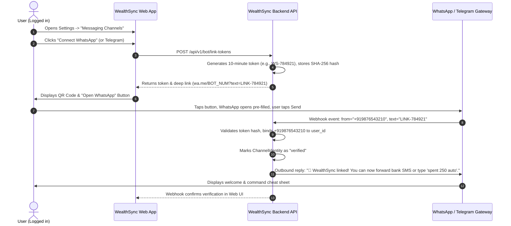

# Zero-App-Open Companion: Architecture & Implementation Plan

**Product:** WealthSync  
**PRD Reference:** `docs/PRD_Zero_App_Open_Companion.md`  
**Primary Channels:** Telegram and WhatsApp  
**Status:** Approved for Implementation  

---

## 1. Executive Summary & Vision

The **Zero-App-Open Companion** brings the highest-frequency daily financial actions directly into the messaging apps users already use all day (WhatsApp and Telegram):
1. **Log expenses instantly** by forwarding bank debit SMS messages or typing quick text commands (e.g. `spent 250 auto`, `paid 450 groceries`).
2. **Instant factual queries** on finances without opening the web dashboard (`today` for daily safe-to-spend, `balance` for tracked ledger balance, `due` for upcoming commitments, `free` for Commitment Vault discretionary funds).
3. **Strict human-in-the-loop safety**: By default, every proposed transaction must be confirmed (`YES`/`NO`) before writing to the database. No black-box AI inferences, no silent category guessing, and no unauthorized financial mutations.

---

## 2. Demystifying the Bot Architecture: Where Do Users Chat?

A central question for any messaging bot is: *To what handle or phone number does the user send messages, and how does the backend receive them?*

### 2.1 Telegram Architecture (Handle-based, Zero Cost, Zero Verification)
- **Identity:** A Telegram Bot has a unique handle, e.g., `@WealthSync_bot`. **It does not have or require a phone number.**
- **Creation:** Created via Telegram's official `@BotFather` bot in under 60 seconds. `@BotFather` returns a secret `TELEGRAM_BOT_TOKEN`.
- **User Discovery:** Users find the bot via:
  - Deep link: `https://t.me/WealthSync_bot?start=WS_LINK_TOKEN`
  - In-app search: typing `@WealthSync_bot` in Telegram.
- **Webhook Delivery:** Telegram forwards messages via HTTPS POST to our backend:
  `POST /api/v1/bot/telegram/webhook/{secret_token}`
- **Payload:** Telegram provides a permanent, verified `from.id` (numeric Telegram User ID) and `chat.id`.

### 2.2 WhatsApp Architecture (Number-based, Meta Cloud API)
- **Identity:** WhatsApp does **not** have username handles. A WhatsApp bot requires a **dedicated real phone number** (a virtual number, VoIP line, or business SIM) that is registered on the **Meta WhatsApp Business Cloud API**.
- **Creation:** Configured in the Meta Developer Portal under a WhatsApp Business Account (WABA).
- **User Discovery:** Users start a conversation via:
  - WhatsApp Click-to-Chat deep link: `https://wa.me/918012345678?text=LINK-TOKEN`
  - Scanning a QR code displayed in the WealthSync Web App.
  - Adding the phone number to their contacts and sending a message.
- **Webhook Delivery:** Meta forwards incoming messages via HTTPS POST:
  `POST /api/v1/bot/whatsapp/webhook`
- **Payload:** Meta delivers the sender's E.164 phone number (e.g., `"919876543210"`).

---

## 3. Authentication & Phone Number Architecture

### 3.1 Should Registration be Redesigned to Require a Phone Number?

**Decision: NO.** Registration will remain simple and secure with Email and Password.

#### Why Forcing Phone Numbers at Signup is an Anti-Pattern:
1. **Drop-Off Friction:** Forcing users to enter and verify phone numbers with SMS OTP at initial signup increases registration drop-off by 40–60%.
2. **SMS Gateway Costs:** Sending SMS OTPs via Twilio, AWS SNS, or MSG91 costs money for every single signup.
3. **Spoofing Vulnerability:** If a phone number is entered without SMS OTP verification, any user could claim someone else's number.
4. **Telegram Incompatibility:** Telegram does not expose the user's phone number by default; it identifies users by numeric `telegram_user_id`. Requiring a phone number at signup does not solve Telegram authentication.

### 3.2 The Cryptographic In-App Linking Token (Zero SMS Cost)

WealthSync uses an **In-App Initiated Linking Flow** (as defined in PRD Section 8.4):



#### Why This is Superior:
- **Zero SMS cost:** The user sends the message from their existing WhatsApp or Telegram app.
- **Provider-Verified Identity:** WhatsApp and Telegram have already cryptographically authenticated the user's device and phone number.
- **One Identity = One User:** The database enforces a `UNIQUE(channel, external_user_id)` constraint so an identity can never belong to more than one WealthSync account.

---

## 4. Key Bottlenecks, Challenges, and Mitigations

| Bottleneck | Problem Description | Engineering Mitigation |
| :--- | :--- | :--- |
| **1. Meta Business Verification** | Meta WhatsApp Cloud API requires Facebook Business Manager verification (GST, business registration documents) to lift rate limits for production. | **Phased Rollout:** Implement **Telegram first** (Milestones 0–4) which has **zero approval barriers**. WhatsApp is integrated in Sandbox mode (up to 5 test numbers) and graduated to production once business documents are approved. |
| **2. WhatsApp 24-Hour Messaging Window & Costs** | WhatsApp enforces a strict 24-hour customer service window after a user's incoming message. Outbound proactive messages outside this window require Meta-approved template messages and incur per-conversation fees. | WealthSync Companion is **reactive**: it replies to incoming user queries (`today`, `due`, `balance`) or forwarded SMS within seconds. All reactive replies within the 24-hour window are **free** on WhatsApp. Proactive push digests are deferred to future milestones. |
| **3. Local Development Webhooks** | Telegram and Meta webhooks cannot send HTTP requests to `http://localhost:8000`. | 1. Use **Cloudflare Tunnels (`cloudflared`)** or **ngrok** during local development to expose an HTTPS webhook URL.<br>2. Build a local fake webhook test fixture suite (Milestone 0) that runs 100% offline in pytest without external network dependencies. |
| **4. Bank SMS Format Divergence** | HDFC, ICICI, SBI, Axis, Kotak, CRED, and UPI apps format debit SMS messages differently. Non-financial SMS (OTPs, promotional offers, credit card limits) must not create false transactions. | 1. **Conservative Deterministic Regex:** High-precision parser with explicit merchant and amount extraction.<br>2. **Confirmation by Default:** Every proposal asks `YES/NO` before writing to the database.<br>3. **Anti-Noise Guard:** Reject messages containing OTP, PIN, password, or balance inquiry terms. |
| **5. Webhook Replay & Duplicate Writes** | Messaging providers retry webhooks if the server response takes >3–5 seconds, which could lead to duplicate transactions. | 1. Fast ACK: Webhook route saves raw event and returns `200 OK` in <100ms.<br>2. Idempotency: Deduplicate on `(channel, provider_message_id)` and secondary SHA-256 payload fingerprinting. |

---

## 5. System Architecture

```mermaid
flowchart TD
    subgraph Messaging Providers
        TG[Telegram Bot Webhook]
        WA[WhatsApp Cloud API Webhook]
    end

    subgraph Ingestion & Security Layer
        W[POST /api/v1/bot/{channel}/webhook]
        SEC[Provider Signature & Token Verification]
        DEDUP[Event Idempotency & Deduplication]
        STORE[inbound_messages Table]
    end

    subgraph Parsing & Proposal Engine
        SP[SmsParser: Deterministic Regex]
        CP[CommandParser: Strict Grammar]
        PROP[TransactionProposal Builder]
    end

    subgraph Ledger & Core Engine
        TS[Shared Transaction Creation Service]
        LEDGER[(transactions Table)]
        CV[Commitment Vault & Safe-to-Spend APIs]
    end

    subgraph Reply & Feedback
        BRS[BotReplyService: Templates & Sanitize]
        OUT[Outbound Channel Adapter]
    end

    TG --> W
    WA --> W
    W --> SEC --> DEDUP --> STORE
    STORE --> SP
    STORE --> CP
    SP --> PROP
    CP --> PROP
    PROP -- "Confirmation YES" --> TS
    TS --> LEDGER
    PROP -- Query (today, due, balance) --> CV
    CV --> BRS
    TS --> BRS
    BRS --> OUT
    OUT --> TG
    OUT --> WA
```

---

## 6. Database Models (`backend/app/models/`)

### 6.1 `channel_identities` (`backend/app/models/channel_identity.py`)
Binds an external messaging account to exactly one WealthSync user.
```python
class ChannelIdentity(Base):
    __tablename__ = "channel_identities"

    id = Column(String, primary_key=True, default=lambda: str(uuid4()))
    user_id = Column(String, ForeignKey("users.id", ondelete="CASCADE"), nullable=False, index=True)
    channel = Column(String(20), nullable=False)  # "telegram" | "whatsapp"
    external_user_id = Column(String(100), nullable=False)  # Stable provider user ID (or phone number)
    external_chat_id = Column(String(100), nullable=True)   # Chat ID for replies
    phone_e164 = Column(String(20), nullable=True)         # Encrypted/masked phone number
    status = Column(String(20), default="pending")          # "pending" | "verified" | "revoked"
    auto_log_enabled = Column(Boolean, default=False)
    verified_at = Column(DateTime, nullable=True)
    revoked_at = Column(DateTime, nullable=True)
    created_at = Column(DateTime, default=datetime.utcnow)
    updated_at = Column(DateTime, default=datetime.utcnow, onupdate=datetime.utcnow)

    __table_args__ = (
        UniqueConstraint("channel", "external_user_id", name="uq_channel_identities_channel_ext_user"),
    )
```

### 6.2 `inbound_messages` (`backend/app/models/inbound_message.py`)
Tracks every message event, deduplication hash, parse output, and link to created transactions.
```python
class InboundMessage(Base):
    __tablename__ = "inbound_messages"

    id = Column(String, primary_key=True, default=lambda: str(uuid4()))
    channel_identity_id = Column(String, ForeignKey("channel_identities.id", ondelete="SET NULL"), nullable=True)
    channel = Column(String(20), nullable=False)
    provider_message_id = Column(String(120), nullable=False)
    provider_event_id = Column(String(120), nullable=True)
    payload_fingerprint = Column(String(64), nullable=False, index=True)  # SHA-256 of normalized text
    message_type = Column(String(30), default="text")  # "text" | "forwarded_sms" | "command"
    redacted_preview = Column(String(160), nullable=True)
    status = Column(String(30), default="received")  # "received"|"parsed"|"awaiting_confirmation"|"committed"|"rejected"|"unrecognized"|"duplicate"
    parse_result_json = Column(JSON, nullable=True)
    proposal_expires_at = Column(DateTime, nullable=True)
    transaction_id = Column(String, ForeignKey("transactions.id", ondelete="SET NULL"), nullable=True, unique=True)
    received_at = Column(DateTime, default=datetime.utcnow)
    processed_at = Column(DateTime, nullable=True)

    __table_args__ = (
        UniqueConstraint("channel", "provider_message_id", name="uq_inbound_messages_channel_msg_id"),
    )
```

### 6.3 `channel_link_tokens` (`backend/app/models/channel_link_token.py`)
Short-lived single-use tokens for in-app pairing.
```python
class ChannelLinkToken(Base):
    __tablename__ = "channel_link_tokens"

    id = Column(String, primary_key=True, default=lambda: str(uuid4()))
    user_id = Column(String, ForeignKey("users.id", ondelete="CASCADE"), nullable=False)
    channel = Column(String(20), nullable=False)
    token_hash = Column(String(64), nullable=False, unique=True, index=True)
    token_display = Column(String(16), nullable=False)  # e.g., "WS-894120"
    expires_at = Column(DateTime, nullable=False)
    consumed_at = Column(DateTime, nullable=True)
    attempts = Column(Integer, default=0)
    created_at = Column(DateTime, default=datetime.utcnow)
```

---

## 7. Deterministic Parsers & Command Grammar

### 7.1 Bank SMS Parser (`SmsParser`)
Covers the top Indian bank debit formats:
1. **HDFC / ICICI / Axis format:**
   `r"(?:Rs\.?|INR)\s*([0-9,]+(?:\.\d{1,2})?)\s*debited\b.*?\b(?:to|at)\s+([A-Za-z0-9 .,&'@_-]+)"`
2. **SBI format:**
   `r"\bdebited\s*(?:by|INR|Rs\.?)\s*([0-9,]+(?:\.\d{1,2})?).*?\b(?:transfer to|at)\s+([A-Za-z0-9 .,&'@_-]+)"`
3. **Generic UPI format:**
   `r"\bsent\s*(?:Rs\.?|INR)\s*([0-9,]+(?:\.\d{1,2})?)\s*to\s+([A-Za-z0-9 .,&'@_-]+)"`

*Safety rules:*
- Amount and direction (`EXPENSE` vs `INCOME`) are strictly required.
- If merchant cannot be determined, set counterparty as `"Unknown Merchant"` and flag confidence as `medium`.
- Messages mentioning "OTP", "verification code", "declined", "failed", or "reversed" are explicitly ignored or marked as non-financial events.

### 7.2 Strict Command Parser (`CommandParser`)
No ambiguous natural language guessing. A predictable, exact syntax:

| Command | Syntax | Action | Sample Response |
| :--- | :--- | :--- | :--- |
| `spent` | `spent <amount> <description>` | Creates `awaiting_confirmation` expense | *"Proposed expense: ₹250 for auto. Reply YES to confirm or NO to cancel."* |
| `income` | `income <amount> <description>` | Creates `awaiting_confirmation` income | *"Proposed income: ₹50,000 for salary. Reply YES to confirm."* |
| `today` | `today` | Queries daily safe-to-spend | *"Daily Safe-to-Spend: ₹1,420 (14 days remaining in cycle)."* |
| `balance` | `balance` | Queries total ledger balance | *"Tracked Balance: ₹45,200.00 (based on recorded transactions)."* |
| `due` | `due` | Queries next 3 scheduled dues | *"Upcoming dues: 1) Airtel (₹1,499 on Oct 10), 2) Jio (₹999 on Oct 18)."* |
| `free` | `free` | Queries Commitment Vault Free amount | *"Vault Free Amount: ₹12,500 unallocated discretionary funds."* |
| `help` | `help` | Returns cheat-sheet of commands | Short 4-line list of valid commands. |

---

## 8. Frontend Integration: Settings UI

Add a new tab **"Messaging Companion"** inside [Settings.jsx](file:///c:/Users/satya/Desktop/projects/wealth_sync/frontend/src/pages/dashboard/Settings.jsx):

```
+-------------------------------------------------------------------------------+
| Settings                                                                      |
| [Profile]  [Notifications]  [Security]  [Messaging Companion]                 |
+-------------------------------------------------------------------------------+
|                                                                               |
| Zero-App-Open Companion                                                       |
| Log expenses and check safe-to-spend directly from Telegram or WhatsApp.      |
|                                                                               |
| +------------------------------------+  +-----------------------------------+ |
| | Telegram Bot                       |  | WhatsApp Companion                | |
| | Status: [ Connected: @satyateja ]  |  | Status: [ Not Connected ]         | |
| |                                    |  |                                   | |
| | Auto-log verified bank SMS: [ON/OFF] | [Connect WhatsApp]                | |
| |                                    |  | (1-click link & QR code modal)    | |
| | [Disconnect]                       |  |                                   | |
| +------------------------------------+  +-----------------------------------+ |
|                                                                               |
| Recent Inbound Messages & Audit Log                                           |
| - Today, 14:22: "Rs. 450 debited at Swiggy" -> Logged (ID #tx_8192)           |
| - Yesterday, 19:10: "today" -> Replied: "Safe-to-spend: ₹1,420"              |
+-------------------------------------------------------------------------------+
```

---

## 9. Phased Implementation Roadmap

### Phase 1: Models & Database Migration (Milestones 0 & 1)
- Create [channel_identity.py](file:///c:/Users/satya/Desktop/projects/wealth_sync/backend/app/models/channel_identity.py), [inbound_message.py](file:///c:/Users/satya/Desktop/projects/wealth_sync/backend/app/models/inbound_message.py), and [channel_link_token.py](file:///c:/Users/satya/Desktop/projects/wealth_sync/backend/app/models/channel_link_token.py).
- Register models in [__init__.py](file:///c:/Users/satya/Desktop/projects/wealth_sync/backend/app/models/__init__.py).
- Create API endpoints for token generation: `POST /api/v1/bot/link-tokens` and status check `GET /api/v1/bot/channels`.

### Phase 2: Parsers & Ingestion Service (Milestone 2)
- Implement `SmsParser` with Indian bank regex patterns and clean text normalizer.
- Implement `CommandParser` for `spent`, `income`, `today`, `due`, `balance`, `free`.
- Implement `BotReplyService` to generate standard privacy-sanitized responses.
- Write pytest fixtures with sample bank SMS messages verifying extraction accuracy.

### Phase 3: Shared Transaction Creation & Lifecycle (Milestone 3)
- Extract transaction creation logic into a shared service function: `create_from_inbound_message()`.
- Ensure bot-created transactions trigger automatic bill/subscription matching and update Commitment Vault safe-to-spend calculations.
- Implement `YES` / `NO` confirmation lifecycle with 10-minute expiry window.

### Phase 4: Telegram Bot Integration (Milestone 4)
- Add `TelegramAdapter` with secret token webhook verification.
- Implement `POST /api/v1/bot/telegram/webhook/{secret}` endpoint.
- Provide inline callback buttons (`[Confirm YES]` / `[Discard NO]`).
- Live verification with `@WealthSync_bot`.

### Phase 5: Web UI in Settings (Milestone 5)
- Add "Messaging Companion" tab in [Settings.jsx](file:///c:/Users/satya/Desktop/projects/wealth_sync/frontend/src/pages/dashboard/Settings.jsx).
- Connect modal with live QR Code and `t.me/...` deep link.
- Display verified channel badge, auto-log toggle switch, and disconnect action.

### Phase 6: WhatsApp Cloud API Integration (Milestone 6)
- Implement `WhatsAppAdapter` handling Meta webhook challenge handshake (`hub.challenge`) and payload parsing.
- Deploy `GET & POST /api/v1/bot/whatsapp/webhook`.
- Connect Meta WhatsApp Business sandbox account for live testing.

---

## 10. Definition of Done

1. A user can click "Connect Telegram" in Settings, scan a QR / click a link, and pair their Telegram account within 10 seconds.
2. Forwarding a supported bank SMS creates an immediate preview proposal: *"Rs. 450 at Swiggy. Reply YES to log."*
3. Replying `YES` creates exactly one validated transaction in WealthSync and replies with the updated Daily Safe-to-Spend amount.
4. Sending `today`, `balance`, or `due` returns accurate, factual metrics directly from the Commitment Vault engine.
5. Replayed, duplicate, or malformed messages never create duplicate or corrupt transactions.
6. Zero registration changes required; email/password authentication remains fast and intact.
